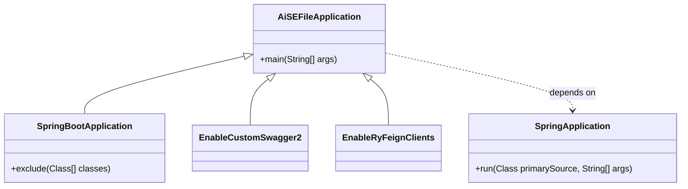
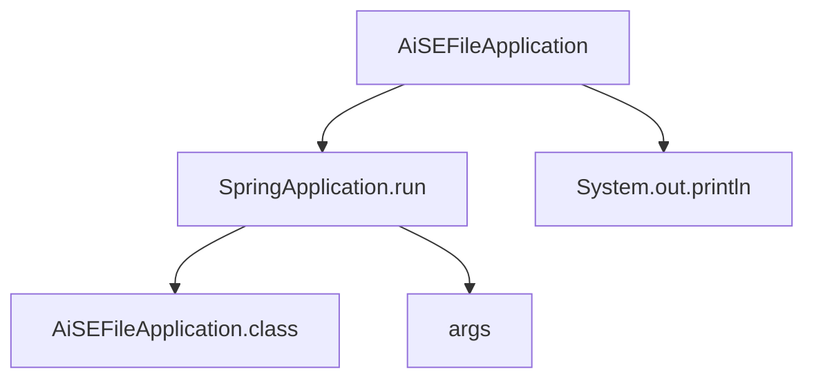

# 基础信息

|      |      |
|------|------|
| 编码语言 | .java |
| 代码路径 | aise-file/src/main/java/com/leaniss/file/AiSEFileApplication.java |
| 包名 | com.leaniss.file |
| 依赖项 | ['com.leaniss.common.security.annotation.EnableRyFeignClients', 'com.leaniss.common.swagger.annotation.EnableCustomSwagger2', 'org.springframework.boot.SpringApplication', 'org.springframework.boot.autoconfigure.SpringBootApplication', 'org.springframework.boot.autoconfigure.jdbc.DataSourceAutoConfiguration'] |
| 概述说明 | AiSEFileApplication是一个Spring Boot应用，排除了DataSourceAutoConfiguration，启用了自定义Swagger2和RyFeignClients。主方法启动应用并输出文件服务模块成功启动的信息。 |

# 说明

AiSEFileApplication是一个基于Spring Boot框架开发的应用。在应用配置中，排除了DataSourceAutoConfiguration，这意味着该应用不依赖于自动配置的数据源，可能是为了使用自定义的数据源配置或不需要数据库支持。此外，应用启用了自定义的Swagger2和RyFeignClients。Swagger2的启用表明该应用提供了API文档生成功能，方便开发者查看和测试API接口。RyFeignClients的启用则说明该应用使用了Feign作为HTTP客户端，用于简化微服务之间的通信。

应用的主方法负责启动整个应用，并在启动成功后输出一条信息，提示文件服务模块已成功启动。这表明AiSEFileApplication的核心功能可能围绕文件服务展开，具体功能可能包括文件的上传、下载、存储等操作。通过Spring Boot的自动配置和自定义配置的结合，该应用能够高效地运行并提供所需的文件服务功能。

# 类列表 Class Summary

| 名称   | 类型  | 说明 |
|-------|------|-------------|
| AiSEFileApplication | class | AiSEFileApplication是一个Spring Boot应用，排除了DataSourceAutoConfiguration，启用了自定义Swagger2和RyFeignClients。主方法启动应用并输出文件服务模块成功启动的信息。 |

## 类 AiSEFileApplication

|      |      |
|------|------|
| 访问范围 | @EnableCustomSwagger2;@SpringBootApplication(exclude = {DataSourceAutoConfiguration.class });@EnableRyFeignClients;public |
| 类型 | class |
| 名称 | AiSEFileApplication |
| 说明 | AiSEFileApplication是一个Spring Boot应用，排除了DataSourceAutoConfiguration，启用了自定义Swagger2和RyFeignClients。主方法启动应用并输出文件服务模块成功启动的信息。 |

### UML类图

### 描述信息：
该UML类图展示了`AiSEFileApplication`类与`SpringBootApplication`、`EnableCustomSwagger2`、`EnableRyFeignClients`和`SpringApplication`之间的关系。`AiSEFileApplication`继承了`SpringBootApplication`、`EnableCustomSwagger2`和`EnableRyFeignClients`，并依赖于`SpringApplication`来启动应用程序。

### 内部方法调用关系图

### 描述信息
该图展示了`AiSEFileApplication`类中的方法调用关系。`main`方法首先调用`SpringApplication.run`来启动Spring Boot应用，并传入`AiSEFileApplication.class`和`args`作为参数。随后，`main`方法调用`System.out.println`输出启动成功的消息。整个过程清晰地展示了Spring Boot应用的启动流程。

### 字段列表 Field List

| 名称  | 类型  | 说明 |
|-------|-------|------|

### 方法列表 Method List

| 名称  | 类型  | 说明 |
|-------|-------|------|
| main | void | 该代码片段是一个Java程序的入口方法，使用SpringApplication启动AiSEFileApplication类，并在控制台输出文件服务模块成功启动的提示信息。 |

