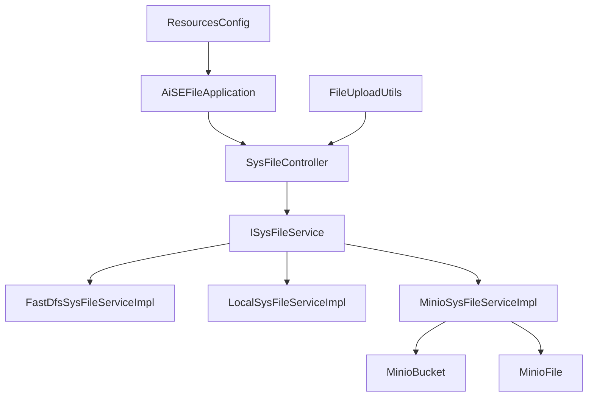

# 基础信息

|      |      |
|------|------|
| 编码语言 | .java |
| 代码路径 | aise-file/src/main/java/com/leaniss/file |
| 包名 | com.leaniss.file |
| 概述说明 | MinioBucket类和MinioFile类用于管理Minio存储系统中的存储桶和文件，分别通过属性和方法支持存储桶和文件的创建、配置和管理。AiSEFileApplication是一个基于Spring Boot的应用，不依赖自动配置的数据源，启用了Swagger2和RyFeignClients，核心功能围绕文件服务。ResourcesConfig类配置资源处理和跨域支持，允许本地文件通过HTTP访问并支持跨域请求。SysFileController类处理文件上传、删除和下载请求，通过sysFileService执行操作并捕获异常。FastDfsSysFileServiceImpl、LocalSysFileServiceImpl和MinioSysFileServiceImpl类分别实现基于不同存储系统的文件管理功能，MinioSysFileServiceImpl提供最全面的操作支持。FileUploadUtils类处理文件上传，支持文件类型和大小校验，并集成MinIO存储桶管理功能。 |

# 说明

MinioBucket类和MinioFile类是两个用于管理和操作Minio存储系统中存储桶和文件的类。MinioBucket类主要用于管理存储桶，包含MinioClient、bucketName、region和lifecycleRuleList四个主要属性。MinioClient是与Minio服务器交互的客户端对象，bucketName表示存储桶的名称，region表示存储桶所在的区域，lifecycleRuleList存储与存储桶相关的生命周期规则列表。构造方法强制要求传入MinioClient和bucketName两个参数，region和lifecycleRuleList是可选的。通过getter和setter方法，用户可以灵活地获取或修改这些属性，从而动态调整存储桶的配置。

MinioFile类则用于管理文件信息，包含桶名、文件路径、文件类型、文件大小、区域、删除标记、版本ID、用户元数据以及输入输出流等属性。桶名标识文件存储的桶，文件路径指定文件在存储系统中的具体位置，文件类型描述文件的格式，文件大小记录文件的大小信息，区域可能指定文件存储的地理位置。删除标记标识文件是否被标记为删除，版本ID用于文件版本控制，用户元数据允许存储自定义元数据信息，输入输出流提供文件内容的读写接口。MinioFile类也提供了相应的getter和setter方法，使用户能够灵活地读取和设置这些属性，从而支持文件的存储、检索、更新和删除等操作。

AiSEFileApplication是一个基于Spring Boot框架开发的应用，排除了DataSourceAutoConfiguration，可能使用自定义的数据源配置或不需要数据库支持。应用启用了Swagger2和RyFeignClients，Swagger2用于生成API文档，RyFeignClients用于简化微服务之间的通信。应用的主方法负责启动整个应用，并在启动成功后输出一条信息，提示文件服务模块已成功启动。

ResourcesConfig类实现了WebMvcConfigurer接口，主要用于配置Web应用程序的资源处理和跨域支持。通过addResourceHandlers方法，将本地文件上传路径与指定的资源映射路径前缀进行关联，使得本地文件可以通过特定的URL路径访问。通过addCorsMappings方法，开启了跨域资源共享（CORS）支持，允许所有域名通过GET方法访问映射路径的规则。

SysFileController类负责处理与文件相关的请求，包括文件的上传、删除和下载。通过upload方法，用户可以上传文件，上传成功后，系统会返回该文件的访问地址。delete方法用于删除指定的文件，用户只需提供文件的minioKey即可完成删除操作。download方法则允许用户下载指定文件名的文件，系统会根据文件名找到对应的文件并提供下载链接。所有文件操作都是通过sysFileService来执行的，系统会捕获可能出现的异常，并将异常信息记录到日志中。

FastDfsSysFileServiceImpl类、LocalSysFileServiceImpl类和MinioSysFileServiceImpl类均实现了ISysFileService接口，分别提供了基于不同存储系统的文件管理功能。FastDfsSysFileServiceImpl类主要支持文件上传和删除功能，LocalSysFileServiceImpl类则专注于本地文件管理，MinioSysFileServiceImpl类提供了更为全面的文件管理功能，包括文件上传、删除和下载。

FileUploadUtils类是一个用于处理文件上传的工具类，提供了多种功能以支持文件上传操作。该类默认支持上传文件的大小限制为50M，并且对文件名的长度也有限制，最大长度为100个字符。在上传过程中，类中的方法会进行文件类型校验和文件大小校验，确保上传的文件符合要求。此外，该类还负责处理文件上传路径的相关逻辑，并集成了对MinIO存储桶的管理功能，支持创建MinIO存储桶，检查存储桶是否存在，设置和查询存储桶策略等功能。

### 包内部结构视图

### 描述信息：
该关系图展示了`AiSEFileApplication`作为入口，调用`SysFileController`，后者依赖于`ISysFileService`接口。`ISysFileService`有三个实现类：`FastDfsSysFileServiceImpl`、`LocalSysFileServiceImpl`和`MinioSysFileServiceImpl`。`MinioSysFileServiceImpl`进一步依赖于`MinioBucket`和`MinioFile`。`FileUploadUtils`和`ResourcesConfig`分别与`SysFileController`和`AiSEFileApplication`有调用关系。

# 文件列表 File List

| 名称   | 类型  | 说明 |
|-------|------|-------------|
| [AiSEFileApplication.java](AiSEFileApplication.md) | file | AiSEFileApplication是一个Spring Boot应用，排除了DataSourceAutoConfiguration，启用了自定义Swagger2和RyFeignClients。主方法启动应用并输出文件服务模块成功启动的信息。 |
| [utils](utils/_package.md) | folder | FileUploadUtils类提供文件上传功能，支持默认文件大小50M和文件名长度100的限制，包含文件类型、大小校验及路径处理。此外，支持MinIO桶的创建、存在检查、策略设置和查询，并生成和应用默认桶策略。 |
| [service](service/s_package.md) | folder | FastDfsSysFileServiceImpl类实现了ISysFileService接口，提供文件上传和删除功能，但下载功能未实现。文件上传通过FastFileStorageClient完成，返回文件访问地址；删除功能可成功移除指定文件。LocalSysFileServiceImpl类同样实现ISysFileService接口，支持本地文件的上传和删除，上传后返回访问地址，删除后返回成功信息，但下载功能也未实现。MinioSysFileServiceImpl类实现ISysFileService接口，提供完整的文件上传、删除和下载功能。上传时检查存储桶并生成唯一文件名，删除时根据文件键值移除对象，下载时返回文件流。所有操作通过MinioClient与Minio存储服务交互，确保高效可靠。 |
| [controller](controller/_package.md) | folder | SysFileController类负责处理文件上传、删除和下载请求。通过upload方法上传文件并返回访问地址，delete方法删除指定minioKey的文件，download方法下载指定文件名的文件。所有操作由sysFileService执行，捕获异常并记录日志，返回操作结果。 |
| [config](config/_package.md) | folder | ResourcesConfig类实现WebMvcConfigurer接口，配置本地文件上传路径和资源映射前缀，通过addResourceHandlers方法映射本地路径到指定前缀，并通过addCorsMappings方法开启跨域支持，允许所有域名通过GET方法访问映射路径。 |
| [bean](bean/_package.md) | folder | MinioBucket类用于管理和操作Minio存储桶，包含MinioClient、bucketName、region和lifecycleRuleList四个主要属性，提供构造方法和getter/setter方法以确保存储桶的有效性和灵活性。MinioFile类用于管理文件信息，包含桶名、文件路径、文件类型、文件大小、区域、删除标记、版本ID、用户元数据和输入输出流等属性，提供getter/setter方法支持文件的存储、检索、更新和删除操作。 |

