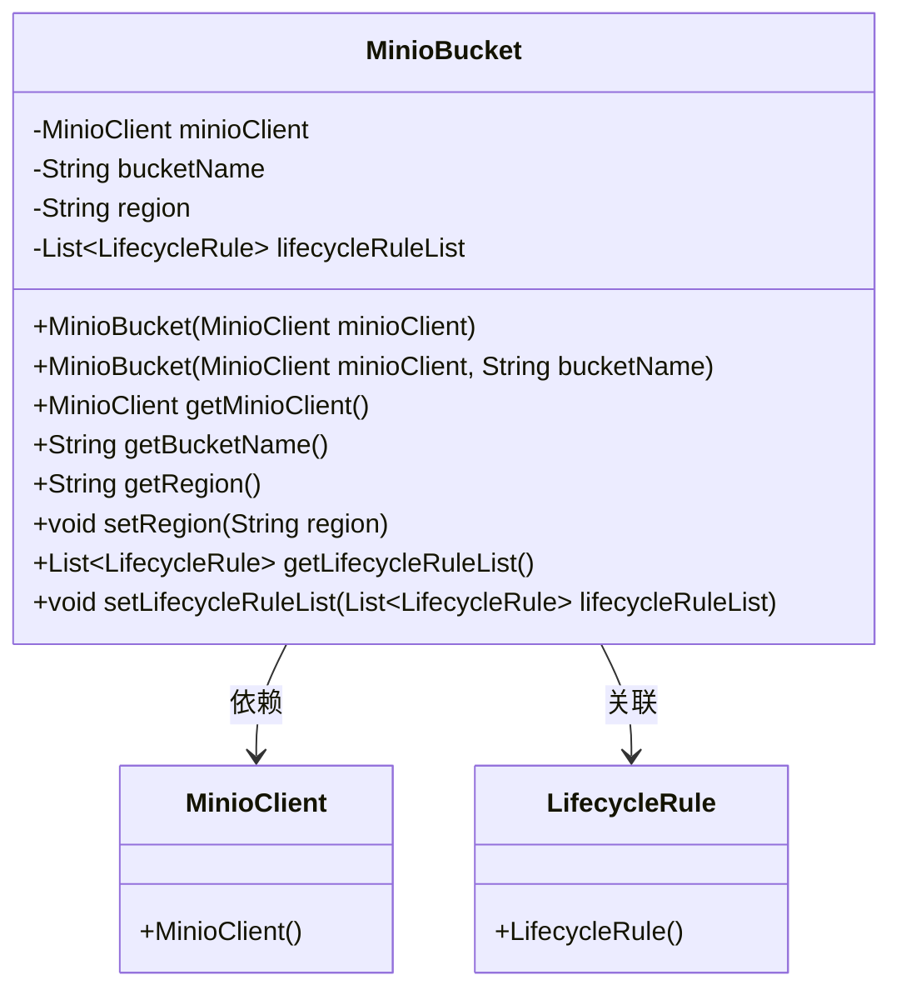
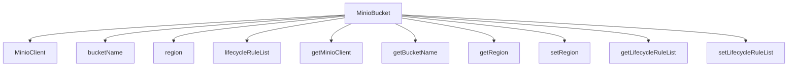

# 基础信息

|      |      |
|------|------|
| 编码语言 | .java |
| 代码路径 | aise-file/src/main/java/com/leaniss/file/bean/MinioBucket.java |
| 包名 | com.leaniss.file.bean |
| 依赖项 | ['io.minio.MinioClient', 'io.minio.messages.LifecycleRule', 'java.util.List'] |
| 概述说明 | MinioBucket类包含MinioClient、bucketName、region和lifecycleRuleList属性，提供构造方法和getter/setter方法。构造方法强制要求MinioClient和bucketName，若为空则抛出异常。 |

# 说明

MinioBucket类是一个用于管理和操作Minio存储桶的类，包含四个主要属性：MinioClient、bucketName、region和lifecycleRuleList。MinioClient是与Minio服务器进行交互的客户端对象，bucketName表示存储桶的名称，region表示存储桶所在的区域，lifecycleRuleList则用于存储与存储桶相关的生命周期规则列表。该类提供了构造方法和相应的getter/setter方法，以便对这些属性进行初始化和访问。

在构造方法中，MinioBucket类强制要求传入MinioClient和bucketName两个参数。这两个参数是创建存储桶实例所必需的，如果其中任何一个参数为空，构造方法将抛出异常，以确保存储桶实例的有效性和完整性。region和lifecycleRuleList属性在构造方法中是可选的，可以根据需要进行设置。

通过getter和setter方法，用户可以获取或修改MinioBucket类中的各个属性。这些方法提供了对存储桶属性的灵活控制，使得用户可以根据实际需求动态调整存储桶的配置。例如，用户可以通过setter方法设置存储桶的区域或更新生命周期规则列表，而getter方法则可以用于获取当前存储桶的相关信息。

总的来说，MinioBucket类通过其属性和方法，提供了一个结构化的方式来管理和操作Minio存储桶，确保存储桶的创建和配置过程是安全和可控的。

# 类列表 Class Summary

| 名称   | 类型  | 说明 |
|-------|------|-------------|
| MinioBucket | class | MinioBucket类包含MinioClient、bucketName、region和lifecycleRuleList属性，提供构造方法和getter/setter方法。构造方法强制要求MinioClient和bucketName，若为空则抛出异常。 |

## 类 MinioBucket

|      |      |
|------|------|
| 访问范围 | public |
| 类型 | class |
| 名称 | MinioBucket |
| 说明 | MinioBucket类包含MinioClient、bucketName、region和lifecycleRuleList属性，提供构造方法和getter/setter方法。构造方法强制要求MinioClient和bucketName，若为空则抛出异常。 |

### UML类图

### 描述信息：
该UML类图展示了`MinioBucket`类与`MinioClient`和`LifecycleRule`类之间的关系。`MinioBucket`类包含私有属性`minioClient`、`bucketName`、`region`和`lifecycleRuleList`，并提供了多个构造函数和公共方法用于访问和修改这些属性。`MinioBucket`类依赖于`MinioClient`类，并与`LifecycleRule`类存在关联关系。

### 内部方法调用关系图

### 描述信息：
该图展示了`MinioBucket`类中的方法调用关系。`MinioBucket`类依赖于`MinioClient`、`bucketName`、`region`和`lifecycleRuleList`等属性，并通过`get`和`set`方法对这些属性进行访问和修改。图中清晰地展示了类内部方法之间的调用关系。

### 字段列表 Field List

| 名称  | 类型  | 说明 |
|-------|-------|------|
| bucketName | String | 概要说明：该信息涉及一个私有字符串变量，名为bucketName，用于存储桶的名称。 |
| region | String | 概要：该信息涉及一个私有字符串变量，名为“region”，用于存储区域相关的数据。 |
| minioClient | MinioClient | private MinioClient minioClient; 定义了一个私有的MinioClient对象，用于与MinIO存储服务进行交互。 |
| lifecycleRuleList | List<LifecycleRule> | `lifecycleRuleList` 包含一组生命周期规则，用于管理对象的存储周期和操作，如自动删除或转换存储类别。 |

### 方法列表 Method List

| 名称  | 类型  | 说明 |
|-------|-------|------|
| getBucketName | String | 该方法返回一个字符串类型的变量`bucketName`，用于获取存储桶的名称。 |
| getMinioClient | MinioClient | 该方法返回一个MinioClient对象，用于访问和操作Minio存储服务。 |
| getRegion | String | 该方法返回一个字符串类型的区域值，具体返回的是变量`region`的值。 |
| getLifecycleRuleList | List<LifecycleRule> | 该方法返回一个包含生命周期规则的列表，类型为`List<LifecycleRule>`，列表名称为`lifecycleRuleList`。 |
| setRegion | void | 该方法用于设置对象的区域属性，接受一个字符串参数region，并将其赋值给对象的region属性。 |
| setLifecycleRuleList | void | 该方法用于设置生命周期规则列表，接受一个`LifecycleRule`类型的列表作为参数，并将其赋值给当前对象的`lifecycleRuleList`属性。 |

