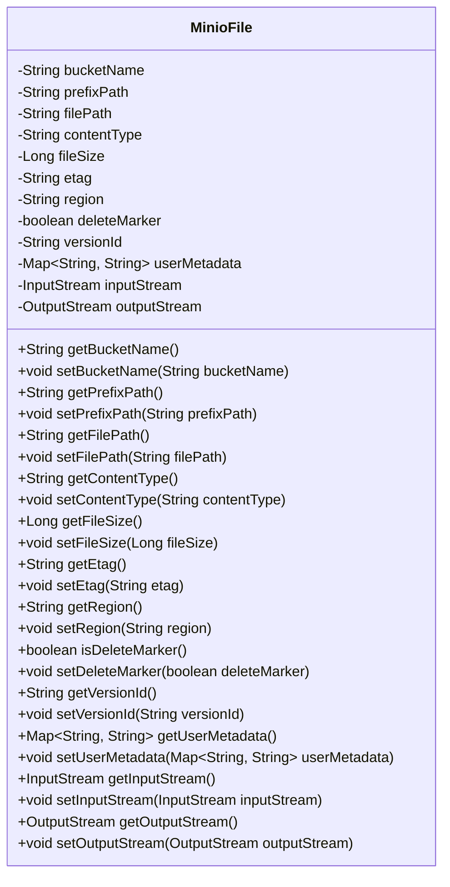

# 基础信息

|      |      |
|------|------|
| 编码语言 | .java |
| 代码路径 | aise-file/src/main/java/com/leaniss/file/bean/MinioFile.java |
| 包名 | com.leaniss.file.bean |
| 依赖项 | ['java.io.InputStream', 'java.io.OutputStream', 'java.util.Map'] |
| 概述说明 | MinioFile类用于管理文件信息，包含桶名、文件路径、文件类型、文件大小、区域、删除标记、版本ID、用户元数据、输入输出流等属性，并提供相应的getter和setter方法。 |

# 说明

MinioFile类是一个用于管理文件信息的类，它包含了多个属性和方法，以便于对文件进行详细的管理和操作。该类的主要属性包括桶名、文件路径、文件类型、文件大小、区域、删除标记、版本ID、用户元数据以及输入输出流等。桶名属性用于标识文件存储的桶，文件路径属性则指定了文件在存储系统中的具体位置。文件类型属性描述了文件的格式或类型，文件大小属性记录了文件的大小信息。区域属性可能用于指定文件存储的地理位置或数据中心。删除标记属性用于标识文件是否已被标记为删除，而版本ID属性则用于管理文件的版本控制。用户元数据属性允许用户存储与文件相关的自定义元数据信息。输入输出流属性则提供了对文件内容进行读写操作的接口。此外，MinioFile类还提供了相应的getter和setter方法，以便于对这些属性进行读取和设置，从而实现对文件信息的灵活管理和操作。通过这些属性和方法，MinioFile类能够有效地支持文件的存储、检索、更新和删除等操作，为用户提供了一个全面的文件管理解决方案。

# 类列表 Class Summary

| 名称   | 类型  | 说明 |
|-------|------|-------------|
| MinioFile | class | MinioFile类用于管理文件信息，包含桶名、文件路径、文件类型、文件大小、区域、删除标记、版本ID、用户元数据、输入输出流等属性，并提供相应的getter和setter方法。 |

## 类 MinioFile

|      |      |
|------|------|
| 访问范围 | public |
| 类型 | class |
| 名称 | MinioFile |
| 说明 | MinioFile类用于管理文件信息，包含桶名、文件路径、文件类型、文件大小、区域、删除标记、版本ID、用户元数据、输入输出流等属性，并提供相应的getter和setter方法。 |

### UML类图

### 描述信息：
该UML类图展示了一个`MinioFile`类，该类用于表示MinIO存储中的文件对象。它包含了文件的元数据（如桶名、文件路径、文件类型、文件大小等）以及输入输出流。每个属性都有对应的getter和setter方法，确保数据的封装性和可访问性。

### 内部方法调用关系图

```mermaid
graph TD
    MinioFile --> getBucketName
    MinioFile --> setBucketName
    MinioFile --> getPrefixPath
    MinioFile --> setPrefixPath
    MinioFile --> getFilePath
    MinioFile --> setFilePath
    MinioFile --> getContentType
    MinioFile --> setContentType
    MinioFile --> getFileSize
    MinioFile --> setFileSize
    MinioFile --> getEtag
    MinioFile --> setEtag
    MinioFile --> getRegion
    MinioFile --> setRegion
    MinioFile --> isDeleteMarker
    MinioFile --> setDeleteMarker
    MinioFile --> getVersionId
    MinioFile --> setVersionId
    MinioFile --> getUserMetadata
    MinioFile --> setUserMetadata
    MinioFile --> getInputStream
    MinioFile --> setInputStream
    MinioFile --> getOutputStream
    MinioFile --> setOutputStream
```

### 描述信息：
该图展示了`MinioFile`类中各个方法之间的调用关系。`MinioFile`类包含了多个属性的getter和setter方法，用于获取和设置文件的相关信息，如桶名、文件路径、文件类型、文件大小等。每个方法都与`MinioFile`类直接关联，形成了一个清晰的调用关系图。

### 字段列表 Field List

| 名称  | 类型  | 说明 |
|-------|-------|------|
| fileSize | Long | 文件大小信息，类型为长整型。 |
| bucketName | String | private String bucketName; 是一个私有字符串变量，用于存储存储桶的名称。 |
| contentType | String | 概要说明：该信息涉及一个私有字符串变量，名为contentType，用于存储内容类型信息。 |
| prefixPath | String | private String prefixPath; 是一个私有字符串变量，用于存储路径前缀。 |
| versionId | String | 概要说明：该信息包含一个私有字符串变量`versionId`，用于存储版本标识符。 |
| inputStream | InputStream | private InputStream inputStream; 定义了一个私有的输入流对象，用于处理数据输入操作。 |
| outputStream | OutputStream | 该信息描述了一个私有类型的OutputStream对象，用于处理输出流操作。 |
| filePath | String | private String filePath; 是一个私有字符串变量，用于存储文件路径信息。 |
| region | String | 概要说明：该信息涉及一个私有字符串变量，命名为"region"，用于存储区域相关的数据。 |
| etag | String | private String etag; 定义了一个私有字符串变量etag，用于存储唯一标识符或版本信息。 |
| deleteMarker | boolean | `deleteMarker` 是一个布尔类型的私有变量，用于标记是否删除某个对象或记录。 |
| userMetadata | Map<String, String> | `userMetadata` 是一个存储键值对的私有映射，键和值均为字符串类型，用于保存用户相关元数据。 |

### 方法列表 Method List

| 名称  | 类型  | 说明 |
|-------|-------|------|
| getFilePath | String | 该方法返回文件路径的字符串值。 |
| getRegion | String | 该方法返回一个字符串类型的区域值。 |
| getFileSize | Long | 该方法返回文件大小的长整型值。 |
| getContentType | String | 该方法返回一个字符串类型的contentType值，用于获取当前内容的类型。 |
| setDeleteMarker | void | 该方法用于设置删除标记的状态，通过传入一个布尔值参数来更新对象的删除标记属性。 |
| setFileSize | void | 该方法用于设置文件大小，接受一个Long类型的参数fileSize，并将其赋值给类的成员变量fileSize。 |
| isDeleteMarker | boolean | 该方法返回一个布尔值，表示当前对象是否为删除标记。返回值由`deleteMarker`变量决定。 |
| setFilePath | void | 该方法用于设置文件路径，接受一个字符串参数filePath，并将其赋值给类的成员变量this.filePath。 |
| getBucketName | String | 该方法返回一个字符串类型的变量`bucketName`，用于获取存储桶的名称。 |
| getPrefixPath | String | 该方法返回一个字符串类型的变量prefixPath，用于获取前缀路径的值。 |
| setBucketName | void | 该方法用于设置存储桶名称，通过传入的字符串参数bucketName来更新当前对象的bucketName属性。 |
| getInputStream | InputStream | 该方法返回一个InputStream对象，用于获取输入流。 |
| getEtag | String | 该方法返回一个字符串类型的etag值。 |
| getUserMetadata | Map<String, String> | 该方法返回一个包含用户元数据的Map对象，键和值均为字符串类型。 |
| setPrefixPath | void | 该方法用于设置前缀路径，通过传入一个字符串参数prefixPath来更新当前对象的前缀路径属性。 |
| getOutputStream | OutputStream | 该方法返回一个`OutputStream`对象，用于获取当前对象的输出流。 |
| setVersionId | void | 该方法用于设置版本ID，通过传入一个字符串参数versionId，将其赋值给当前对象的versionId属性。 |
| setContentType | void | 该方法用于设置内容类型，通过传入一个字符串参数`contentType`来更新对象的`contentType`属性。 |
| setRegion | void | 该方法用于设置对象的区域属性，接受一个字符串参数region，并将其赋值给对象的region属性。 |
| setInputStream | void | 该方法用于设置输入流，将传入的InputStream对象赋值给类的成员变量inputStream。 |
| setOutputStream | void | 该方法用于设置输出流，将传入的OutputStream对象赋值给类的成员变量outputStream。 |
| getVersionId | String | 该方法返回一个字符串类型的版本ID，具体实现为直接返回成员变量versionId的值。 |
| setEtag | void | 该方法用于设置对象的etag属性，接受一个字符串参数etag并将其赋值给对象的etag成员变量。 |
| setUserMetadata | void | 该方法用于设置用户元数据，接受一个键值对形式的Map作为参数，并将其赋值给类的userMetadata属性。 |

