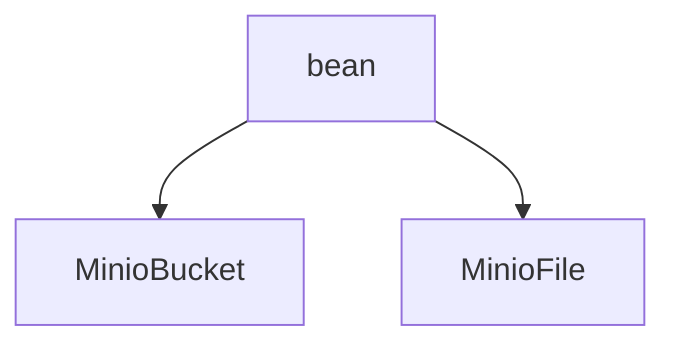

# 基础信息

|      |      |
|------|------|
| 编码语言 | .java |
| 代码路径 | aise-file/src/main/java/com/leaniss/file/bean |
| 包名 | com.leaniss.file.bean |
| 概述说明 | MinioBucket类用于管理和操作Minio存储桶，包含MinioClient、bucketName、region和lifecycleRuleList四个主要属性，提供构造方法和getter/setter方法以确保存储桶的有效性和灵活性。MinioFile类用于管理文件信息，包含桶名、文件路径、文件类型、文件大小、区域、删除标记、版本ID、用户元数据和输入输出流等属性，提供getter/setter方法支持文件的存储、检索、更新和删除操作。 |

# 说明

MinioBucket类和MinioFile类是两个用于管理和操作Minio存储系统中存储桶和文件的类。MinioBucket类主要用于管理存储桶，包含四个主要属性：MinioClient、bucketName、region和lifecycleRuleList。MinioClient是与Minio服务器交互的客户端对象，bucketName表示存储桶的名称，region表示存储桶所在的区域，lifecycleRuleList存储与存储桶相关的生命周期规则列表。构造方法强制要求传入MinioClient和bucketName两个参数，以确保存储桶实例的有效性和完整性，而region和lifecycleRuleList是可选的。通过getter和setter方法，用户可以灵活地获取或修改这些属性，从而动态调整存储桶的配置。

MinioFile类则用于管理文件信息，包含多个属性，如桶名、文件路径、文件类型、文件大小、区域、删除标记、版本ID、用户元数据以及输入输出流等。桶名标识文件存储的桶，文件路径指定文件在存储系统中的具体位置，文件类型描述文件的格式，文件大小记录文件的大小信息，区域可能指定文件存储的地理位置。删除标记标识文件是否被标记为删除，版本ID用于文件版本控制，用户元数据允许存储自定义元数据信息，输入输出流提供文件内容的读写接口。MinioFile类也提供了相应的getter和setter方法，使用户能够灵活地读取和设置这些属性，从而支持文件的存储、检索、更新和删除等操作。

总的来说，MinioBucket类和MinioFile类通过其属性和方法，提供了结构化的方式来管理和操作Minio存储系统中的存储桶和文件，确保存储桶和文件的创建、配置和管理过程是安全、可控且灵活的。

### 包内部结构视图

### 描述信息：
该Mermaid图展示了`bean`文件夹与其中的两个Java文件`MinioBucket.java`和`MinioFile.java`之间的层级关系。`bean`文件夹包含了这两个文件，分别用于处理Minio存储桶和文件的相关操作。

# 文件列表 File List

| 名称   | 类型  | 说明 |
|-------|------|-------------|
| [MinioFile.java](MinioFile.md) | file | MinioFile类用于管理文件信息，包含桶名、文件路径、文件类型、文件大小、区域、删除标记、版本ID、用户元数据、输入输出流等属性，并提供相应的getter和setter方法。 |
| [MinioBucket.java](MinioBucket.md) | file | MinioBucket类包含MinioClient、bucketName、region和lifecycleRuleList属性，提供构造方法和getter/setter方法。构造方法强制要求MinioClient和bucketName，若为空则抛出异常。 |

