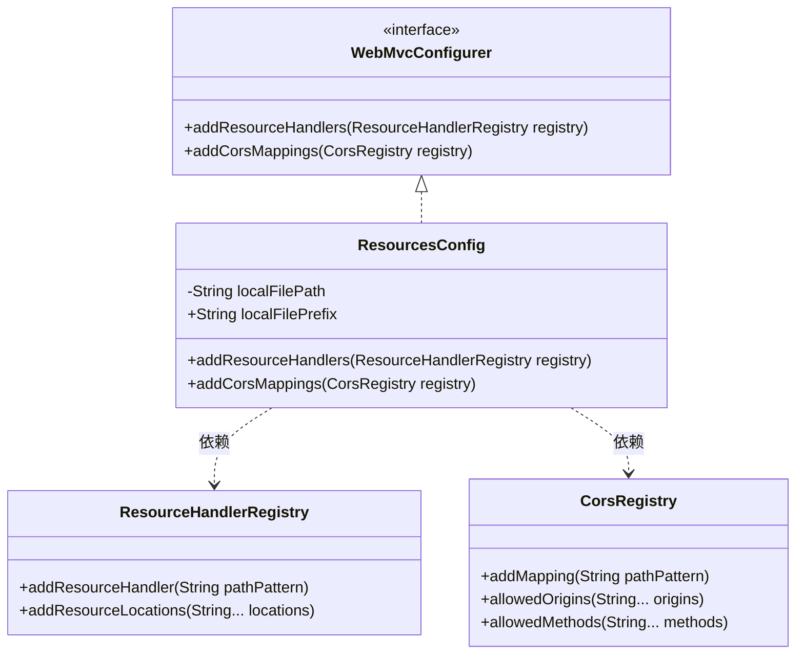

# 基础信息

|      |      |
|------|------|
| 编码语言 | .java |
| 代码路径 | aise-file/src/main/java/com/leaniss/file/config/ResourcesConfig.java |
| 包名 | com.leaniss.file.config |
| 依赖项 | ['java.io.File', 'org.springframework.beans.factory.annotation.Value', 'org.springframework.context.annotation.Configuration', 'org.springframework.web.servlet.config.annotation.CorsRegistry', 'org.springframework.web.servlet.config.annotation.ResourceHandlerRegistry', 'org.springframework.web.servlet.config.annotation.WebMvcConfigurer'] |
| 概述说明 | ResourcesConfig类实现WebMvcConfigurer接口，配置本地文件上传路径和资源映射前缀，通过addResourceHandlers方法映射本地路径到指定前缀，并通过addCorsMappings方法开启跨域支持，允许所有域名通过GET方法访问映射路径。 |

# 说明

ResourcesConfig类实现了WebMvcConfigurer接口，主要用于配置Web应用程序的资源处理和跨域支持。该类通过实现addResourceHandlers方法，将本地文件上传路径与指定的资源映射路径前缀进行关联，使得本地文件可以通过特定的URL路径访问。这一配置允许应用程序将本地存储的文件资源映射到Web服务器上，便于前端或其他客户端通过HTTP请求访问这些资源。

此外，ResourcesConfig类还通过实现addCorsMappings方法，开启了跨域资源共享（CORS）支持。具体来说，该方法配置了允许所有域名通过GET方法访问映射路径的规则。这意味着，任何域名的客户端都可以通过GET请求访问这些资源路径，而不会受到浏览器的同源策略限制。这一配置有助于实现跨域请求，特别是在前后端分离的应用场景中，前端应用可以从不同的域名或端口访问后端资源。

总的来说，ResourcesConfig类通过配置资源映射和跨域支持，增强了Web应用程序的灵活性和可访问性，使得本地文件资源能够方便地通过HTTP访问，并且支持跨域请求，提升了系统的互操作性。

# 类列表 Class Summary

| 名称   | 类型  | 说明 |
|-------|------|-------------|
| ResourcesConfig | class | ResourcesConfig类实现了WebMvcConfigurer接口，配置了本地文件上传路径和资源映射路径前缀，并通过addResourceHandlers方法将本地文件路径映射到指定前缀。同时，通过addCorsMappings方法开启了跨域支持，允许所有域名通过GET方法访问映射路径。 |

## 类 ResourcesConfig

|      |      |
|------|------|
| 访问范围 | @Configuration;public |
| 类型 | class |
| 名称 | ResourcesConfig |
| 说明 | ResourcesConfig类实现了WebMvcConfigurer接口，配置了本地文件上传路径和资源映射路径前缀，并通过addResourceHandlers方法将本地文件路径映射到指定前缀。同时，通过addCorsMappings方法开启了跨域支持，允许所有域名通过GET方法访问映射路径。 |

### UML类图

### 描述信息：
该UML类图展示了`ResourcesConfig`类实现了`WebMvcConfigurer`接口，并依赖于`ResourceHandlerRegistry`和`CorsRegistry`类来配置资源处理和跨域请求。`ResourcesConfig`类包含两个属性：`localFilePath`和`localFilePrefix`，并重写了接口中的方法以实现资源映射和跨域配置。

### 内部方法调用关系图

### 描述信息：
`ResourcesConfig`类实现了`WebMvcConfigurer`接口，并重写了`addResourceHandlers`和`addCorsMappings`方法。`addResourceHandlers`方法用于配置本地文件上传路径，而`addCorsMappings`方法用于开启跨域请求支持。这些方法通过`registry`对象进行资源处理和跨域配置。

### 字段列表 Field List

| 名称  | 类型  | 说明 |
|-------|-------|------|
| localFilePath | String | 该代码片段定义了一个私有字符串变量`localFilePath`，并通过`@Value`注解从配置文件中注入`file.path`属性的值。 |
| localFilePrefix | String | 该代码片段定义了一个公共字符串变量`localFilePrefix`，并通过`@Value`注解从配置文件中注入值，配置键为`file.prefix`。 |

### 方法列表 Method List

| 名称  | 类型  | 说明 |
|-------|-------|------|
| addCorsMappings | void | 该方法配置了跨域资源共享（CORS），允许所有域名通过GET方法访问指定路由路径下的资源。 |
| addResourceHandlers | void | 该方法用于配置本地文件上传路径，通过`addResourceHandler`指定URL路径前缀，`addResourceLocations`将请求映射到本地文件系统的具体目录。 |

