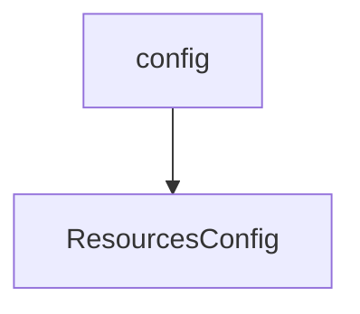

# 基础信息

|      |      |
|------|------|
| 编码语言 | .java |
| 代码路径 | aise-file/src/main/java/com/leaniss/file/config |
| 包名 | com.leaniss.file.config |
| 概述说明 | ResourcesConfig类实现WebMvcConfigurer接口，配置本地文件上传路径和资源映射前缀，通过addResourceHandlers方法映射本地路径到指定前缀，并通过addCorsMappings方法开启跨域支持，允许所有域名通过GET方法访问映射路径。 |

# 说明

ResourcesConfig类实现了WebMvcConfigurer接口，主要用于配置Web应用程序的资源处理和跨域支持。该类通过实现addResourceHandlers方法，将本地文件上传路径与指定的资源映射路径前缀进行关联，使得本地文件可以通过特定的URL路径访问。这一配置允许应用程序将本地存储的文件资源映射到Web服务器上，便于前端或其他客户端通过HTTP请求访问这些资源。

此外，ResourcesConfig类还通过实现addCorsMappings方法，开启了跨域资源共享（CORS）支持。具体来说，该方法配置了允许所有域名通过GET方法访问映射路径的规则。这意味着，任何域名的客户端都可以通过GET请求访问这些资源路径，而不会受到浏览器的同源策略限制。这一配置有助于实现跨域请求，特别是在前后端分离的应用场景中，前端应用可以从不同的域名或端口访问后端资源。

总的来说，ResourcesConfig类通过配置资源映射和跨域支持，增强了Web应用程序的灵活性和可访问性，使得本地文件资源能够方便地通过HTTP访问，并且支持跨域请求，提升了系统的互操作性。

### 包内部结构视图

### 描述信息：
该Mermaid图展示了`config`文件夹与`ResourcesConfig.java`文件之间的调用关系。`config`文件夹包含`ResourcesConfig.java`文件，表示配置资源的相关类。

# 文件列表 File List

| 名称   | 类型  | 说明 |
|-------|------|-------------|
| [ResourcesConfig.java](ResourcesConfig.md) | file | ResourcesConfig类实现WebMvcConfigurer接口，配置本地文件上传路径和资源映射前缀，通过addResourceHandlers方法映射本地路径到指定前缀，并通过addCorsMappings方法开启跨域支持，允许所有域名通过GET方法访问映射路径。 |

