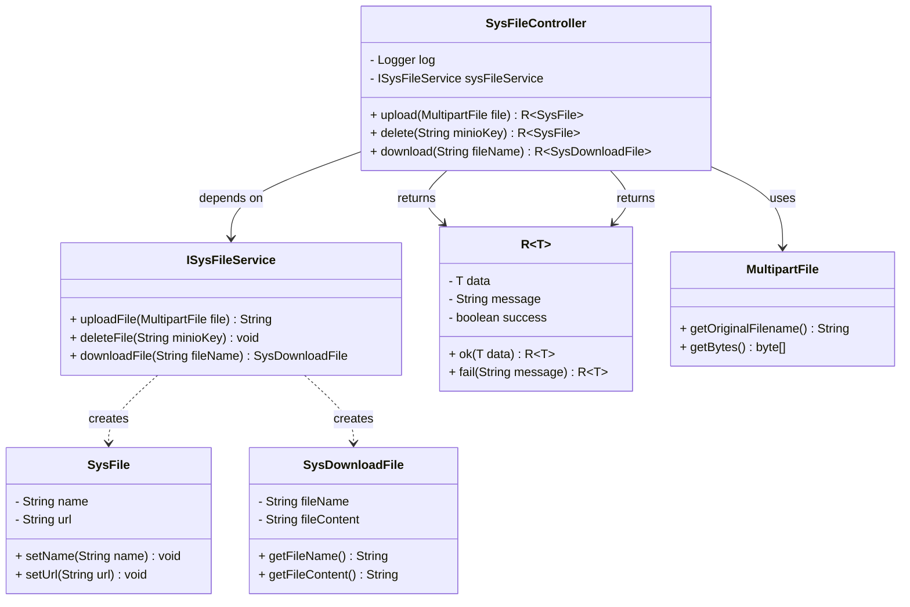
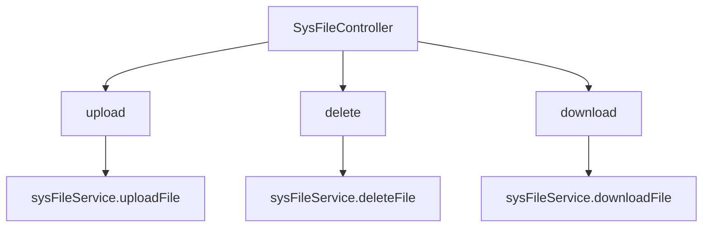

# 基础信息

|      |      |
|------|------|
| 编码语言 | .java |
| 代码路径 | aise-file/src/main/java/com/leaniss/file/controller/SysFileController.java |
| 包名 | com.leaniss.file.controller |
| 依赖项 | ['com.leaniss.system.api.domain.SysDownloadFile', 'io.swagger.models.auth.In', 'org.slf4j.Logger', 'org.slf4j.LoggerFactory', 'org.springframework.beans.factory.annotation.Autowired', 'org.springframework.http.MediaType', 'org.springframework.web.bind.annotation', 'org.springframework.web.multipart.MultipartFile', 'com.leaniss.common.core.domain.R', 'com.leaniss.common.core.utils.file.FileUtils', 'com.leaniss.file.service.ISysFileService', 'com.leaniss.system.api.domain.SysFile'] |
| 概述说明 | SysFileController类负责处理文件上传、删除和下载请求。通过upload方法上传文件并返回访问地址，delete方法删除指定minioKey的文件，download方法下载指定文件名的文件。所有操作由sysFileService执行，捕获异常并记录日志，返回操作结果。 |

# 说明

SysFileController类负责处理与文件相关的请求，包括文件的上传、删除和下载。通过upload方法，用户可以上传文件，上传成功后，系统会返回该文件的访问地址，方便用户后续访问。delete方法用于删除指定的文件，用户只需提供文件的minioKey即可完成删除操作。download方法则允许用户下载指定文件名的文件，系统会根据文件名找到对应的文件并提供下载链接。所有文件操作，包括上传、删除和下载，都是通过sysFileService来执行的。在执行这些操作时，系统会捕获可能出现的异常，并将异常信息记录到日志中，以便后续排查问题。最终，系统会根据操作的结果返回相应的信息，告知用户操作是否成功。

# 类列表 Class Summary

| 名称   | 类型  | 说明 |
|-------|------|-------------|
| SysFileController | class | SysFileController类处理文件上传、删除和下载请求。通过upload方法上传文件并返回访问地址，delete方法删除指定minioKey的文件，download方法下载指定文件名的文件。所有操作均通过sysFileService执行，并捕获异常记录日志，返回操作结果。 |

## 类 SysFileController

|      |      |
|------|------|
| 访问范围 | @RestController;public |
| 类型 | class |
| 名称 | SysFileController |
| 说明 | SysFileController类处理文件上传、删除和下载请求。通过upload方法上传文件并返回访问地址，delete方法删除指定minioKey的文件，download方法下载指定文件名的文件。所有操作均通过sysFileService执行，并捕获异常记录日志，返回操作结果。 |

### UML类图

### 描述信息：
该UML类图展示了`SysFileController`类与`ISysFileService`接口之间的关系，以及`SysFile`和`SysDownloadFile`类的结构。`SysFileController`通过依赖注入使用`ISysFileService`来处理文件上传、删除和下载操作，并返回`R`类型的响应对象。`ISysFileService`接口定义了文件操作的方法，并创建了`SysFile`和`SysDownloadFile`对象。

### 内部方法调用关系图

### 描述信息：
该图展示了`SysFileController`类中的三个主要方法：`upload`、`delete`和`download`。这些方法分别调用了`sysFileService`中的`uploadFile`、`deleteFile`和`downloadFile`方法，用于处理文件的上传、删除和下载操作。每个方法都包含异常处理逻辑，确保在操作失败时记录错误并返回相应的错误信息。

### 字段列表 Field List

| 名称  | 类型  | 说明 |
|-------|-------|------|
| log = LoggerFactory.getLogger(SysFileController.class) | Logger | 在SysFileController类中，使用LoggerFactory创建了一个静态的Logger实例，用于记录日志信息。 |
| sysFileService | ISysFileService | 在代码中，使用@Autowired注解自动注入了一个名为sysFileService的ISysFileService接口实例。 |

### 方法列表 Method List

| 名称  | 类型  | 说明 |
|-------|-------|------|
| upload | R<SysFile> | 该代码实现了一个文件上传功能，通过`@PostMapping`注解处理上传请求，调用`sysFileService.uploadFile`方法上传文件并返回访问地址，成功时返回包含文件名和URL的`SysFile`对象，失败时记录错误并返回失败信息。 |
| download | R<SysDownloadFile> | 该代码定义了一个POST请求接口，路径为"download"，用于下载文件。接口接收文件名作为参数，调用`sysFileService.downloadFile`方法下载文件并返回文件信息。若下载成功，返回文件信息；若失败，记录错误日志并返回失败信息。 |
| delete | R<SysFile> | 该代码定义了一个删除文件的API接口，通过`@DeleteMapping`注解映射到`remote/delete`路径。方法接收一个`minioKey`参数，调用`sysFileService.deleteFile`方法删除对应的Minio文件。若删除成功返回成功响应，失败则记录错误日志并返回失败信息。 |

