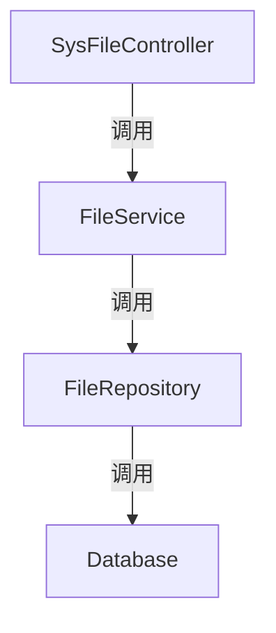

# 基础信息

|      |      |
|------|------|
| 编码语言 | .java |
| 代码路径 | aise-file/src/main/java/com/leaniss/file/controller |
| 包名 | com.leaniss.file.controller |
| 概述说明 | SysFileController类负责处理文件上传、删除和下载请求。通过upload方法上传文件并返回访问地址，delete方法删除指定minioKey的文件，download方法下载指定文件名的文件。所有操作由sysFileService执行，捕获异常并记录日志，返回操作结果。 |

# 说明

SysFileController类负责处理与文件相关的请求，包括文件的上传、删除和下载。通过upload方法，用户可以上传文件，上传成功后，系统会返回该文件的访问地址，方便用户后续访问。delete方法用于删除指定的文件，用户只需提供文件的minioKey即可完成删除操作。download方法则允许用户下载指定文件名的文件，系统会根据文件名找到对应的文件并提供下载链接。所有文件操作，包括上传、删除和下载，都是通过sysFileService来执行的。在执行这些操作时，系统会捕获可能出现的异常，并将异常信息记录到日志中，以便后续排查问题。最终，系统会根据操作的结果返回相应的信息，告知用户操作是否成功。

### 包内部结构视图

### 描述信息：
该Mermaid图展示了`SysFileController`类中的方法调用关系。`SysFileController`调用`FileService`，`FileService`进一步调用`FileRepository`，最后`FileRepository`与`Database`进行交互。这个关系图清晰地展示了从控制器到数据库的调用链。

# 文件列表 File List

| 名称   | 类型  | 说明 |
|-------|------|-------------|
| [SysFileController.java](SysFileController.md) | file | SysFileController类负责处理文件上传、删除和下载请求。通过upload方法上传文件并返回访问地址，delete方法删除指定minioKey的文件，download方法下载指定文件名的文件。所有操作由sysFileService执行，捕获异常并记录日志，返回操作结果。 |

