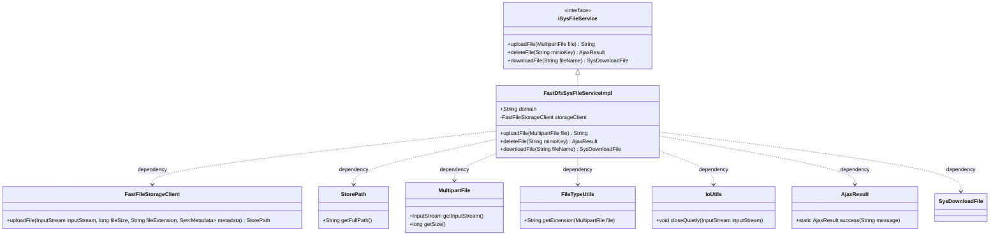
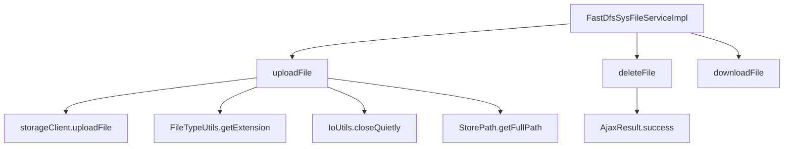

# 基础信息

|      |      |
|------|------|
| 编码语言 | .java |
| 代码路径 | aise-file/src/main/java/com/leaniss/file/service/FastDfsSysFileServiceImpl.java |
| 包名 | com.leaniss.file.service |
| 依赖项 | ['com.alibaba.nacos.common.utils.IoUtils', 'com.github.tobato.fastdfs.domain.fdfs.StorePath', 'com.github.tobato.fastdfs.service.FastFileStorageClient', 'com.leaniss.common.core.utils.file.FileTypeUtils', 'com.leaniss.common.core.web.domain.AjaxResult', 'com.leaniss.system.api.domain.SysDownloadFile', 'org.springframework.beans.factory.annotation.Autowired', 'org.springframework.beans.factory.annotation.Value', 'org.springframework.stereotype.Service', 'org.springframework.web.multipart.MultipartFile', 'java.io.InputStream'] |
| 概述说明 | FastDfsSysFileServiceImpl类实现了ISysFileService接口，提供文件上传、删除和下载功能。通过FastFileStorageClient上传文件并返回访问地址，删除文件返回成功信息，下载功能暂未实现。 |

# 说明

FastDfsSysFileServiceImpl类实现了ISysFileService接口，主要提供了文件上传、删除和下载的功能。在文件上传方面，该类通过FastFileStorageClient将文件上传到存储系统，并返回文件的访问地址，以便用户可以访问该文件。对于文件删除功能，该类能够成功删除指定的文件，并返回删除成功的相关信息。然而，文件下载功能目前尚未实现，这意味着用户暂时无法通过该类下载文件。总体而言，FastDfsSysFileServiceImpl类在文件管理方面提供了基本的上传和删除功能，但下载功能仍有待开发和完善。

# 类列表 Class Summary

| 名称   | 类型  | 说明 |
|-------|------|-------------|
| FastDfsSysFileServiceImpl | class | FastDfsSysFileServiceImpl类实现了ISysFileService接口，提供文件上传、删除和下载功能。通过FastFileStorageClient上传文件并返回访问地址，删除文件返回成功信息，下载文件功能暂未实现。 |

## 类 FastDfsSysFileServiceImpl

|      |      |
|------|------|
| 访问范围 | @Service;public |
| 类型 | class |
| 名称 | FastDfsSysFileServiceImpl |
| 说明 | FastDfsSysFileServiceImpl类实现了ISysFileService接口，提供文件上传、删除和下载功能。通过FastFileStorageClient上传文件并返回访问地址，删除文件返回成功信息，下载文件功能暂未实现。 |

### UML类图

### 描述信息：
该UML类图展示了`FastDfsSysFileServiceImpl`类实现了`ISysFileService`接口，并依赖于`FastFileStorageClient`、`StorePath`、`MultipartFile`、`FileTypeUtils`、`IoUtils`、`AjaxResult`和`SysDownloadFile`等类。`FastDfsSysFileServiceImpl`类提供了文件上传、删除和下载的功能。

### 内部方法调用关系图

### 描述信息：
该图展示了`FastDfsSysFileServiceImpl`类中的方法调用关系。`uploadFile`方法调用了`storageClient.uploadFile`、`FileTypeUtils.getExtension`、`IoUtils.closeQuietly`和`StorePath.getFullPath`方法。`deleteFile`方法调用了`AjaxResult.success`方法。`downloadFile`方法未调用其他方法。

### 字段列表 Field List

| 名称  | 类型  | 说明 |
|-------|-------|------|
| domain | String | 该代码片段定义了一个公共字符串变量`domain`，其值通过Spring的`@Value`注解从配置文件中获取，具体路径为`${fdfs.domain}`。 |
| storageClient | FastFileStorageClient | 代码片段中使用了Spring框架的@Autowired注解，自动注入了一个名为storageClient的FastFileStorageClient类型的私有变量。 |

### 方法列表 Method List

| 名称  | 类型  | 说明 |
|-------|-------|------|
| downloadFile | SysDownloadFile | 该方法名为`downloadFile`，接受一个字符串参数`fileName`，返回类型为`SysDownloadFile`，并可能抛出异常。当前实现返回`null`。 |
| uploadFile | String | 该方法用于上传文件，接收MultipartFile对象，获取输入流后通过storageClient上传文件，返回文件存储路径。上传完成后关闭输入流，返回完整文件访问路径。 |
| deleteFile | AjaxResult | 该方法名为deleteFile，接受一个String类型的参数minioKey，返回类型为AjaxResult。方法实现中直接返回了一个包含字符串"FastDfsSysFileServiceImpl"的AjaxResult成功响应。 |

