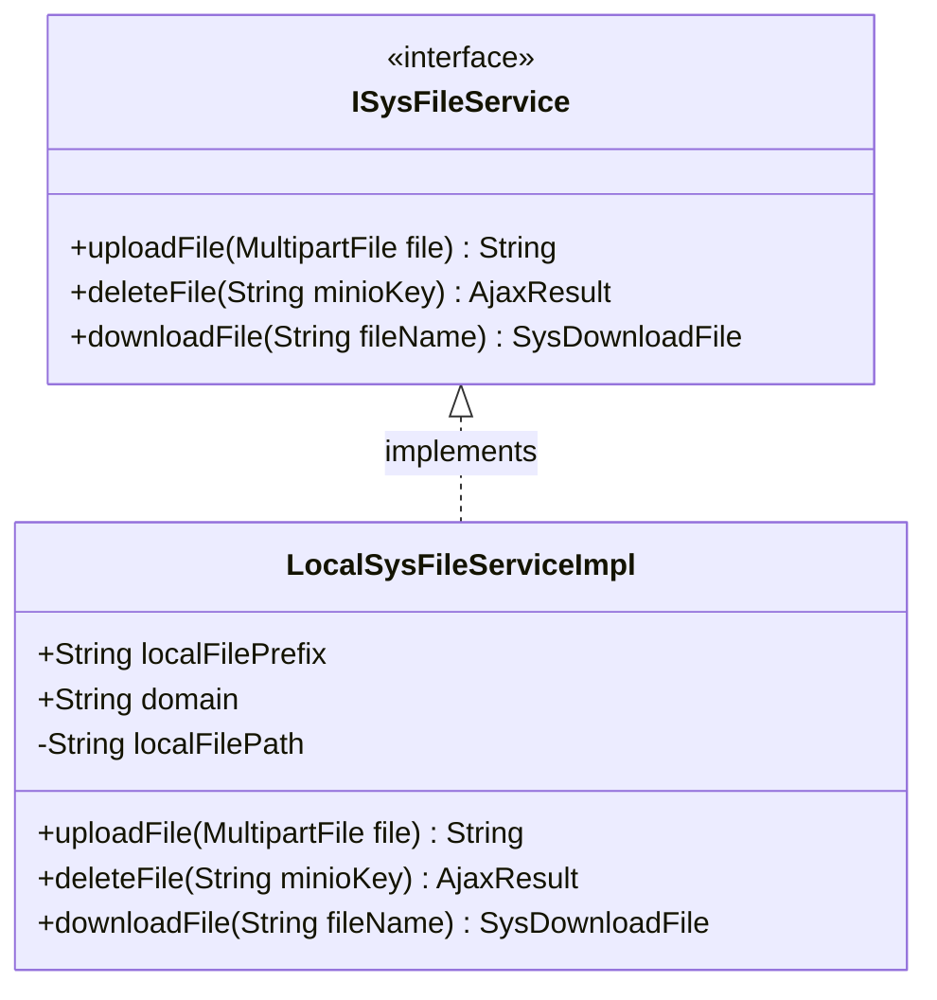
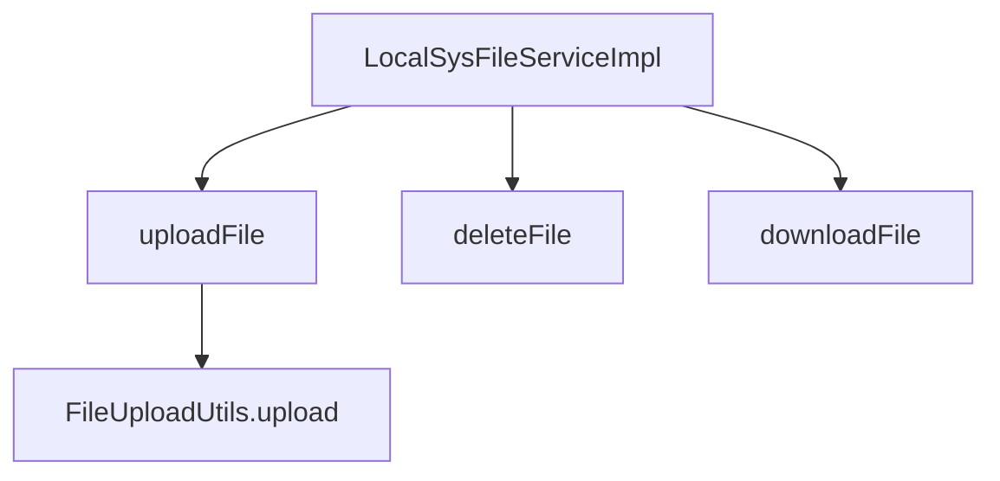

# 基础信息

|      |      |
|------|------|
| 编码语言 | .java |
| 代码路径 | aise-file/src/main/java/com/leaniss/file/service/LocalSysFileServiceImpl.java |
| 包名 | com.leaniss.file.service |
| 依赖项 | ['com.leaniss.common.core.web.domain.AjaxResult', 'com.leaniss.system.api.domain.SysDownloadFile', 'org.springframework.beans.factory.annotation.Value', 'org.springframework.context.annotation.Primary', 'org.springframework.stereotype.Service', 'org.springframework.web.multipart.MultipartFile', 'com.leaniss.file.utils.FileUploadUtils'] |
| 概述说明 | `LocalSysFileServiceImpl`类实现`ISysFileService`接口，负责本地文件管理。通过配置获取资源路径前缀、域名和存储路径，支持文件上传并返回访问地址，支持文件删除并返回成功信息，但未实现文件下载功能。 |

# 说明

`LocalSysFileServiceImpl`类是一个实现了`ISysFileService`接口的本地文件管理服务类。该类的主要功能是通过配置文件获取资源映射路径前缀、域名和本地存储路径，以便进行文件管理操作。具体功能包括文件上传、文件删除和文件下载。在文件上传功能中，用户可以将文件上传到本地存储路径，上传成功后，系统会返回该文件的访问地址，方便用户后续访问。文件删除功能允许用户删除指定的文件，并在删除操作成功后返回相应的成功信息。然而，文件下载功能目前尚未实现，这意味着用户暂时无法通过该服务类下载文件。总体而言，`LocalSysFileServiceImpl`类提供了基本的本地文件管理功能，但在下载功能方面仍有待完善。

# 类列表 Class Summary

| 名称   | 类型  | 说明 |
|-------|------|-------------|
| LocalSysFileServiceImpl | class | `LocalSysFileServiceImpl`类实现了`ISysFileService`接口，用于本地文件管理。通过配置文件获取资源映射路径前缀、域名和本地存储路径。提供文件上传功能，上传后返回访问地址；删除文件返回成功信息；下载文件功能未实现。 |

## 类 LocalSysFileServiceImpl

|      |      |
|------|------|
| 访问范围 | @Service;public |
| 类型 | class |
| 名称 | LocalSysFileServiceImpl |
| 说明 | `LocalSysFileServiceImpl`类实现了`ISysFileService`接口，用于本地文件管理。通过配置文件获取资源映射路径前缀、域名和本地存储路径。提供文件上传功能，上传后返回访问地址；删除文件返回成功信息；下载文件功能未实现。 |

### UML类图

### 描述信息：
该UML类图展示了`LocalSysFileServiceImpl`类实现了`ISysFileService`接口。`LocalSysFileServiceImpl`类包含三个属性：`localFilePrefix`、`domain`和`localFilePath`，并实现了接口中的三个方法：`uploadFile`、`deleteFile`和`downloadFile`。类图清晰地展示了接口与实现类之间的关系。

### 内部方法调用关系图

### 描述信息：
`LocalSysFileServiceImpl` 类实现了 `ISysFileService` 接口，提供了文件上传、删除和下载的功能。`uploadFile` 方法调用 `FileUploadUtils.upload` 来处理文件上传逻辑，并将文件存储在本地路径中。`deleteFile` 和 `downloadFile` 方法分别处理文件的删除和下载操作。

### 字段列表 Field List

| 名称  | 类型  | 说明 |
|-------|-------|------|
| localFilePath | String | 通过@Value注解从配置文件中注入file.path的值，并将其赋值给私有字符串变量localFilePath。 |
| domain | String | 该代码片段定义了一个公共字符串变量`domain`，其值通过`@Value`注解从配置文件中的`file.domain`属性注入。 |
| localFilePrefix | String | 该代码片段定义了一个公共字符串变量`localFilePrefix`，其值通过`@Value`注解从配置文件中获取，具体路径为`file.prefix`。 |

### 方法列表 Method List

| 名称  | 类型  | 说明 |
|-------|-------|------|
| downloadFile | SysDownloadFile | 该方法名为`downloadFile`，接受一个字符串参数`fileName`，返回类型为`SysDownloadFile`，并可能抛出`Exception`异常。当前方法实现返回`null`，未提供具体功能。 |
| uploadFile | String | 该方法用于上传文件，接收一个MultipartFile类型的文件参数，通过FileUploadUtils工具类将文件上传到指定本地路径，生成文件名后与域名和本地文件前缀拼接，返回完整的文件访问URL。 |
| deleteFile | AjaxResult | 该代码片段展示了一个Java方法`deleteFile`，它接受一个字符串参数`minioKey`，并返回一个`AjaxResult`对象，其中包含成功信息"LocalSysFileServiceImpl"。该方法用于删除文件，具体实现未展示。 |

