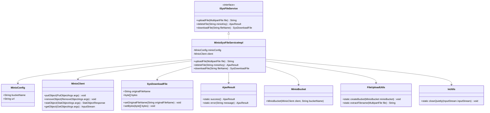
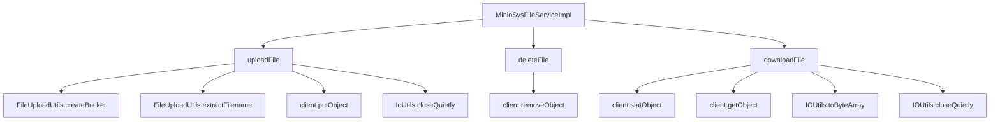

# 基础信息

|      |      |
|------|------|
| 编码语言 | .java |
| 代码路径 | aise-file/src/main/java/com/leaniss/file/service/MinioSysFileServiceImpl.java |
| 包名 | com.leaniss.file.service |
| 依赖项 | ['com.alibaba.nacos.common.utils.IoUtils', 'com.leaniss.common.core.config.MinioConfig', 'com.leaniss.common.core.utils.StringUtils', 'com.leaniss.common.core.web.domain.AjaxResult', 'com.leaniss.file.bean.MinioBucket', 'com.leaniss.file.utils.FileUploadUtils', 'com.leaniss.system.api.domain.SysDownloadFile', 'io.minio', 'org.apache.commons.io.IOUtils', 'org.springframework.beans.factory.annotation.Autowired', 'org.springframework.context.annotation.Primary', 'org.springframework.stereotype.Service', 'org.springframework.web.multipart.MultipartFile', 'java.io', 'java.util.HashMap', 'java.util.Map'] |
| 概述说明 | `MinioSysFileServiceImpl` 类实现 `ISysFileService` 接口，提供文件上传、删除和下载功能。上传时检查存储桶、生成文件名并设置元数据，返回访问地址；删除时根据键值移除对象；下载时获取元数据和原始文件名，返回文件流。所有操作通过 `MinioClient` 与 Minio 存储服务交互。 |

# 说明

`MinioSysFileServiceImpl` 类实现了 `ISysFileService` 接口，提供了文件上传、删除和下载的核心功能。在上传文件时，该类首先会检查指定的存储桶是否存在，如果不存在则进行相应的处理。接着，它会生成一个唯一的文件名，并设置文件的元数据，然后将文件上传到 Minio 存储服务中。上传完成后，系统会返回文件的访问地址，以便用户可以通过该地址访问文件。在删除文件时，该类会根据文件的键值（即唯一标识符）从 Minio 存储服务中移除对应的对象。下载文件时，系统会获取文件的元数据以及原始文件名，并返回文件流供用户下载。所有这些操作都是通过 `MinioClient` 与 Minio 存储服务进行交互的，确保了文件操作的高效性和可靠性。

# 类列表 Class Summary

| 名称   | 类型  | 说明 |
|-------|------|-------------|
| MinioSysFileServiceImpl | class | `MinioSysFileServiceImpl` 类实现了 `ISysFileService` 接口，提供文件上传、删除和下载功能。文件上传时，检查存储桶是否存在，生成文件名并设置元数据，上传后返回访问地址。删除文件时，根据键值移除对象。下载文件时，获取文件元数据和原始文件名，返回文件流。所有操作均通过 `MinioClient` 与 Minio 存储服务交互。 |

## 类 MinioSysFileServiceImpl

|      |      |
|------|------|
| 访问范围 | @Primary;@Service;public |
| 类型 | class |
| 名称 | MinioSysFileServiceImpl |
| 说明 | `MinioSysFileServiceImpl` 类实现了 `ISysFileService` 接口，提供文件上传、删除和下载功能。文件上传时，检查存储桶是否存在，生成文件名并设置元数据，上传后返回访问地址。删除文件时，根据键值移除对象。下载文件时，获取文件元数据和原始文件名，返回文件流。所有操作均通过 `MinioClient` 与 Minio 存储服务交互。 |

### UML类图

### 描述信息：
该UML类图展示了`MinioSysFileServiceImpl`类实现了`ISysFileService`接口，并依赖于`MinioConfig`、`MinioClient`、`SysDownloadFile`、`AjaxResult`、`MinioBucket`、`FileUploadUtils`和`IoUtils`等类。`MinioSysFileServiceImpl`类提供了文件上传、删除和下载的功能，并通过`MinioClient`与Minio存储服务进行交互。

### 内部方法调用关系图

### 描述信息：
该图展示了`MinioSysFileServiceImpl`类中的三个主要方法：`uploadFile`、`deleteFile`和`downloadFile`。`uploadFile`方法调用了`FileUploadUtils`类的方法来创建存储桶并提取文件名，然后通过`MinioClient`上传文件。`deleteFile`方法通过`MinioClient`删除文件。`downloadFile`方法通过`MinioClient`获取文件元数据和内容，并返回文件流。

### 字段列表 Field List

| 名称  | 类型  | 说明 |
|-------|-------|------|
| client | MinioClient | 在代码中，使用@Autowired注解自动注入了一个MinioClient类型的私有变量client。 |
| minioConfig | MinioConfig | 在代码中，使用@Autowired注解自动注入了一个MinioConfig类型的私有变量minioConfig。 |

### 方法列表 Method List

| 名称  | 类型  | 说明 |
|-------|-------|------|
| downloadFile | SysDownloadFile | 该方法用于从MinIO存储中下载文件。首先获取文件的元数据，确定原始文件名。然后通过MinIO客户端获取文件输入流，将其转换为字节数组并封装到SysDownloadFile对象中，最后返回该对象。 |
| deleteFile | AjaxResult | 该方法用于删除MinIO存储中的文件，接收minioKey作为参数。首先检查minioKey是否为空，若不为空则构建RemoveObjectArgs对象并调用client.removeObject方法删除文件。若删除过程中发生异常，返回错误信息；否则返回成功结果。 |
| uploadFile | String | 该方法用于上传文件到Minio存储服务。首先检查存储桶是否存在，若不存在则创建。提取文件名并确定内容类型，若为multipart/form-data则改为application/octet-stream。设置用户元数据以保存原始文件名，通过输入流上传文件，并返回文件的访问URL。 |

