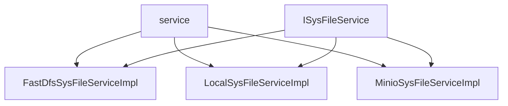

# 基础信息

|      |      |
|------|------|
| 编码语言 | .java |
| 代码路径 | aise-file/src/main/java/com/leaniss/file/service |
| 包名 | com.leaniss.file.service |
| 概述说明 | FastDfsSysFileServiceImpl类实现了ISysFileService接口，提供文件上传和删除功能，但下载功能未实现。文件上传通过FastFileStorageClient完成，返回文件访问地址；删除功能可成功移除指定文件。LocalSysFileServiceImpl类同样实现ISysFileService接口，支持本地文件的上传和删除，上传后返回访问地址，删除后返回成功信息，但下载功能也未实现。MinioSysFileServiceImpl类实现ISysFileService接口，提供完整的文件上传、删除和下载功能。上传时检查存储桶并生成唯一文件名，删除时根据文件键值移除对象，下载时返回文件流。所有操作通过MinioClient与Minio存储服务交互，确保高效可靠。 |

# 说明

FastDfsSysFileServiceImpl类、LocalSysFileServiceImpl类和MinioSysFileServiceImpl类均实现了ISysFileService接口，分别提供了基于不同存储系统的文件管理功能。FastDfsSysFileServiceImpl类主要支持文件上传和删除功能，通过FastFileStorageClient将文件上传到存储系统，并返回文件的访问地址，同时能够删除指定文件并返回成功信息，但文件下载功能尚未实现。LocalSysFileServiceImpl类则专注于本地文件管理，通过配置文件获取资源映射路径前缀、域名和本地存储路径，支持文件上传和删除功能，上传成功后返回文件访问地址，删除操作也返回成功信息，但同样缺少文件下载功能。MinioSysFileServiceImpl类提供了更为全面的文件管理功能，包括文件上传、删除和下载。在上传文件时，它会检查存储桶是否存在并生成唯一文件名，设置元数据后将文件上传到Minio存储服务，并返回访问地址。删除功能通过文件的键值从Minio中移除对象，而下载功能则获取文件的元数据和原始文件名，返回文件流供用户下载。所有操作均通过MinioClient与Minio存储服务交互，确保了操作的高效性和可靠性。总体而言，这三个类在文件管理方面各有侧重，FastDfsSysFileServiceImpl和LocalSysFileServiceImpl类在下载功能上仍需完善，而MinioSysFileServiceImpl类则提供了更完整的文件操作支持。

### 包内部结构视图

### 描述信息：
该图展示了`service`文件夹下的三个实现类（`FastDfsSysFileServiceImpl`、`LocalSysFileServiceImpl`、`MinioSysFileServiceImpl`）与接口`ISysFileService`之间的调用关系。所有实现类都依赖于`ISysFileService`接口，并通过`service`文件夹进行组织。

# 文件列表 File List

| 名称   | 类型  | 说明 |
|-------|------|-------------|
| [ISysFileService.java](ISysFileService.md) | file | 请提供需要总结的具体内容，以便我为您生成不超过100字的概要说明。 |
| [MinioSysFileServiceImpl.java](MinioSysFileServiceImpl.md) | file | `MinioSysFileServiceImpl` 类实现 `ISysFileService` 接口，提供文件上传、删除和下载功能。上传时检查存储桶、生成文件名并设置元数据，返回访问地址；删除时根据键值移除对象；下载时获取元数据和原始文件名，返回文件流。所有操作通过 `MinioClient` 与 Minio 存储服务交互。 |
| [LocalSysFileServiceImpl.java](LocalSysFileServiceImpl.md) | file | `LocalSysFileServiceImpl`类实现`ISysFileService`接口，负责本地文件管理。通过配置获取资源路径前缀、域名和存储路径，支持文件上传并返回访问地址，支持文件删除并返回成功信息，但未实现文件下载功能。 |
| [FastDfsSysFileServiceImpl.java](FastDfsSysFileServiceImpl.md) | file | FastDfsSysFileServiceImpl类实现了ISysFileService接口，提供文件上传、删除和下载功能。通过FastFileStorageClient上传文件并返回访问地址，删除文件返回成功信息，下载功能暂未实现。 |

