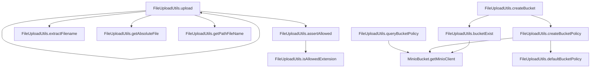

# 基础信息

|      |      |
|------|------|
| 编码语言 | .java |
| 代码路径 | aise-file/src/main/java/com/leaniss/file/utils/FileUploadUtils.java |
| 包名 | com.leaniss.file.utils |
| 依赖项 | ['java.io.File', 'java.io.IOException', 'java.nio.file.Paths', 'java.security.InvalidKeyException', 'java.security.NoSuchAlgorithmException', 'java.util.Objects', 'com.leaniss.file.bean.MinioBucket', 'io.minio.BucketExistsArgs', 'io.minio.GetBucketPolicyArgs', 'io.minio.MakeBucketArgs', 'io.minio.SetBucketPolicyArgs', 'io.minio.errors', 'lombok.SneakyThrows', 'org.apache.commons.io.FilenameUtils', 'org.springframework.web.multipart.MultipartFile', 'com.leaniss.common.core.exception.file.FileException', 'com.leaniss.common.core.exception.file.FileNameLengthLimitExceededException', 'com.leaniss.common.core.exception.file.FileSizeLimitExceededException', 'com.leaniss.common.core.exception.file.InvalidExtensionException', 'com.leaniss.common.core.utils.DateUtils', 'com.leaniss.common.core.utils.StringUtils', 'com.leaniss.common.core.utils.file.FileTypeUtils', 'com.leaniss.common.core.utils.file.MimeTypeUtils', 'com.leaniss.common.core.utils.uuid.Seq'] |
| 概述说明 | FileUploadUtils类提供文件上传功能，支持默认文件大小50M和文件名长度100的限制，包含文件类型、大小校验及路径处理。此外，支持MinIO桶的创建、存在检查、策略设置和查询，并生成和应用默认桶策略。 |

# 说明

FileUploadUtils类是一个用于处理文件上传的工具类，提供了多种功能以支持文件上传操作。该类默认支持上传文件的大小限制为50M，并且对文件名的长度也有限制，最大长度为100个字符。在上传过程中，类中的方法会进行文件类型校验和文件大小校验，确保上传的文件符合要求。此外，该类还负责处理文件上传路径的相关逻辑。

除了文件上传功能，FileUploadUtils类还集成了对MinIO存储桶的管理功能。具体来说，该类支持创建MinIO存储桶，并提供了检查存储桶是否存在的功能。同时，类中还包含了对存储桶策略的设置和查询功能，允许用户生成默认的存储桶策略并将其应用到指定的存储桶中。这些功能使得FileUploadUtils类不仅能够处理文件上传，还能够有效地管理与MinIO存储桶相关的操作，确保文件存储的合规性和安全性。

# 类列表 Class Summary

| 名称   | 类型  | 说明 |
|-------|------|-------------|
| FileUploadUtils | class | FileUploadUtils类提供文件上传功能，支持默认文件大小50M和文件名长度100的限制。上传方法包括文件类型校验、大小校验和路径处理。此外，类中还包含MinIO桶的创建、存在检查、策略设置和查询功能，支持默认桶策略的生成和应用。 |

## 类 FileUploadUtils

|      |      |
|------|------|
| 访问范围 | public |
| 类型 | class |
| 名称 | FileUploadUtils |
| 说明 | FileUploadUtils类提供文件上传功能，支持默认文件大小50M和文件名长度100的限制。上传方法包括文件类型校验、大小校验和路径处理。此外，类中还包含MinIO桶的创建、存在检查、策略设置和查询功能，支持默认桶策略的生成和应用。 |

### UML类图

```mermaid
classDiagram
    class FileUploadUtils {
        +DEFAULT_MAX_SIZE : long
        +DEFAULT_FILE_NAME_LENGTH : int
        +upload(String baseDir, MultipartFile file) : String
        +upload(String baseDir, MultipartFile file, String[] allowedExtension) : String
        +extractFilename(MultipartFile file) : String
        -getAbsoluteFile(String uploadDir, String fileName) : File
        -getPathFileName(String fileName) : String
        +assertAllowed(MultipartFile file, String[] allowedExtension) : void
        +isAllowedExtension(String extension, String[] allowedExtension) : boolean
        +createBucket(MinioBucket minioBucket) : void
        +bucketExist(MinioBucket minioBucket) : boolean
        +queryBucketPolicy(MinioBucket minioBucket) : StringBuilder
        +createBucketPolicy(MinioBucket minioBucket) : void
        +createBucketPolicy(StringBuilder builder, MinioBucket minioBucket) : void
        -defaultBucketPolicy(String bucketName) : StringBuilder
    }

    class MultipartFile {
        +getOriginalFilename() : String
        +getSize() : long
        +transferTo(Path dest) : void
    }

    class File {
        +exists() : boolean
        +getParentFile() : File
        +mkdirs() : boolean
        +isAbsolute() : boolean
        +getAbsoluteFile() : File
    }

    class MinioBucket {
        +getBucketName() : String
        +getRegion() : String
        +getMinioClient() : MinioClient
    }

    class MinioClient {
        +makeBucket(MakeBucketArgs args) : void
        +bucketExists(BucketExistsArgs args) : boolean
        +getBucketPolicy(GetBucketPolicyArgs args) : String
        +setBucketPolicy(SetBucketPolicyArgs args) : void
    }

    class FileSizeLimitExceededException {
        +FileSizeLimitExceededException(long maxSize) : void
    }

    class FileNameLengthLimitExceededException {
        +FileNameLengthExceededException(int maxLength) : void
    }

    class InvalidExtensionException {
        +InvalidExtensionException(String[] allowedExtension, String extension, String fileName) : void
    }

    class InvalidImageExtensionException {
        +InvalidImageExtensionException(String[] allowedExtension, String extension, String fileName) : void
    }

    class InvalidFlashExtensionException {
        +InvalidFlashExtensionException(String[] allowedExtension, String extension, String fileName) : void
    }

    class InvalidMediaExtensionException {
        +InvalidMediaExtensionException(String[] allowedExtension, String extension, String fileName) : void
    }

    class InvalidVideoExtensionException {
        +InvalidVideoExtensionException(String[] allowedExtension, String extension, String fileName) : void
    }

    FileUploadUtils ..> MultipartFile : 依赖
    FileUploadUtils ..> File : 依赖
    FileUploadUtils ..> MinioBucket : 依赖
    FileUploadUtils ..> MinioClient : 依赖
    FileUploadUtils ..> FileSizeLimitExceededException : 依赖
    FileUploadUtils ..> FileNameLengthLimitExceededException : 依赖
    FileUploadUtils ..> InvalidExtensionException : 依赖
    InvalidExtensionException <|-- InvalidImageExtensionException
    InvalidExtensionException <|-- InvalidFlashExtensionException
    InvalidExtensionException <|-- InvalidMediaExtensionException
    InvalidExtensionException <|-- InvalidVideoExtensionException
```

### 描述信息：
该UML类图展示了`FileUploadUtils`类的结构及其与其他类的关系。`FileUploadUtils`类负责文件上传、文件大小校验、文件名编码等功能，并依赖于`MultipartFile`、`File`、`MinioBucket`等类。此外，它还处理了多种异常情况，如文件大小超出限制、文件名过长等。

### 内部方法调用关系图

### 描述信息：
该图展示了`FileUploadUtils`类中方法之间的调用关系。`upload`方法调用了多个辅助方法如`assertAllowed`、`extractFilename`等来完成文件上传功能。`createBucket`方法则依赖于`bucketExist`和`createBucketPolicy`来创建和配置MinIO桶。整体调用关系清晰，确保了文件上传和桶管理的功能实现。

### 字段列表 Field List

| 名称  | 类型  | 说明 |
|-------|-------|------|
| DEFAULT_MAX_SIZE = 50 * 1024 * 1024 | long | DEFAULT_MAX_SIZE 是一个静态常量，表示默认的最大大小为50MB。 |
| DEFAULT_FILE_NAME_LENGTH = 100 | int | public static final int DEFAULT_FILE_NAME_LENGTH = 100 定义了一个常量，表示默认文件名的最大长度为100个字符。 |

### 方法列表 Method List

| 名称  | 类型  | 说明 |
|-------|-------|------|
| queryBucketPolicy | StringBuilder | 该方法使用`@SneakyThrows`注解处理异常，通过`MinioClient`获取指定Minio存储桶的策略，并将其封装到`StringBuilder`中返回。 |
| getPathFileName | String | 该方法接收一个文件名作为参数，返回以斜杠开头的文件路径字符串。如果输入的文件名为空或无效，可能会抛出IOException异常。 |
| getAbsoluteFile | File | 该方法用于获取指定上传目录和文件名的绝对路径文件对象。如果文件或父目录不存在，则创建父目录。最终返回文件的绝对路径对象。 |
| isAllowedExtension | boolean | 该方法用于检查给定文件扩展名是否在允许的扩展名列表中。通过遍历允许的扩展名数组，忽略大小写进行比较，如果匹配则返回true，否则返回false。 |
| createBucketPolicy | void | 该方法用于为Minio存储桶创建策略。如果传入的StringBuilder为空，则使用默认策略。最终通过Minio客户端设置存储桶策略，策略内容为StringBuilder的字符串形式。 |
| upload | String | 该方法用于上传文件，接收基础目录和文件作为参数，调用内部方法上传文件并指定默认允许的扩展名。若捕获到文件异常或其他异常，则抛出带有相应错误信息的IO异常。 |
| bucketExist | boolean | 该方法用于检查指定的Minio存储桶是否存在。通过调用Minio客户端的`bucketExists`方法，并传入存储桶名称作为参数，返回一个布尔值表示存储桶是否存在。方法可能抛出多种异常，包括IO异常、无效密钥异常、无效响应异常等。 |
| createBucket | void | 该方法用于在Minio中创建存储桶。首先检查桶是否已存在，若存在则直接返回。若不存在，则根据提供的桶名称和区域信息构建创建参数，并调用Minio客户端创建存储桶。最后，为新建的存储桶创建默认的访问策略。 |
| extractFilename | String | 该方法用于从MultipartFile对象中提取文件名，生成格式为“日期路径/原文件名_序列号.扩展名”的新文件名，其中日期路径通过DateUtils.datePath()获取，原文件名通过FilenameUtils.getBaseName()获取，序列号通过Seq.getId()生成，扩展名通过FileTypeUtils.getExtension()获取。 |
| defaultBucketPolicy | StringBuilder | 该方法生成一个默认的AWS S3存储桶策略，允许所有用户执行特定操作。策略包括两部分：第一部分允许获取存储桶位置和列出多部分上传，第二部分允许列出多部分上传部分、上传对象、中止多部分上传、删除对象和获取对象。策略适用于指定存储桶及其所有对象。 |
| createBucketPolicy | void | 该方法使用`@SneakyThrows`注解捕获异常，定义了一个静态方法`createBucketPolicy`，接受`MinioBucket`对象作为参数，并调用另一个重载方法，传入`StringBuilder`对象和`MinioBucket`对象。 |
| assertAllowed | void | 该方法用于验证上传文件的大小和扩展名是否允许。首先检查文件大小是否超过默认最大值，若超过则抛出FileSizeLimitExceededException。然后获取文件扩展名，若扩展名不在允许的列表中，则根据扩展名类型抛出相应的InvalidExtensionException异常。 |
| upload | String | 该方法用于上传文件，接受基础目录、文件对象和允许的扩展名数组作为参数。方法首先检查文件名长度是否超出限制，若超出则抛出异常。接着验证文件扩展名是否在允许范围内。然后提取文件名并生成绝对路径，将文件传输到指定路径，最后返回文件路径。过程中可能抛出文件大小超出、文件名长度超出、无效扩展名等异常。 |

