# 基础信息

|      |      |
|------|------|
| 编码语言 | .java |
| 代码路径 | yudao-module-ai |
| 概述说明 | RedisVectorStoreAutoConfiguration类是一个自动配置类，依赖JedisPooled、JedisConnectionFactory等组件，仅在存在JedisConnectionFactory时生效，支持FLAT和HSNW向量算法，允许自定义索引名称和内容字段，确保高效数据存储和检索。YudaoAiAutoConfiguration类配置AI功能，创建AiModelFactory及多个AI客户端，支持条件属性控制客户端启用状态。AiUtils类提供AI交互工具方法，MidjourneyApi、DeepSeekChatModel等类分别与不同AI服务交互，支持生成图片、音乐等功能。TongYiChatModel类支持流式和非流式聊天响应，TongYiAutoConfiguration类配置多个TongYi模型。AudioSpeechModels类管理音频语音模型，TongYiAudioSpeechModel类调用语音服务。测试框架涵盖多个聊天模型和图像生成API的测试，但均被禁用。该系统是一个综合性AI解决方案，涵盖AI聊天、写作、知识库、思维导图、音乐、绘画及角色管理等功能模块，通过RESTful API提供服务，确保数据安全性和合法性。 |

# 说明

RedisVectorStoreAutoConfiguration类是一个自动配置类，依赖于JedisPooled、JedisConnectionFactory、RedisVectorStore和EmbeddingModel等组件，仅在系统中存在JedisConnectionFactory bean时生效。它通过RedisVectorStoreProperties读取配置属性，创建并返回RedisVectorStore bean，支持FLAT和HSNW两种向量算法，允许自定义索引名称、前缀、内容字段等，确保数据高效存储和检索。RedisVectorStore类实现了VectorStore和InitializingBean接口，支持文档的添加、删除和相似性搜索操作，通过JedisPooled与Redis交互，支持JSON格式存储数据。

YudaoAiAutoConfiguration类通过@AutoConfiguration和@EnableConfigurationProperties注解配置AI相关功能，创建AiModelFactory及多个AI客户端，如DeepSeekChatModel、XingHuoChatModel等，支持通过条件属性控制客户端启用状态。YudaoAiProperties类管理多个AI服务配置，包含DeepSeek、讯飞星火、Midjourney和Suno等子配置类，灵活配置各AI服务的参数。AiModelFactoryImpl类实现AiModelFactory接口，管理多个AI平台的模型实例，通过缓存机制和单例模式提升系统性能。

AiUtils类提供与AI交互的工具方法，包括构建聊天选项和消息对象。MidjourneyApi类与Midjourney API交互，支持生成图片、放大和缩小图片等功能。DeepSeekChatModel类简化与DeepSeek API的通信，支持同步和异步调用。SunoApi类与Suno API交互，支持生成音乐、歌词等功能。XingHuoChatOptions类和XingHuoChatModel类分别用于配置和与星火API交互，支持同步和异步调用。

TongYiChatOptions类配置聊天模型生成参数，TongYiChatProperties类配置通义千问聊天客户端，TongYiChatModel类支持流式和非流式聊天响应。TongYiConstants类定义配置和常量，TongYiException和TongYiImagesException类处理异常。TongYiAutoConfiguration类配置多个TongYi模型，包括聊天、图像、语音和文本嵌入等。

AudioSpeechModels类管理音频语音模型，TongYiAudioSpeechOptions类配置音频合成选项，TongYiAudioSpeechModel类调用TongYi音频语音服务。SpeechPrompt、SpeechResponse、SpeechMessage和Speech类处理语音消息和响应。TongYiAudioTranscriptionProperties类配置音频转录功能，AudioTranscriptionResponse、AudioTranscriptionResult和AudioTranscriptionPrompt类处理音频转录响应和请求。

TongYiAudioSpeechResponseMetadata、TongYiAudioTranscriptionResponseMetadata、TongYiImagesResponseMetadata、TongYiAiUsage、TongYiTextEmbeddingResponseMetadata和TongYiAiChatResponseMetadata类分别处理语音合成、音频转录、图像合成、文本嵌入和聊天响应的元数据。TongYiTextEmbeddingProperties、TongYiEmbeddingOptions和TongYiTextEmbeddingModel类配置和处理文本嵌入任务。TongYiConnectionProperties、TongYiImagesProperties、TongYiImagesModel和TongYiImagesOptions类配置图像生成功能。

测试框架涵盖多个聊天模型和图像生成API的测试，包括ZhiPuAiChatModel、TongYiChatModel、DeepSeekChatModel等，测试方法包括同步调用和流式调用。图像生成API测试包括SunoApi、MidjourneyApi、OpenAiImageApi等，测试方法设置图像生成参数并调用API生成图像。尽管测试方法已编写完成，但均被禁用，未实际执行。

该管理后台系统是一个综合性的AI解决方案，涵盖了多个功能模块，包括AI聊天对话、AI写作、AI知识库、AI思维导图、AI音乐、AI绘画以及AI聊天角色和模型管理。每个模块通过RESTful API提供服务，并经过用户权限验证，确保数据的安全性和合法性。整体设计旨在提供一个高效、安全且易于管理的AI解决方案，满足用户对AI聊天、写作、知识库、思维导图、音乐、绘画以及角色和模型管理的多样化需求。

### 包内部结构视图

```mermaid
graph TD
    yudao-spring-boot-starter-ai --> src
    src --> main
    main --> java
    java --> org
    org --> springframework
    springframework --> ai
    ai --> autoconfigure
    autoconfigure --> vectorstore
    vectorstore --> redis
    redis --> RedisVectorStoreAutoConfiguration.java
    ai --> vectorstore
    vectorstore --> RedisVectorStore.java
    java --> cn
    cn --> iocoder
    iocoder --> yudao
    yudao --> framework
    framework --> ai
    ai --> package-info.java
    ai --> config
    config --> YudaoAiAutoConfiguration.java
    config --> YudaoAiProperties.java
    ai --> core
    core --> factory
    factory --> AiModelFactory.java
    factory --> AiModelFactoryImpl.java
    core --> enums
    enums --> AiPlatformEnum.java
    core --> util
    util --> AiUtils.java
    core --> model
    model --> midjourney
    midjourney --> api
    api --> MidjourneyApi.java
    model --> deepseek
    deepseek --> DeepSeekChatModel.java
    deepseek --> DeepSeekChatOptions.java
    model --> suno
    suno --> api
    api --> SunoApi.java
    model --> xinghuo
    xinghuo --> XingHuoChatOptions.java
    xinghuo --> XingHuoChatModel.java
    java --> com
    com --> alibaba
    alibaba --> cloud
    cloud --> ai
    ai --> tongyi
    tongyi --> chat
    chat --> TongYiChatOptions.java
    chat --> TongYiChatProperties.java
    chat --> TongYiChatModel.java
    tongyi --> common
    common --> constants
    constants --> TongYiConstants.java
    common --> exception
    exception --> TongYiException.java
    exception --> TongYiImagesException.java
    tongyi --> TongYiAutoConfiguration.java
    tongyi --> audio
    audio --> AudioSpeechModels.java
    audio --> speech
    speech --> TongYiAudioSpeechOptions.java
    speech --> TongYiAudioSpeechModel.java
    speech --> TongYiAudioSpeechProperties.java
    speech --> api
    api --> SpeechPrompt.java
    api --> SpeechStreamModel.java
    api --> SpeechModel.java
    api --> SpeechMetadata.java
    api --> SpeechResponse.java
    api --> SpeechMessage.java
    api --> Speech.java
    audio --> transcription
    transcription --> TongYiAudioTranscriptionProperties.java
    transcription --> api
    api --> AudioTranscriptionResponse.java
    api --> AudioTranscriptionResult.java
    api --> AudioTranscriptionPrompt.java
    transcription --> TongYiAudioTranscriptionOptions.java
    transcription --> TongYiAudioTranscriptionModel.java
    audio --> AudioTranscriptionModels.java
    tongyi --> metadata
    metadata --> audio
    audio --> TongYiAudioTranscriptionMetadata.java
    audio --> TongYiAudioSpeechResponseMetadata.java
    audio --> TongYiAudioTranscriptionResponseMetadata.java
    metadata --> TongYiImagesResponseMetadata.java
    metadata --> TongYiAiUsage.java
    metadata --> TongYiTextEmbeddingResponseMetadata.java
    metadata --> TongYiAiChatResponseMetadata.java
    tongyi --> embedding
    embedding --> TongYiTextEmbeddingProperties.java
    embedding --> TongYiEmbeddingOptions.java
    embedding --> TongYiTextEmbeddingModel.java
    tongyi --> TongYiConnectionProperties.java
    tongyi --> image
    image --> TongYiImagesProperties.java
    image --> TongYiImagesModel.java
    image --> TongYiImagesOptions.java
    main --> resources
    resources --> META-INF
    META-INF --> spring
    src --> test
    test --> java
    java --> cn
    cn --> iocoder
    iocoder --> yudao
    yudao --> framework
    framework --> ai
    ai --> chat
    chat --> ZhiPuAiChatModelTests.java
    chat --> TongYiChatModelTests.java
    chat --> DeepSeekChatModelTests.java
    chat --> LlamaChatModelTests.java
    chat --> OpenAIChatModelTests.java
    chat --> YiYanChatModelTests.java
    chat --> AzureOpenAIChatModelTests.java
    chat --> XingHuoChatModelTests.java
    ai --> music
    music --> SunoApiTests.java
    ai --> image
    image --> MidjourneyApiTests.java
    image --> OpenAiImageModelTests.java
    image --> StabilityAiImageModelTests.java
    image --> ZhiPuAiImageModelTests.java
    image --> TongYiImagesModelTest.java
    image --> QianFanImageTests.java
    yudao-module-ai-biz --> src
    src --> main
    main --> java
    java --> cn
    cn --> iocoder
    iocoder --> yudao
    yudao --> module
    module --> ai
    ai --> dal
    dal --> dataobject
    dataobject --> chat
    chat --> AiChatConversationDO.java
    chat --> AiChatMessageDO.java
    dataobject --> write
    write --> AiWriteDO.java
    dataobject --> knowledge
    knowledge --> AiKnowledgeDO.java
    knowledge --> AiKnowledgeSegmentDO.java
    knowledge --> AiKnowledgeDocumentDO.java
    dataobject --> mindmap
    mindmap --> AiMindMapDO.java
    dataobject --> music
    music --> AiMusicDO.java
    dataobject --> image
    image --> AiImageDO.java
    dataobject --> model
    model --> AiChatModelDO.java
    model --> AiChatRoleDO.java
    model --> AiApiKeyDO.java
    dal --> mysql
    mysql --> chat
    chat --> AiChatConversationMapper.java
    chat --> AiChatMessageMapper.java
    mysql --> write
    write --> AiWriteMapper.java
    mysql --> knowledge
    knowledge --> AiKnowledgeDocumentMapper.java
    knowledge --> AiKnowledgeMapper.java
    knowledge --> AiKnowledgeSegmentMapper.java
    mysql --> mindmap
    mindmap --> AiMindMapMapper.java
    mysql --> music
    music --> AiMusicMapper.java
    mysql --> image
    image --> AiImageMapper.java
    mysql --> model
    model --> AiChatModelMapper.java
    model --> AiChatRoleMapper.java
    model --> AiApiKeyMapper.java
    ai --> framework
    framework --> web
    web --> package-info.java
    web --> config
    config --> AiWebConfiguration.java
    framework --> package-info.java
    ai --> controller
    controller --> app
    app --> package-info.java
    controller --> package-info.java
    controller --> admin
    admin --> chat
    chat --> AiChatConversationController.java
    chat --> vo
    vo --> conversation
    conversation --> AiChatConversationCreateMyReqVO.java
    conversation --> AiChatConversationRespVO.java
    conversation --> AiChatConversationUpdateMyReqVO.java
    conversation --> AiChatConversationPageReqVO.java
    vo --> message
    message --> AiChatMessageRespVO.java
    message --> AiChatMessageSendReqVO.java
    message --> AiChatMessageSendRespVO.java
    message --> AiChatMessagePageReqVO.java
    chat --> AiChatMessageController.java
    admin --> write
    write --> vo
    vo --> AiWriteGenerateReqVO.java
    vo --> AiWriteRespVO.java
    vo --> AiWritePageReqVO.java
    write --> AiWriteController.java
    admin --> knowledge
    knowledge --> AiKnowledgeController.java
    knowledge --> vo
    vo --> knowledge
    knowledge --> AiKnowledgeUpdateReqVO.java
    knowledge --> AiKnowledgePageReqVO.java
    knowledge --> AiKnowledgeRespVO.java
    knowledge --> AiKnowledgeCreateReqVO.java
    knowledge --> AiKnowledgeDocumentCreateReqVO.java
    vo --> document
    document --> AiKnowledgeDocumentRespVO.java
    document --> AiKnowledgeDocumentUpdateReqVO.java
    document --> AiKnowledgeDocumentPageReqVO.java
    vo --> segment
    segment --> AiKnowledgeSegmentSearchReqVO.java
    segment --> AiKnowledgeSegmentUpdateStatusReqVO.java
    segment --> AiKnowledgeSegmentUpdateReqVO.java
    segment --> AiKnowledgeSegmentRespVO.java
    segment --> AiKnowledgeSegmentPageReqVO.java
    knowledge --> AiKnowledgeSegmentController.java
    knowledge --> AiKnowledgeDocumentController.java
    admin --> mindmap
    mindmap --> AiMindMapController.java
    mindmap --> vo
    vo --> AiMindMapRespVO.java
    vo --> AiMindMapPageReqVO.java
    vo --> AiMindMapGenerateReqVO.java
    admin --> music
    music --> AiMusicController.java
    music --> vo
    vo --> AiMusicUpdateMyReqVO.java
    vo --> AiMusicRespVO.java
    vo --> AiMusicPageReqVO.java
    vo --> AiSunoGenerateReqVO.java
    vo --> AiMusicUpdateReqVO.java
    admin --> image
    image --> AiImageController.java
    image --> vo
    vo --> AiImageRespVO.java
    vo --> AiImageUpdateReqVO.java
    vo --> midjourney
    midjourney --> AiMidjourneyImagineReqVO.java
    midjourney --> AiMidjourneyActionReqVO.java
    vo --> AiImagePublicPageReqVO.java
    vo --> AiImagePageReqVO.java
    vo --> AiImageDrawReqVO.java
    admin --> model
    model --> AiApiKeyController.java
    model --> AiChatModelController.java
    model --> AiChatRoleController.java
    model --> vo
    vo --> chatRole
    chatRole --> AiChatRoleRespVO.java
    chatRole --> AiChatRoleSaveReqVO.java
    chatRole --> AiChatRolePageReqVO.java
    chatRole --> AiChatRoleSaveMyReqVO.java
    vo --> chatModel
    chatModel --> AiChatModelSaveReqVO.java
    chatModel --> AiChatModelRespVO.java
    chatModel --> AiChatModelPageReqVO.java
    vo --> apikey
    apikey --> AiApiKeyRespVO.java
    apikey --> AiApiKeyPageReqVO.java
    apikey --> AiApiKeySaveReqVO.java
    ai --> service
    service --> chat
    chat --> AiChatMessageServiceImpl.java
    chat --> AiChatMessageService.java
    chat --> AiChatConversationServiceImpl.java
    chat --> AiChatConversationService.java
    service --> write
    write --> AiWriteServiceImpl.java
    write --> AiWriteService.java
    service --> knowledge
    knowledge --> AiKnowledgeDocumentServiceImpl.java
    knowledge --> AiKnowledgeSegmentService.java
    knowledge --> AiKnowledgeService.java
    knowledge --> AiKnowledgeServiceImpl.java
    knowledge --> AiKnowledgeSegmentServiceImpl.java
    knowledge --> AiKnowledgeDocumentService.java
    service --> mindmap
    mindmap --> AiMindMapServiceImpl.java
    mindmap --> AiMindMapService.java
    service --> music
    music --> AiMusicServiceImpl.java
    music --> AiMusicService.java
    service --> image
    image --> AiImageServiceImpl.java
    image --> AiImageService.java
    service --> model
    model --> AiChatModelService.java
    model --> AiApiKeyService.java
    model --> AiChatRoleServiceImpl.java
    model --> AiChatModelServiceImpl.java
    model --> AiChatRoleService.java
    model --> AiApiKeyServiceImpl.java
    ai --> job
    job --> music
    music --> AiSunoSyncJob.java
    job --> image
    image --> AiMidjourneySyncJob.java
    yudao-module-ai-api --> src
    src --> main
    main --> java
    java --> cn
    cn --> iocoder
    iocoder --> yudao
    yudao --> module
    module --> ai
    ai --> enums
    enums --> DictTypeConstants.java
    enums --> write
    write --> AiWriteTypeEnum.java
    enums --> ErrorCodeConstants.java
    enums --> knowledge
    knowledge --> AiKnowledgeDocumentStatusEnum.java
    enums --> AiChatRoleEnum.java
    enums --> music
    music --> AiMusicGenerateModeEnum.java
    music --> AiMusicStatusEnum.java
    enums --> image
    image --> AiImageStatusEnum.java
    ai --> api
    api --> package-info.java
```

### 描述信息：
该Mermaid图展示了`yudao-spring-boot-starter-ai`和`yudao-module-ai-biz`模块中的文件与文件夹之间的调用关系。图中清晰地展示了从根目录到各个子目录的层级结构，以及各个Java文件之间的依赖关系。通过该图，可以快速了解项目的整体结构和模块间的调用关系。

