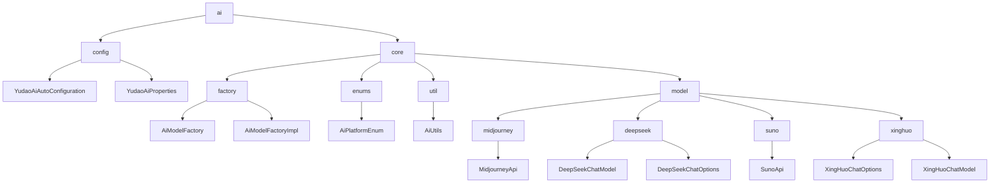

# 基础信息

|      |      |
|------|------|
| 编码语言 | .java |
| 代码路径 | yudao-module-ai/yudao-spring-boot-starter-ai/src/main/java/cn/iocoder/yudao/framework/ai |
| 包名 | cn.iocoder.yudao.framework.ai |
| 概述说明 | YudaoAiAutoConfiguration类通过注解实现AI功能配置，创建AiModelFactory及多个AI客户端，支持条件属性控制服务启用状态，涉及RAG组件。YudaoAiProperties类管理多个AI服务配置，包含DeepSeek、讯飞星火、Midjourney和Suno子配置类，灵活调整参数。AiModelFactoryImpl类实现AiModelFactory接口，管理多种AI模型实例，支持缓存和单例模式提升性能。AiUtils类提供与AI交互的工具方法，简化配置和消息生成。MidjourneyApi、DeepSeekChatModel、SunoApi和XingHuoChatModel类分别实现与相应API的交互，提供生成图片、聊天、音乐等功能，支持同步、异步调用和流式处理。 |

# 说明

YudaoAiAutoConfiguration类通过使用@AutoConfiguration和@EnableConfigurationProperties注解，实现了对AI相关功能的配置。该类主要负责创建AiModelFactory以及多个AI客户端，包括DeepSeekChatModel、XingHuoChatModel、MidjourneyApi和SunoApi等。这些客户端的启用可以通过条件属性进行控制，从而灵活地管理不同AI服务的启用状态。此外，该类还涉及RAG（Retrieval-Augmented Generation）相关的组件，如TokenTextSplitter和TokenCountEstimator，这些组件用于文本处理和分词计数等功能。不过，部分功能目前尚未完全实现或处于注释状态，可能需要在后续版本中进行完善。

YudaoAiProperties类是一个用于管理多个AI服务配置的类，包含四个子配置类，分别是DeepSeek、讯飞星火、Midjourney和Suno。每个子配置类都用于设置和存储各自AI服务的相关参数。DeepSeek和讯飞星火的配置类包括多个参数，如模型选择、温度设置和最大令牌数等。Midjourney的配置类主要包含基础URL和API密钥。Suno的配置类相对简单，仅包含启用状态和基础URL两个参数。通过这些配置类，YudaoAiProperties类能够灵活地管理和配置多个AI服务，确保它们能够根据需求进行启用和参数调整。

AiModelFactoryImpl类实现了AiModelFactory接口，主要用于获取或创建不同AI平台的模型实例，包括TongYi、YiYan、DeepSeek等。这些平台涵盖了多种类型的模型，如聊天模型、图像模型、Midjourney API、Suno API、嵌入模型和向量存储。通过缓存机制和单例模式，AiModelFactoryImpl类能够高效地管理和复用模型实例，避免重复创建，从而提升系统性能。

`AiUtils`类是一个用于处理与人工智能交互相关功能的工具类，主要包含两个核心方法。第一个方法是`buildChatOptions`，它根据指定的平台类型构建聊天选项，支持多个平台如TONG_YI、YI_YAN等，并处理模型类型、温度设置和最大令牌数等参数。第二个方法是`buildMessage`，它根据消息类型创建相应的消息对象，支持用户消息、助手消息、系统消息和函数消息。

MidjourneyApi类用于与Midjourney API进行交互，提供生成图片、放大和缩小图片等功能。通过WebClient发送POST请求与API通信，处理非2xx响应状态码并记录错误日志。支持设置通知地址以接收任务完成或状态变化的通知，并能返回任务提交结果和任务列表，方便管理任务进度。

DeepSeekChatModel类实现了ChatModel接口，简化了与DeepSeek API的通信。通过HTTP接口与OpenAI兼容的API交互，提供同步和异步调用方法，支持流式处理功能，减少内存消耗并提高处理效率。类包含默认选项和重试模板，减少配置复杂性，并通过API密钥初始化确保安全通信。

SunoApi类用于与Suno API交互，提供生成音乐、自定义生成音乐、生成歌词、获取音乐列表和查询限额使用情况等功能。通过WebClient实现通信，记录错误日志并抛出异常以便处理问题。

XingHuoChatOptions类实现了ChatOptions接口，包含模型、温度、最大Token等属性，默认模型为"generalv3.5"。支持无参和全参构造函数，以及Builder模式和fromOptions方法，提供灵活的配置选项。XingHuoChatModel类实现了ChatModel接口，用于与星火API交互。通过OpenAiApi通信，支持同步和异步调用方式。构造函数接收apiKey、secretKey、XingHuoChatOptions和RetryTemplate参数，确保实例化过程不会因缺少必要参数而失败。提供call和stream方法，分别用于处理请求并返回ChatResponse对象和支持流式响应。createRequest方法用于构建请求对象，合并默认选项和运行时选项，确保请求包含所有必要配置信息。

### 包内部结构视图

### 描述信息：
该Mermaid图展示了`yudao-module-ai`模块中各个文件夹和文件之间的调用关系。`ai`文件夹下包含`config`和`core`两个主要子文件夹，`core`文件夹进一步细分为`factory`、`enums`、`util`和`model`，每个子文件夹中包含具体的实现类或接口。图中清晰地展示了各个类之间的依赖关系。

# 文件列表 File List

| 名称   | 类型  | 说明 |
|-------|------|-------------|
| [package-info.java](package-info.md) | file | 请提供需要总结的具体内容，以便我为您生成概要说明。 |
| [core](core/_package.md) | folder | AiModelFactoryImpl类实现了AiModelFactory接口，用于获取或创建TongYi、YiYan、DeepSeek等AI平台的模型实例，涵盖聊天、图像、Midjourney API、Suno API、嵌入模型和向量存储等类型。通过缓存和单例模式提升性能，支持动态生成模型实例并获取默认模型，简化流程。AiUtils类提供buildChatOptions和buildMessage方法，简化与AI平台的交互。MidjourneyApi类支持图片生成、放大缩小等功能，通过WebClient与API通信。DeepSeekChatModel类实现ChatModel接口，支持同步、异步调用和流式处理。SunoApi类提供音乐生成、歌词生成等功能，通过WebClient通信。XingHuoChatOptions和XingHuoChatModel类分别用于配置和与星火API交互，支持同步、异步调用和流式响应。 |
| [config](config/_package.md) | folder | YudaoAiAutoConfiguration类通过@AutoConfiguration和@EnableConfigurationProperties注解实现AI功能配置，创建AiModelFactory及多个AI客户端（如DeepSeekChatModel、XingHuoChatModel等），并通过条件属性控制启用状态。涉及RAG组件如TokenTextSplitter和TokenCountEstimator，部分功能未完全实现。YudaoAiProperties类管理多个AI服务配置，包含DeepSeek、讯飞星火、Midjourney和Suno子配置类，分别设置模型、温度、最大令牌数、基础URL和API密钥等参数，灵活满足不同应用需求。 |

