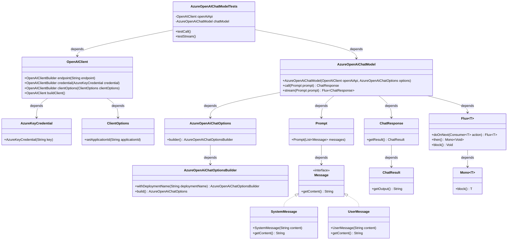
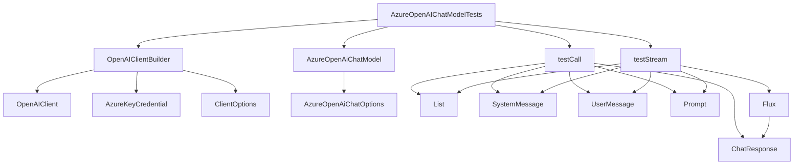

# 基础信息

|      |      |
|------|------|
| 编码语言 | .java |
| 代码路径 | yudao-module-ai/yudao-spring-boot-starter-ai/src/test/java/cn/iocoder/yudao/framework/ai/chat/AzureOpenAIChatModelTests.java |
| 包名 | cn.iocoder.yudao.framework.ai.chat |
| 依赖项 | ['com.azure.ai.openai.OpenAIClient', 'com.azure.ai.openai.OpenAIClientBuilder', 'com.azure.core.credential.AzureKeyCredential', 'com.azure.core.util.ClientOptions', 'org.junit.jupiter.api.Disabled', 'org.junit.jupiter.api.Test', 'org.springframework.ai.azure.openai.AzureOpenAiChatModel', 'org.springframework.ai.azure.openai.AzureOpenAiChatOptions', 'org.springframework.ai.chat.messages.Message', 'org.springframework.ai.chat.messages.SystemMessage', 'org.springframework.ai.chat.messages.UserMessage', 'org.springframework.ai.chat.model.ChatResponse', 'org.springframework.ai.chat.prompt.Prompt', 'reactor.core.publisher.Flux', 'java.util.ArrayList', 'java.util.List', 'org.springframework.ai.autoconfigure.azure.openai.AzureOpenAiChatProperties.DEFAULT_DEPLOYMENT_NAME'] |
| 概述说明 | 该代码演示了如何使用Azure OpenAI客户端测试聊天模型，包括构建OpenAIClient、设置端点、凭证和客户端选项，创建AzureOpenAiChatModel实例。测试涵盖同步调用`testCall`和异步流式调用`testStream`，分别通过`call`和`stream`方法发送系统消息和用户消息，并打印响应结果。两个测试方法均被禁用（@Disabled）。 |

# 说明

该代码展示了如何使用Azure OpenAI客户端进行聊天模型的测试。首先，通过构建OpenAIClient并设置端点、凭证和客户端选项，创建了一个AzureOpenAiChatModel实例。测试过程包括两个主要方法：同步调用`testCall`和异步流式调用`testStream`。在`testCall`方法中，使用`call`方法发送包含系统消息和用户消息的提示，并打印响应结果。而在`testStream`方法中，使用`stream`方法进行异步流式调用，同样发送包含系统消息和用户消息的提示，并打印响应结果。值得注意的是，这两个测试方法均被禁用，使用了`@Disabled`注解。整体上，该代码展示了如何通过Azure OpenAI客户端进行聊天模型的同步和异步测试，并处理了包含系统消息和用户消息的提示。

# 类列表 Class Summary

| 名称   | 类型  | 说明 |
|-------|------|-------------|
| AzureOpenAIChatModelTests | class | 该代码展示了如何使用Azure OpenAI客户端进行聊天模型的测试。通过构建OpenAIClient并设置端点、凭证和客户端选项，创建了AzureOpenAiChatModel实例。测试包括同步调用`testCall`和异步流式调用`testStream`，分别通过`call`和`stream`方法发送包含系统消息和用户消息的提示，并打印响应结果。两个测试方法均被禁用（@Disabled）。 |

## 类 AzureOpenAIChatModelTests

|      |      |
|------|------|
| 访问范围 | public |
| 类型 | class |
| 名称 | AzureOpenAIChatModelTests |
| 说明 | 该代码展示了如何使用Azure OpenAI客户端进行聊天模型的测试。通过构建OpenAIClient并设置端点、凭证和客户端选项，创建了AzureOpenAiChatModel实例。测试包括同步调用`testCall`和异步流式调用`testStream`，分别通过`call`和`stream`方法发送包含系统消息和用户消息的提示，并打印响应结果。两个测试方法均被禁用（@Disabled）。 |

### UML类图

### 描述信息：
该UML类图展示了`AzureOpenAIChatModelTests`类及其相关依赖关系。`AzureOpenAIChatModelTests`依赖于`OpenAIClient`和`AzureOpenAiChatModel`，后者进一步依赖于`AzureOpenAiChatOptions`和`Prompt`。`Prompt`依赖于`Message`接口，`SystemMessage`和`UserMessage`实现了该接口。`AzureOpenAiChatModel`还依赖于`ChatResponse`和`Flux`，用于处理流式响应。

### 内部方法调用关系图

### 描述信息
该图展示了`AzureOpenAIChatModelTests`类中方法间的调用关系。`testCall`和`testStream`方法分别调用了`AzureOpenAiChatModel`的`call`和`stream`方法，并处理了`ChatResponse`。`OpenAIClientBuilder`用于构建`OpenAIClient`，并通过`AzureKeyCredential`和`ClientOptions`进行配置。

### 字段列表 Field List

| 名称  | 类型  | 说明 |
|-------|-------|------|
| chatModel = new AzureOpenAiChatModel(openAiApi,
            AzureOpenAiChatOptions.builder().withDeploymentName(DEFAULT_DEPLOYMENT_NAME).build()) | AzureOpenAiChatModel | 创建了一个名为chatModel的AzureOpenAiChatModel实例，使用openAiApi和默认部署名称DEFAULT_DEPLOYMENT_NAME进行配置。 |
| openAiApi = (new OpenAIClientBuilder())
            .endpoint("https://eastusprejade.openai.azure.com")
            .credential(new AzureKeyCredential("xxx"))
            .clientOptions((new ClientOptions()).setApplicationId("spring-ai"))
            .buildClient() | OpenAIClient | 通过OpenAIClientBuilder创建OpenAIClient实例，设置端点为"https://eastusprejade.openai.azure.com"，使用AzureKeyCredential进行认证，并配置客户端选项的应用程序ID为"spring-ai"。 |

### 方法列表 Method List

| 名称  | 类型  | 说明 |
|-------|-------|------|
| testStream | void | 该代码片段展示了一个被禁用的测试方法，用于测试流式聊天模型。方法中创建了一个包含系统消息和用户消息的列表，调用聊天模型的流式处理方法，并打印每个响应的输出结果。 |
| testCall | void | 该代码片段展示了一个被禁用的测试方法`testCall`，用于测试聊天模型的调用。方法中创建了一个包含系统消息和用户消息的列表，系统消息指定了模型角色为文言文作者，用户消息为简单数学问题。随后调用聊天模型并打印响应结果及其输出内容。 |

