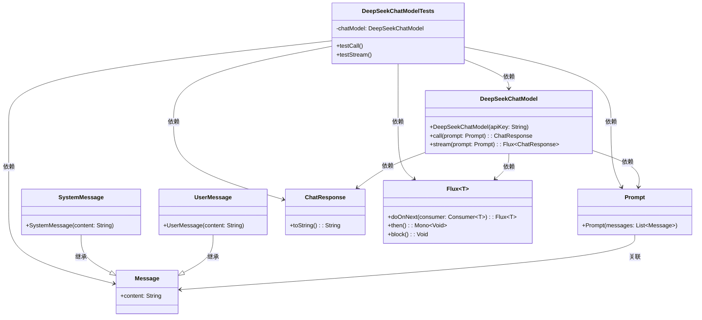

# 基础信息

|      |      |
|------|------|
| 编码语言 | .java |
| 代码路径 | yudao-module-ai/yudao-spring-boot-starter-ai/src/test/java/cn/iocoder/yudao/framework/ai/chat/DeepSeekChatModelTests.java |
| 包名 | cn.iocoder.yudao.framework.ai.chat |
| 依赖项 | ['cn.iocoder.yudao.framework.ai.core.model.deepseek.DeepSeekChatModel', 'org.junit.jupiter.api.Disabled', 'org.junit.jupiter.api.Test', 'org.springframework.ai.chat.messages.Message', 'org.springframework.ai.chat.messages.SystemMessage', 'org.springframework.ai.chat.messages.UserMessage', 'org.springframework.ai.chat.model.ChatResponse', 'org.springframework.ai.chat.prompt.Prompt', 'reactor.core.publisher.Flux', 'java.util.ArrayList', 'java.util.List'] |
| 概述说明 | DeepSeekChatModelTests类包含两个禁用测试方法：testCall和testStream。testCall通过chatModel.call处理包含系统消息和用户消息的列表并打印响应，testStream通过chatModel.stream处理消息并打印流式响应。 |

# 说明

DeepSeekChatModelTests类包含两个测试方法：testCall和testStream，这两个方法都使用DeepSeekChatModel进行测试。testCall方法通过调用chatModel.call来处理消息列表，并打印出响应结果。testStream方法则通过chatModel.stream来处理消息，并打印出流式响应。这两个测试方法目前均被禁用，无法执行。消息列表中包含系统消息和用户消息，用于模拟实际的聊天场景。通过这些测试方法，可以验证DeepSeekChatModel在处理消息时的功能表现，包括普通调用和流式调用的响应情况。

# 类列表 Class Summary

| 名称   | 类型  | 说明 |
|-------|------|-------------|
| DeepSeekChatModelTests | class | DeepSeekChatModelTests类包含两个测试方法：testCall和testStream，均使用DeepSeekChatModel进行测试。testCall方法通过调用chatModel.call处理消息列表并打印响应，testStream方法通过chatModel.stream处理消息并打印流式响应。两个测试方法均被禁用，且消息列表包含系统消息和用户消息。 |


## 类 DeepSeekChatModelTests

|      |      |
|------|------|
| 访问范围 | public |
| 类型 | class |
| 名称 | DeepSeekChatModelTests |
| 说明 | DeepSeekChatModelTests类包含两个测试方法：testCall和testStream，均使用DeepSeekChatModel进行测试。testCall方法通过调用chatModel.call处理消息列表并打印响应，testStream方法通过chatModel.stream处理消息并打印流式响应。两个测试方法均被禁用，且消息列表包含系统消息和用户消息。 |


### UML类图



### 描述信息：
该UML类图展示了`DeepSeekChatModelTests`类及其相关类的结构和关系。`DeepSeekChatModelTests`类依赖于`DeepSeekChatModel`、`Message`、`Prompt`、`ChatResponse`和`Flux`类。`SystemMessage`和`UserMessage`继承自`Message`类，`Prompt`类与`Message`类关联。`DeepSeekChatModel`类通过`call`和`stream`方法与`Prompt`、`ChatResponse`和`Flux`类交互。


### 内部方法调用关系图

```mermaid
graph TD
    DeepSeekChatModelTests --> testCall
    DeepSeekChatModelTests --> testStream
    testCall --> chatModel.call
    testStream --> chatModel.stream
    chatModel.call --> Prompt
    chatModel.stream --> Prompt
    Prompt --> List<Message>
    List<Message> --> SystemMessage
    List<Message> --> UserMessage
    chatModel.call --> ChatResponse
    chatModel.stream --> Flux<ChatResponse>
    ChatResponse --> System.out.println
    Flux<ChatResponse> --> System.out.println
```

### 描述信息：
该图展示了`DeepSeekChatModelTests`类中的两个测试方法`testCall`和`testStream`如何调用`DeepSeekChatModel`类的`call`和`stream`方法。这两个方法都接收一个`Prompt`对象作为参数，`Prompt`对象包含一个`List<Message>`，其中包含`SystemMessage`和`UserMessage`。最终，`call`方法返回`ChatResponse`，而`stream`方法返回`Flux<ChatResponse>`，并通过`System.out.println`打印结果。

### 字段列表 Field List

| 名称  | 类型  | 说明 |
|-------|-------|------|
| chatModel = new DeepSeekChatModel("sk-e94db327cc7d457d99a8de8810fc6b12") | DeepSeekChatModel | 该代码片段创建了一个名为`chatModel`的私有最终变量，其类型为`DeepSeekChatModel`，并通过构造函数初始化，传入了一个API密钥`"sk-e94db327cc7d457d99a8de8810fc6b12"`。 |

### 方法列表 Method List

| 名称  | 类型  | 说明 |
|-------|-------|------|
| testStream | void | 该代码片段展示了一个被禁用的测试方法`testStream`，用于测试流式聊天模型。方法中创建了一个包含系统消息和用户消息的列表，调用`chatModel.stream`方法处理这些消息，并通过流式响应打印结果。 |
| testCall | void | 该代码片段展示了一个被禁用的测试方法，用于测试调用聊天模型。方法中创建了一个包含系统消息和用户消息的列表，系统消息设定模型为文言文作者，用户消息询问简单数学问题。随后调用聊天模型并打印响应结果。 |


