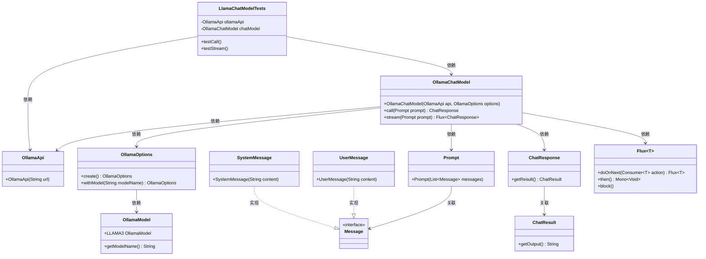

# 基础信息

|      |      |
|------|------|
| 编码语言 | .java |
| 代码路径 | yudao-module-ai/yudao-spring-boot-starter-ai/src/test/java/cn/iocoder/yudao/framework/ai/chat/LlamaChatModelTests.java |
| 包名 | cn.iocoder.yudao.framework.ai.chat |
| 依赖项 | ['org.junit.jupiter.api.Disabled', 'org.junit.jupiter.api.Test', 'org.springframework.ai.chat.messages.Message', 'org.springframework.ai.chat.messages.SystemMessage', 'org.springframework.ai.chat.messages.UserMessage', 'org.springframework.ai.chat.model.ChatResponse', 'org.springframework.ai.chat.prompt.Prompt', 'org.springframework.ai.ollama.OllamaChatModel', 'org.springframework.ai.ollama.api.OllamaApi', 'org.springframework.ai.ollama.api.OllamaModel', 'org.springframework.ai.ollama.api.OllamaOptions', 'reactor.core.publisher.Flux', 'java.util.ArrayList', 'java.util.List'] |
| 概述说明 | LlamaChatModelTests类测试了OllamaChatModel的call和stream方法，通过OllamaApi与本地服务器通信。测试中，系统消息设定模型为文言文作者，用户消息询问1+1的结果，分别通过call和stream方法获取并打印响应结果。两个测试方法均被禁用。 |

# 说明

LlamaChatModelTests类用于测试OllamaChatModel的call和stream方法，这些方法通过OllamaApi与本地服务器进行通信。在测试过程中，系统消息被设定为模拟文言文作者的角色，用户消息则提出了一个简单的数学问题，即询问1+1的结果。测试分别通过call和stream方法来获取并打印响应结果。call方法用于同步获取响应，而stream方法则用于异步流式获取响应。尽管这两个测试方法被设计用于验证OllamaChatModel的功能，但在实际测试中，这两个方法均被禁用，意味着它们并未被执行或生效。这一测试场景展示了如何通过本地服务器与模型进行交互，并验证其响应能力，但由于测试方法的禁用，具体的响应结果和性能表现未能得到实际验证。

# 类列表 Class Summary

| 名称   | 类型  | 说明 |
|-------|------|-------------|
| LlamaChatModelTests | class | LlamaChatModelTests类测试了OllamaChatModel的call和stream方法，使用OllamaApi与本地服务器通信。测试中，系统消息设定模型为文言文作者，用户消息询问1+1的结果，分别通过call和stream方法获取并打印响应结果。两个测试方法均被禁用。 |


## 类 LlamaChatModelTests

|      |      |
|------|------|
| 访问范围 | public |
| 类型 | class |
| 名称 | LlamaChatModelTests |
| 说明 | LlamaChatModelTests类测试了OllamaChatModel的call和stream方法，使用OllamaApi与本地服务器通信。测试中，系统消息设定模型为文言文作者，用户消息询问1+1的结果，分别通过call和stream方法获取并打印响应结果。两个测试方法均被禁用。 |


### UML类图



### 描述信息：
该UML类图展示了`LlamaChatModelTests`类及其相关依赖的类结构。`LlamaChatModelTests`依赖于`OllamaApi`和`OllamaChatModel`，而`OllamaChatModel`又依赖于`OllamaApi`和`OllamaOptions`。`OllamaOptions`进一步依赖于`OllamaModel`。`SystemMessage`和`UserMessage`实现了`Message`接口，`Prompt`类与`Message`类关联。`ChatResponse`与`ChatResult`关联，`OllamaChatModel`通过`call`和`stream`方法与`Prompt`和`ChatResponse`交互。


### 内部方法调用关系图

```mermaid
graph TD
    LlamaChatModelTests --> OllamaApi
    LlamaChatModelTests --> OllamaChatModel
    LlamaChatModelTests --> testCall
    LlamaChatModelTests --> testStream
    testCall --> chatModel.call
    testStream --> chatModel.stream
    chatModel.call --> Prompt
    chatModel.stream --> Prompt
    Prompt --> List<Message>
    List<Message> --> SystemMessage
    List<Message> --> UserMessage
    chatModel.call --> ChatResponse
    chatModel.stream --> Flux<ChatResponse>
    ChatResponse --> response.getResult.getOutput
    Flux<ChatResponse --> response.getResult.getOutput
```

### 描述信息：
该图展示了`LlamaChatModelTests`类中方法的调用关系。`testCall`和`testStream`方法分别调用`chatModel.call`和`chatModel.stream`，并通过`Prompt`对象传递消息列表。最终，`ChatResponse`和`Flux<ChatResponse>`被处理并输出结果。

### 字段列表 Field List

| 名称  | 类型  | 说明 |
|-------|-------|------|
| chatModel = new OllamaChatModel(ollamaApi,
            OllamaOptions.create().withModel(OllamaModel.LLAMA3.getModelName())) | OllamaChatModel | 创建了一个私有的OllamaChatModel实例，使用ollamaApi和OllamaOptions配置，指定模型为OllamaModel.LLAMA3。 |
| ollamaApi = new OllamaApi(
            "http://127.0.0.1:11434") | OllamaApi | 创建了一个名为ollamaApi的私有最终变量，使用OllamaApi类的新实例初始化，并指定了API的基础URL为"http://127.0.0.1:11434"。 |

### 方法列表 Method List

| 名称  | 类型  | 说明 |
|-------|-------|------|
| testStream | void | 该代码片段展示了一个被禁用的测试方法`testStream`，用于测试流式聊天模型。方法中创建了一个包含系统消息和用户消息的列表，调用`chatModel.stream`方法处理这些消息，并通过流式响应打印输出结果。 |
| testCall | void | 该代码片段展示了一个测试方法，用于调用聊天模型生成文言文回复。测试方法中，首先准备了一个包含系统消息和用户消息的列表，系统消息指定模型为文言文作者，用户消息为数学问题。接着调用聊天模型并打印响应结果及其输出内容。该测试方法当前被禁用。 |


