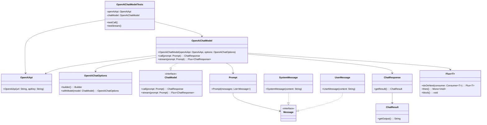

# 基础信息

|      |      |
|------|------|
| 编码语言 | .java |
| 代码路径 | yudao-module-ai/yudao-spring-boot-starter-ai/src/test/java/cn/iocoder/yudao/framework/ai/chat/OpenAIChatModelTests.java |
| 包名 | cn.iocoder.yudao.framework.ai.chat |
| 依赖项 | ['org.junit.jupiter.api.Disabled', 'org.junit.jupiter.api.Test', 'org.springframework.ai.chat.messages.Message', 'org.springframework.ai.chat.messages.SystemMessage', 'org.springframework.ai.chat.messages.UserMessage', 'org.springframework.ai.chat.model.ChatResponse', 'org.springframework.ai.chat.prompt.Prompt', 'org.springframework.ai.openai.OpenAiChatModel', 'org.springframework.ai.openai.OpenAiChatOptions', 'org.springframework.ai.openai.api.OpenAiApi', 'reactor.core.publisher.Flux', 'java.util.ArrayList', 'java.util.List'] |
| 概述说明 | OpenAIChatModelTests类测试了OpenAiChatModel的同步和流式调用功能，配置使用GPT-4模型并模拟文言文作者角色。测试包括准备消息列表、调用模型并打印结果，流式调用使用Flux处理响应。所有测试用例均被禁用。 |

# 说明

OpenAIChatModelTests类旨在测试OpenAiChatModel的功能，涵盖了同步调用和流式调用两种方式。在测试过程中，模型被配置为使用GPT-4模型，并模拟了一个文言文作者的角色，以验证其在不同场景下的表现。测试用例包括准备消息列表、调用模型并打印结果。对于流式调用，测试使用了Flux来处理响应，以确保模型能够以流式方式返回结果。尽管测试用例设计得较为全面，但所有测试用例均被禁用，意味着这些测试在当前状态下并未实际执行。这一测试类的设计目的是为了验证OpenAiChatModel在不同调用方式下的功能完整性，但由于测试被禁用，实际效果尚未得到验证。

# 类列表 Class Summary

| 名称   | 类型  | 说明 |
|-------|------|-------------|
| OpenAIChatModelTests | class | OpenAIChatModelTests类测试了OpenAiChatModel的功能，包括同步调用和流式调用。测试中，模型被配置为使用GPT-4模型，并模拟了一个文言文作者的角色。测试用例包括准备消息列表、调用模型并打印结果，其中流式调用使用Flux处理响应。所有测试用例均被禁用。 |


## 类 OpenAIChatModelTests

|      |      |
|------|------|
| 访问范围 | public |
| 类型 | class |
| 名称 | OpenAIChatModelTests |
| 说明 | OpenAIChatModelTests类测试了OpenAiChatModel的功能，包括同步调用和流式调用。测试中，模型被配置为使用GPT-4模型，并模拟了一个文言文作者的角色。测试用例包括准备消息列表、调用模型并打印结果，其中流式调用使用Flux处理响应。所有测试用例均被禁用。 |


### UML类图



### 描述信息
该UML类图展示了`OpenAIChatModelTests`类及其相关类的结构和关系。`OpenAIChatModelTests`类依赖于`OpenAiApi`和`OpenAiChatModel`类，`OpenAiChatModel`实现了`ChatModel`接口，并通过`Prompt`类与`Message`类进行交互。`ChatResponse`和`ChatResult`类用于处理聊天响应的结果。


### 内部方法调用关系图

```mermaid
graph TD
    OpenAIChatModelTests --> OpenAiApi
    OpenAIChatModelTests --> OpenAiChatModel
    OpenAiChatModel --> OpenAiApi
    OpenAIChatModelTests --> testCall
    OpenAIChatModelTests --> testStream
    testCall --> chatModel.call
    testStream --> chatModel.stream
    chatModel.call --> Prompt
    chatModel.stream --> Prompt
    Prompt --> List<Message>
    List<Message> --> SystemMessage
    List<Message> --> UserMessage
    chatModel.call --> ChatResponse
    chatModel.stream --> Flux<ChatResponse>
    ChatResponse --> getResult
    getResult --> getOutput
    Flux<ChatResponse> --> doOnNext
    doOnNext --> getResult
    getResult --> getOutput
```

### 描述信息：
该图展示了`OpenAIChatModelTests`类中方法的调用关系。`testCall`和`testStream`方法分别调用了`chatModel.call`和`chatModel.stream`，并通过`Prompt`对象传递消息列表。`ChatResponse`和`Flux<ChatResponse>`用于处理响应，最终通过`getResult`和`getOutput`获取输出结果。

### 字段列表 Field List

| 名称  | 类型  | 说明 |
|-------|-------|------|
| chatModel = new OpenAiChatModel(openAiApi,
            OpenAiChatOptions.builder().withModel(OpenAiApi.ChatModel.GPT_4_O).build()) | OpenAiChatModel | 代码创建了一个名为chatModel的私有最终变量，使用OpenAiChatModel类初始化，传入openAiApi和配置了GPT-4_O模型的OpenAiChatOptions对象。 |
| openAiApi = new OpenAiApi(
            "https://api.holdai.top",
            "sk-dZEPiVaNcT3FHhef51996bAa0bC74806BeAb620dA5Da10Bf") | OpenAiApi | 代码片段创建了一个OpenAiApi实例，使用指定的API地址"https://api.holdai.top"和API密钥"sk-dZEPiVaNcT3FHhef51996bAa0bC74806BeAb620dA5Da10Bf"进行初始化。 |

### 方法列表 Method List

| 名称  | 类型  | 说明 |
|-------|-------|------|
| testStream | void | 该代码片段展示了一个被禁用的测试方法，用于测试流式处理聊天模型。方法中创建了一个包含系统消息和用户消息的列表，调用聊天模型的流式处理方法，并打印每个响应的输出结果。 |
| testCall | void | 该代码片段展示了一个被禁用的测试方法`testCall()`，用于测试调用聊天模型。首先，准备了一个包含系统消息和用户消息的列表，系统消息设定角色为文言文作者，用户消息为简单数学问题。然后，调用聊天模型并传入提示信息，最后打印模型响应及其输出结果。 |


