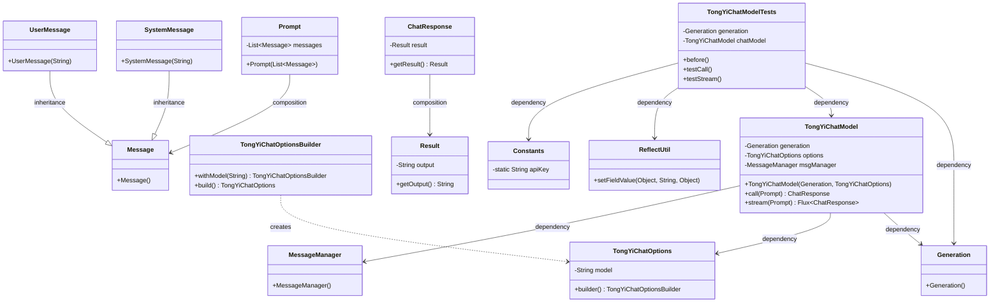
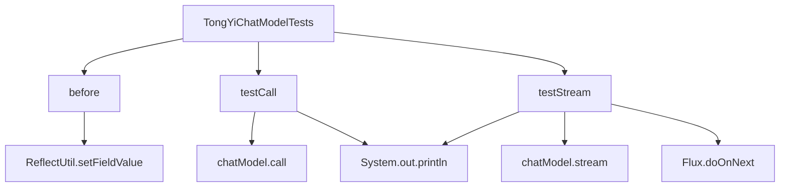

# 基础信息

|      |      |
|------|------|
| 编码语言 | .java |
| 代码路径 | yudao-module-ai/yudao-spring-boot-starter-ai/src/test/java/cn/iocoder/yudao/framework/ai/chat/TongYiChatModelTests.java |
| 包名 | cn.iocoder.yudao.framework.ai.chat |
| 依赖项 | ['cn.hutool.core.util.ReflectUtil', 'com.alibaba.cloud.ai.tongyi.chat.TongYiChatModel', 'com.alibaba.cloud.ai.tongyi.chat.TongYiChatOptions', 'com.alibaba.dashscope.aigc.generation.Generation', 'com.alibaba.dashscope.common.MessageManager', 'com.alibaba.dashscope.utils.Constants', 'org.junit.jupiter.api.BeforeEach', 'org.junit.jupiter.api.Disabled', 'org.junit.jupiter.api.Test', 'org.springframework.ai.chat.messages.Message', 'org.springframework.ai.chat.messages.SystemMessage', 'org.springframework.ai.chat.messages.UserMessage', 'org.springframework.ai.chat.model.ChatResponse', 'org.springframework.ai.chat.prompt.Prompt', 'reactor.core.publisher.Flux', 'java.util.ArrayList', 'java.util.List'] |
| 概述说明 | 该代码测试了TongYiChatModel的调用和流式处理功能，包括同步调用（testCall）和流式处理（testStream）。测试类初始化了模型并设置了API密钥，输入包含系统消息和用户消息，输出结果通过控制台打印。测试方法被禁用，未实际执行。 |

# 说明

该代码主要用于测试TongYiChatModel的调用和流式处理功能。测试类中首先初始化了TongYiChatModel，并设置了API密钥以确保模型能够正确访问相关服务。测试方法包括两个主要部分：testCall和testStream。testCall方法用于测试同步调用功能，即模型在接收到系统消息和用户消息后，能够立即返回处理结果，并将输出结果通过控制台打印出来。testStream方法则用于测试流式处理功能，即模型能够逐步处理输入消息，并在处理过程中逐步输出结果，同样通过控制台打印。尽管这两个测试方法被编写并包含在代码中，但它们被禁用，未实际执行。这意味着代码的主要目的是展示如何配置和调用TongYiChatModel的同步和流式处理功能，而不是在实际环境中运行这些测试。

# 类列表 Class Summary

| 名称   | 类型  | 说明 |
|-------|------|-------------|
| TongYiChatModelTests | class | 该代码测试了TongYiChatModel的调用和流式处理功能。测试类中初始化了TongYiChatModel，并设置了API密钥。测试方法包括testCall和testStream，分别测试了同步调用和流式处理，输入包含系统消息和用户消息，输出结果通过控制台打印。测试方法被禁用，未实际执行。 |

## 类 TongYiChatModelTests

|      |      |
|------|------|
| 访问范围 | public |
| 类型 | class |
| 名称 | TongYiChatModelTests |
| 说明 | 该代码测试了TongYiChatModel的调用和流式处理功能。测试类中初始化了TongYiChatModel，并设置了API密钥。测试方法包括testCall和testStream，分别测试了同步调用和流式处理，输入包含系统消息和用户消息，输出结果通过控制台打印。测试方法被禁用，未实际执行。 |

### UML类图

### 描述信息：
该UML类图展示了`TongYiChatModelTests`类及其相关类的结构和关系。`TongYiChatModelTests`依赖于`Generation`和`TongYiChatModel`，而`TongYiChatModel`依赖于`Generation`、`TongYiChatOptions`和`MessageManager`。`Prompt`类包含多个`Message`对象，`ChatResponse`包含`Result`对象。`SystemMessage`和`UserMessage`继承自`Message`类。

### 内部方法调用关系图

### 描述信息：
该图展示了`TongYiChatModelTests`类中方法的调用关系。`before`方法用于初始化`TongYiChatModel`，防止空指针异常。`testCall`和`testStream`方法分别测试同步和异步调用`chatModel`的功能，并通过`System.out.println`输出结果。

### 字段列表 Field List

| 名称  | 类型  | 说明 |
|-------|-------|------|
| chatModel = new TongYiChatModel(generation,
            TongYiChatOptions.builder().withModel("qwen1.5-72b-chat").build()) | TongYiChatModel | private final TongYiChatModel chatModel = new TongYiChatModel(generation, TongYiChatOptions.builder().withModel("qwen1.5-72b-chat").build()); |
| generation = new Generation() | Generation | private final Generation generation = new Generation(); 创建了一个名为generation的私有不可变Generation对象实例。 |

### 方法列表 Method List

| 名称  | 类型  | 说明 |
|-------|-------|------|
| before | void | 在测试前，通过ReflectUtil.setFieldValue方法为chatModel的msgManager字段赋值一个新的MessageManager实例，以防止TongYiChatModel调用时出现空指针异常。 |
| testStream | void | 该代码片段展示了一个被禁用的测试方法，用于测试流式处理聊天模型。方法中创建了一个包含系统消息和用户消息的列表，调用聊天模型的流式处理方法，并打印每个响应的输出结果。 |
| testCall | void | 该代码片段展示了一个被禁用的测试方法，用于测试聊天模型的调用。方法中创建了一个包含系统消息和用户消息的列表，系统消息指定了聊天模型为文言文作者，用户消息提出了一个简单数学问题。随后调用聊天模型并打印响应结果及其输出内容。 |

