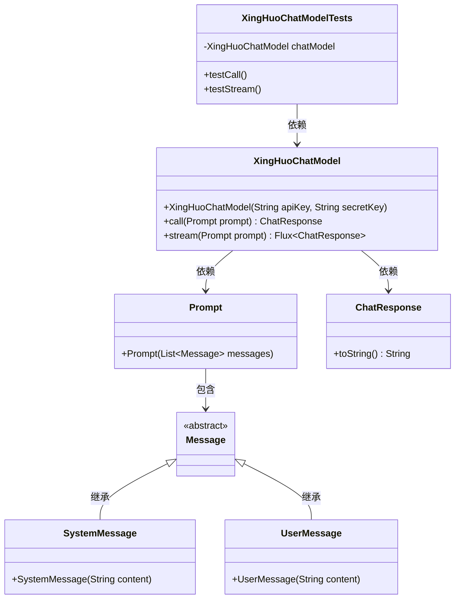

# 基础信息

|      |      |
|------|------|
| 编码语言 | .java |
| 代码路径 | yudao-module-ai/yudao-spring-boot-starter-ai/src/test/java/cn/iocoder/yudao/framework/ai/chat/XingHuoChatModelTests.java |
| 包名 | cn.iocoder.yudao.framework.ai.chat |
| 依赖项 | ['cn.iocoder.yudao.framework.ai.core.model.xinghuo.XingHuoChatModel', 'org.junit.jupiter.api.Disabled', 'org.junit.jupiter.api.Test', 'org.springframework.ai.chat.messages.Message', 'org.springframework.ai.chat.messages.SystemMessage', 'org.springframework.ai.chat.messages.UserMessage', 'org.springframework.ai.chat.model.ChatResponse', 'org.springframework.ai.chat.prompt.Prompt', 'reactor.core.publisher.Flux', 'java.util.ArrayList', 'java.util.List'] |
| 概述说明 | XingHuoChatModelTests类包含两个测试方法testCall和testStream，均使用XingHuoChatModel实例进行测试。通过SystemMessage和UserMessage构造消息列表，分别调用chatModel的call和stream方法并打印结果。两个测试方法均被禁用。 |

# 说明

XingHuoChatModelTests类是一个测试类，其中包含两个测试方法：testCall和testStream。这两个方法都使用XingHuoChatModel的实例进行测试。在测试过程中，通过SystemMessage和UserMessage构建消息列表，分别调用chatModel的call方法和stream方法，并将结果打印出来。尽管这两个测试方法已经编写完成，但它们目前均被禁用，意味着在当前的测试环境中不会被执行。

# 类列表 Class Summary

| 名称   | 类型  | 说明 |
|-------|------|-------------|
| XingHuoChatModelTests | class | XingHuoChatModelTests类包含两个测试方法：testCall和testStream，均使用XingHuoChatModel实例进行测试。测试方法中，通过SystemMessage和UserMessage构造消息列表，分别调用chatModel的call和stream方法，并打印结果。两个测试方法均被禁用。 |


## 类 XingHuoChatModelTests

|      |      |
|------|------|
| 访问范围 | public |
| 类型 | class |
| 名称 | XingHuoChatModelTests |
| 说明 | XingHuoChatModelTests类包含两个测试方法：testCall和testStream，均使用XingHuoChatModel实例进行测试。测试方法中，通过SystemMessage和UserMessage构造消息列表，分别调用chatModel的call和stream方法，并打印结果。两个测试方法均被禁用。 |


### UML类图



### 描述信息：
该UML类图展示了`XingHuoChatModelTests`类与`XingHuoChatModel`类之间的依赖关系，以及`Prompt`、`Message`、`SystemMessage`、`UserMessage`和`ChatResponse`类之间的继承与包含关系。`XingHuoChatModel`类负责与聊天模型交互，`Prompt`类包含消息列表，`Message`类为抽象类，`SystemMessage`和`UserMessage`继承自`Message`类。


### 内部方法调用关系图

```mermaid
graph TD
    XingHuoChatModelTests --> testCall
    XingHuoChatModelTests --> testStream
    testCall --> chatModel.call
    testStream --> chatModel.stream
    chatModel.call --> Prompt
    chatModel.stream --> Prompt
    Prompt --> List<Message>
    List<Message> --> SystemMessage
    List<Message> --> UserMessage
    chatModel.call --> ChatResponse
    chatModel.stream --> Flux<ChatResponse>
    Flux<ChatResponse> --> System.out::println
    ChatResponse --> System.out::println
```

### 描述信息：
该图展示了`XingHuoChatModelTests`类中的两个测试方法`testCall`和`testStream`如何调用`XingHuoChatModel`的`call`和`stream`方法。`call`和`stream`方法接收`Prompt`对象作为参数，`Prompt`对象包含`List<Message>`，其中包含`SystemMessage`和`UserMessage`。`call`方法返回`ChatResponse`，而`stream`方法返回`Flux<ChatResponse>`，最终结果通过`System.out::println`打印。

### 字段列表 Field List

| 名称  | 类型  | 说明 |
|-------|-------|------|
| chatModel = new XingHuoChatModel(
            "cb6415c19d6162cda07b47316fcb0416",
            "Y2JiYTIxZjA3MDMxMjNjZjQzYzVmNzdh") | XingHuoChatModel | 代码创建了一个名为chatModel的私有最终变量，类型为XingHuoChatModel，并传入两个参数：一个字符串"cb6415c19d6162cda07b47316fcb0416"和另一个字符串"Y2JiYTIxZjA3MDMxMjNjZjQzYzVmNzdh"。 |

### 方法列表 Method List

| 名称  | 类型  | 说明 |
|-------|-------|------|
| testStream | void | 该代码片段展示了一个被禁用的测试方法，用于测试流式处理聊天模型。方法中创建了一个包含系统消息和用户消息的列表，调用`chatModel.stream`方法处理这些消息，并通过流式输出打印结果。 |
| testCall | void | 该代码片段展示了一个被禁用的测试方法，用于测试聊天模型的调用。方法中准备了包含系统消息和用户消息的列表，系统消息设定角色为文言文作者，用户消息为简单数学问题。调用聊天模型后，打印响应结果。 |


