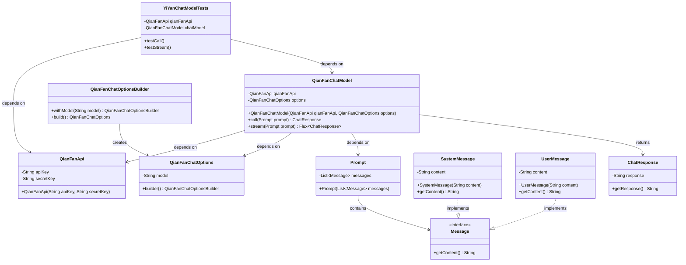
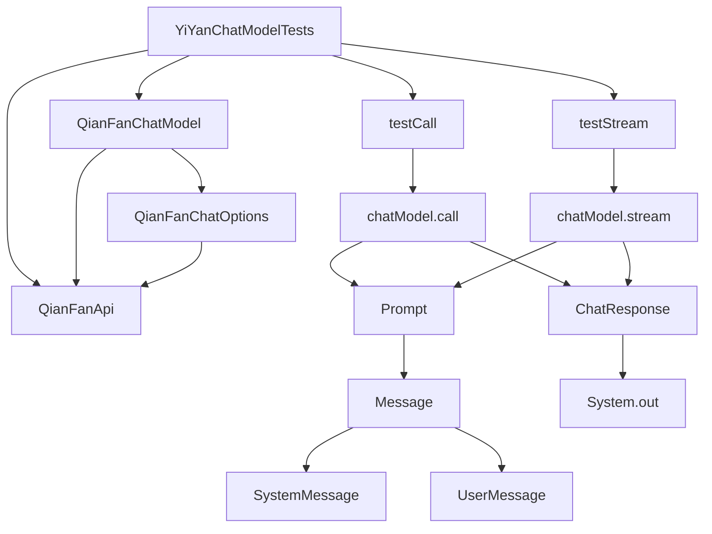

# 基础信息

|      |      |
|------|------|
| 编码语言 | .java |
| 代码路径 | yudao-module-ai/yudao-spring-boot-starter-ai/src/test/java/cn/iocoder/yudao/framework/ai/chat/YiYanChatModelTests.java |
| 包名 | cn.iocoder.yudao.framework.ai.chat |
| 依赖项 | ['org.junit.jupiter.api.Disabled', 'org.junit.jupiter.api.Test', 'org.springframework.ai.chat.messages.Message', 'org.springframework.ai.chat.messages.UserMessage', 'org.springframework.ai.chat.model.ChatResponse', 'org.springframework.ai.chat.prompt.Prompt', 'org.springframework.ai.qianfan.QianFanChatModel', 'org.springframework.ai.qianfan.QianFanChatOptions', 'org.springframework.ai.qianfan.api.QianFanApi', 'reactor.core.publisher.Flux', 'java.util.ArrayList', 'java.util.List'] |
| 概述说明 | YiYanChatModelTests类测试了QianFanChatModel的调用和流式处理功能，使用QianFanApi和ERNIE_Tiny_8K模型。测试方法testCall和testStream分别验证同步调用和流式处理，但因SystemMessage导致文心一言报错，测试被禁用。测试内容包括发送用户消息并打印响应结果。 |

# 说明

YiYanChatModelTests类主要用于测试QianFanChatModel的调用和流式处理功能。测试过程中使用了QianFanApi和QianFanChatModel，并设置了ERNIE_Tiny_8K模型作为测试对象。测试方法包括两个主要部分：testCall和testStream。testCall方法用于测试同步调用功能，即发送用户消息并等待完整的响应结果；testStream方法则用于测试流式处理功能，即逐步接收和处理响应数据。然而，在测试过程中，由于SystemMessage的使用导致文心一言（ERNIE）报错，因此相关测试被暂时禁用。测试的核心内容包括发送用户消息并打印出响应结果，以验证QianFanChatModel的功能是否正常。

# 类列表 Class Summary

| 名称   | 类型  | 说明 |
|-------|------|-------------|
| YiYanChatModelTests | class | YiYanChatModelTests类测试了QianFanChatModel的调用和流式处理功能。测试中使用了QianFanApi和QianFanChatModel，设置了ERNIE_Tiny_8K模型。测试方法testCall和testStream分别测试了同步调用和流式处理，但由于SystemMessage导致文心一言报错，测试被禁用。测试内容包括发送用户消息并打印响应结果。 |

## 类 YiYanChatModelTests

|      |      |
|------|------|
| 访问范围 | public |
| 类型 | class |
| 名称 | YiYanChatModelTests |
| 说明 | YiYanChatModelTests类测试了QianFanChatModel的调用和流式处理功能。测试中使用了QianFanApi和QianFanChatModel，设置了ERNIE_Tiny_8K模型。测试方法testCall和testStream分别测试了同步调用和流式处理，但由于SystemMessage导致文心一言报错，测试被禁用。测试内容包括发送用户消息并打印响应结果。 |

### UML类图

### 描述信息：
该UML类图展示了`YiYanChatModelTests`类及其相关依赖的类结构。`YiYanChatModelTests`依赖于`QianFanApi`和`QianFanChatModel`，后者又依赖于`QianFanChatOptions`和`Prompt`。`Prompt`类包含`Message`接口的实现类`SystemMessage`和`UserMessage`。`QianFanChatModel`通过`call`和`stream`方法返回`ChatResponse`。

### 内部方法调用关系图

### 描述信息：
该图展示了`YiYanChatModelTests`类中的方法调用关系。`YiYanChatModelTests`类依赖于`QianFanApi`和`QianFanChatModel`，并通过`testCall`和`testStream`方法分别调用`chatModel.call`和`chatModel.stream`。这些方法进一步调用`Prompt`和`Message`类，最终生成`ChatResponse`并输出结果。

### 字段列表 Field List

| 名称  | 类型  | 说明 |
|-------|-------|------|
| qianFanApi = new QianFanApi(
            "qS8k8dYr2nXunagK4SSU8Xjj",
            "pHGbx51ql2f0hOyabQvSZezahVC3hh3e") | QianFanApi | 代码片段中创建了一个名为qianFanApi的私有常量，使用QianFanApi类实例化，并传入两个字符串参数作为API的密钥和密钥ID。 |
| chatModel = new QianFanChatModel(qianFanApi,
            QianFanChatOptions.builder().withModel(QianFanApi.ChatModel.ERNIE_Tiny_8K.getValue()).build()
    ) | QianFanChatModel | 该代码片段创建了一个名为`chatModel`的私有最终变量，使用`QianFanChatModel`类初始化，并传入`qianFanApi`和`QianFanChatOptions`配置，其中模型设置为`ERNIE_Tiny_8K`。 |

### 方法列表 Method List

| 名称  | 类型  | 说明 |
|-------|-------|------|
| testCall | void | 该代码片段展示了一个被禁用的测试方法，用于测试聊天模型的调用。测试中准备了一个包含用户消息的列表，但注释指出在添加系统消息时会导致错误。代码调用聊天模型并打印响应结果。 |
| testStream | void | 该代码片段展示了一个未启用的测试方法，用于测试流式聊天模型。方法中创建了一个包含用户消息的列表，并尝试调用聊天模型生成响应。由于系统消息导致错误，代码中注释掉了添加系统消息的部分。最终，测试方法打印了聊天模型的响应结果。 |

