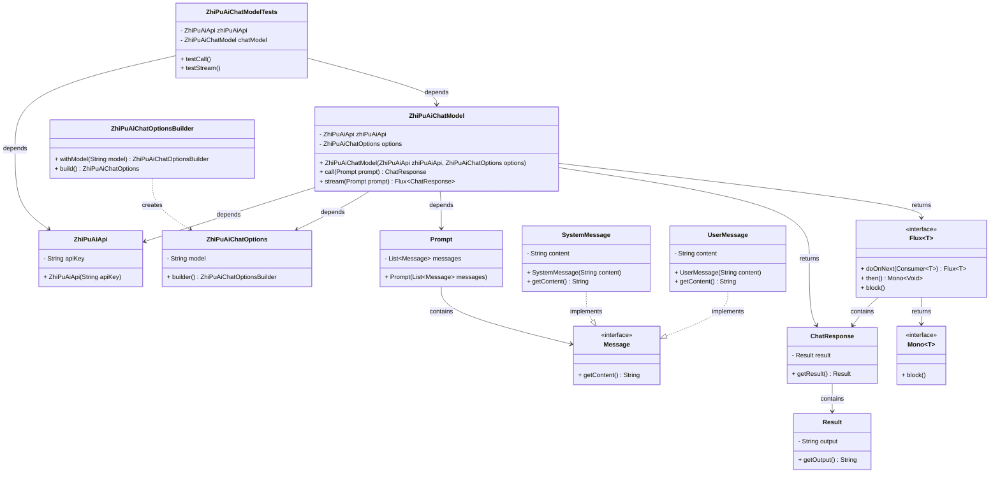

# 基础信息

|      |      |
|------|------|
| 编码语言 | .java |
| 代码路径 | yudao-module-ai/yudao-spring-boot-starter-ai/src/test/java/cn/iocoder/yudao/framework/ai/chat/ZhiPuAiChatModelTests.java |
| 包名 | cn.iocoder.yudao.framework.ai.chat |
| 依赖项 | ['org.junit.jupiter.api.Disabled', 'org.junit.jupiter.api.Test', 'org.springframework.ai.chat.messages.Message', 'org.springframework.ai.chat.messages.SystemMessage', 'org.springframework.ai.chat.messages.UserMessage', 'org.springframework.ai.chat.model.ChatResponse', 'org.springframework.ai.chat.prompt.Prompt', 'org.springframework.ai.zhipuai.ZhiPuAiChatModel', 'org.springframework.ai.zhipuai.ZhiPuAiChatOptions', 'org.springframework.ai.zhipuai.api.ZhiPuAiApi', 'reactor.core.publisher.Flux', 'java.util.ArrayList', 'java.util.List'] |
| 概述说明 | 该代码演示了如何使用ZhiPuAiChatModel进行聊天模型测试，涵盖同步和流式调用。通过ZhiPuAiApi和ZhiPuAiChatModel类，传递系统消息和用户消息以测试模型响应。测试方法被禁用，未实际执行。 |

# 说明

该代码展示了如何使用ZhiPuAiChatModel进行聊天模型的测试，涵盖了同步调用和流式调用两种方式。测试过程中，设置了系统消息和用户消息，分别用于验证模型在不同输入下的响应输出。代码中使用了ZhiPuAiApi和ZhiPuAiChatModel类，通过Prompt传递消息列表来模拟对话场景。尽管测试方法被禁用，未实际执行，但代码结构清晰地展示了如何配置和调用聊天模型，以及如何处理系统消息和用户消息的输入与输出。整体上，代码提供了一个完整的测试框架，能够帮助开发者理解和验证ZhiPuAiChatModel的功能和性能。

# 类列表 Class Summary

| 名称   | 类型  | 说明 |
|-------|------|-------------|
| ZhiPuAiChatModelTests | class | 该代码展示了如何使用ZhiPuAiChatModel进行聊天模型的测试，包括同步调用和流式调用。测试中设置了系统消息和用户消息，分别测试了模型的响应输出。代码中使用了ZhiPuAiApi和ZhiPuAiChatModel类，并通过Prompt传递消息列表。测试方法被禁用，未实际执行。 |


## 类 ZhiPuAiChatModelTests

|      |      |
|------|------|
| 访问范围 | public |
| 类型 | class |
| 名称 | ZhiPuAiChatModelTests |
| 说明 | 该代码展示了如何使用ZhiPuAiChatModel进行聊天模型的测试，包括同步调用和流式调用。测试中设置了系统消息和用户消息，分别测试了模型的响应输出。代码中使用了ZhiPuAiApi和ZhiPuAiChatModel类，并通过Prompt传递消息列表。测试方法被禁用，未实际执行。 |


### UML类图



### 描述信息：
该UML类图展示了`ZhiPuAiChatModelTests`类及其相关依赖的类结构。`ZhiPuAiChatModelTests`依赖于`ZhiPuAiApi`和`ZhiPuAiChatModel`，而`ZhiPuAiChatModel`则依赖于`ZhiPuAiApi`和`ZhiPuAiChatOptions`。`Prompt`类包含`Message`接口的实现类`SystemMessage`和`UserMessage`。`ZhiPuAiChatModel`通过`call`和`stream`方法返回`ChatResponse`和`Flux<ChatResponse>`。


### 内部方法调用关系图

```mermaid
graph TD
    ZhiPuAiChatModelTests --> ZhiPuAiApi
    ZhiPuAiChatModelTests --> ZhiPuAiChatModel
    ZhiPuAiChatModelTests --> testCall
    ZhiPuAiChatModelTests --> testStream
    testCall --> chatModel.call
    testStream --> chatModel.stream
    chatModel.call --> Prompt
    chatModel.stream --> Prompt
    Prompt --> List<Message>
    List<Message --> SystemMessage
    List<Message --> UserMessage
    chatModel.call --> ChatResponse
    chatModel.stream --> Flux<ChatResponse>
    ChatResponse --> System.out.println
    Flux<ChatResponse --> System.out.println
```

### 描述信息：
该图展示了`ZhiPuAiChatModelTests`类中的方法调用关系。`testCall`和`testStream`方法分别调用了`chatModel.call`和`chatModel.stream`方法，并传递了`Prompt`对象。`Prompt`对象包含了`List<Message>`，其中包含`SystemMessage`和`UserMessage`。最终，`ChatResponse`和`Flux<ChatResponse>`的结果通过`System.out.println`打印输出。

### 字段列表 Field List

| 名称  | 类型  | 说明 |
|-------|-------|------|
| chatModel = new ZhiPuAiChatModel(zhiPuAiApi,
            ZhiPuAiChatOptions.builder().withModel(ZhiPuAiApi.ChatModel.GLM_4.getModelName()).build()) | ZhiPuAiChatModel | 该代码片段创建了一个名为`chatModel`的私有最终变量，使用`ZhiPuAiChatModel`类初始化，并传入`zhiPuAiApi`和`ZhiPuAiChatOptions`配置，其中指定了模型为`GLM_4`。 |
| zhiPuAiApi = new ZhiPuAiApi("32f84543e54eee31f8d56b2bd6020573.3vh9idLJZ2ZhxDEs") | ZhiPuAiApi | 代码片段创建了一个名为`zhiPuAiApi`的`ZhiPuAiApi`对象，使用API密钥`"32f84543e54eee31f8d56b2bd6020573.3vh9idLJZ2ZhxDEs"`进行初始化。 |

### 方法列表 Method List

| 名称  | 类型  | 说明 |
|-------|-------|------|
| testCall | void | 该代码片段展示了一个被禁用的测试方法`testCall`，用于测试聊天模型的调用。方法中准备了一个包含系统消息和用户消息的列表，系统消息指示模型以文言文描述城市人文风景，用户消息询问“1 + 1 = ？”。随后调用聊天模型并打印响应结果及其输出内容。 |
| testStream | void | 该代码片段展示了一个被禁用的测试方法`testStream`，用于测试流式聊天模型。方法中创建了一个包含系统消息和用户消息的列表，调用`chatModel.stream`方法处理这些消息，并打印每个响应的输出结果。测试方法使用了`Flux`来处理流式响应，并通过`block`方法确保同步执行。 |


