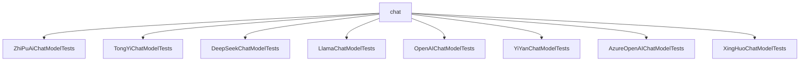

# 基础信息

|      |      |
|------|------|
| 编码语言 | .java |
| 代码路径 | yudao-module-ai/yudao-spring-boot-starter-ai/src/test/java/cn/iocoder/yudao/framework/ai/chat |
| 包名 | cn.iocoder.yudao.framework.ai.chat |
| 概述说明 | 该代码展示了如何使用多种聊天模型（如ZhiPuAi、TongYi、DeepSeek、Llama、OpenAI、YiYan、Azure OpenAI、XingHuo）进行同步和流式调用的测试。测试方法包括`testCall`和`testStream`，分别用于验证模型在同步和流式处理消息时的响应。测试过程中设置了系统消息和用户消息，模拟实际对话场景。尽管所有测试方法均被禁用，未实际执行，但代码结构清晰，展示了如何配置和调用这些模型，并处理消息的输入与输出，为开发者提供了完整的测试框架。 |

# 说明

该代码展示了多个聊天模型的测试框架，涵盖了同步调用和流式调用两种方式。每个测试类都针对不同的聊天模型进行测试，包括ZhiPuAiChatModel、TongYiChatModel、DeepSeekChatModel、OllamaChatModel、OpenAiChatModel、QianFanChatModel、AzureOpenAiChatModel和XingHuoChatModel。测试过程中，每个模型都通过系统消息和用户消息模拟对话场景，以验证模型在不同输入下的响应输出。

在测试类中，通常包含两个主要测试方法：`testCall`和`testStream`。`testCall`方法用于测试同步调用功能，即模型在接收到消息后立即返回处理结果，并将输出结果通过控制台打印出来。`testStream`方法则用于测试流式处理功能，即模型能够逐步处理输入消息，并在处理过程中逐步输出结果，同样通过控制台打印。尽管这些测试方法被编写并包含在代码中，但它们均被禁用，未实际执行。这意味着代码的主要目的是展示如何配置和调用这些聊天模型的同步和流式处理功能，而不是在实际环境中运行这些测试。

每个测试类都通过特定的API或客户端与模型进行交互。例如，ZhiPuAiChatModel通过ZhiPuAiApi进行调用，TongYiChatModel通过设置API密钥确保模型能够正确访问相关服务，而AzureOpenAiChatModel则通过构建OpenAIClient并设置端点、凭证和客户端选项来创建实例。此外，某些测试类还模拟了特定的角色或场景，如OpenAiChatModel被配置为使用GPT-4模型并模拟文言文作者的角色，OllamaChatModel则通过OllamaApi与本地服务器进行通信。

尽管这些测试方法被禁用，但它们提供了一个完整的测试框架，能够帮助开发者理解和验证各个聊天模型的功能和性能。通过这些测试方法，开发者可以了解如何配置和调用这些模型，以及如何处理系统消息和用户消息的输入与输出。

### 包内部结构视图

### 描述信息：
该图展示了`chat`文件夹与其包含的多个测试类文件之间的调用关系。每个测试类文件都直接依赖于`chat`文件夹，表示这些测试类文件在`chat`文件夹中进行测试操作。图中清晰地展示了文件与文件夹之间的层级关系。

# 文件列表 File List

| 名称   | 类型  | 说明 |
|-------|------|-------------|
| [XingHuoChatModelTests.java](XingHuoChatModelTests.md) | file | XingHuoChatModelTests类包含两个测试方法testCall和testStream，均使用XingHuoChatModel实例进行测试。通过SystemMessage和UserMessage构造消息列表，分别调用chatModel的call和stream方法并打印结果。两个测试方法均被禁用。 |
| [AzureOpenAIChatModelTests.java](AzureOpenAIChatModelTests.md) | file | 该代码演示了如何使用Azure OpenAI客户端测试聊天模型，包括构建OpenAIClient、设置端点、凭证和客户端选项，创建AzureOpenAiChatModel实例。测试涵盖同步调用`testCall`和异步流式调用`testStream`，分别通过`call`和`stream`方法发送系统消息和用户消息，并打印响应结果。两个测试方法均被禁用（@Disabled）。 |
| [YiYanChatModelTests.java](YiYanChatModelTests.md) | file | YiYanChatModelTests类测试了QianFanChatModel的调用和流式处理功能，使用QianFanApi和ERNIE_Tiny_8K模型。测试方法testCall和testStream分别验证同步调用和流式处理，但因SystemMessage导致文心一言报错，测试被禁用。测试内容包括发送用户消息并打印响应结果。 |
| [OpenAIChatModelTests.java](OpenAIChatModelTests.md) | file | OpenAIChatModelTests类测试了OpenAiChatModel的同步和流式调用功能，配置使用GPT-4模型并模拟文言文作者角色。测试包括准备消息列表、调用模型并打印结果，流式调用使用Flux处理响应。所有测试用例均被禁用。 |
| [LlamaChatModelTests.java](LlamaChatModelTests.md) | file | LlamaChatModelTests类测试了OllamaChatModel的call和stream方法，通过OllamaApi与本地服务器通信。测试中，系统消息设定模型为文言文作者，用户消息询问1+1的结果，分别通过call和stream方法获取并打印响应结果。两个测试方法均被禁用。 |
| [DeepSeekChatModelTests.java](DeepSeekChatModelTests.md) | file | DeepSeekChatModelTests类包含两个禁用测试方法：testCall和testStream。testCall通过chatModel.call处理包含系统消息和用户消息的列表并打印响应，testStream通过chatModel.stream处理消息并打印流式响应。 |
| [TongYiChatModelTests.java](TongYiChatModelTests.md) | file | 该代码测试了TongYiChatModel的调用和流式处理功能，包括同步调用（testCall）和流式处理（testStream）。测试类初始化了模型并设置了API密钥，输入包含系统消息和用户消息，输出结果通过控制台打印。测试方法被禁用，未实际执行。 |
| [ZhiPuAiChatModelTests.java](ZhiPuAiChatModelTests.md) | file | 该代码演示了如何使用ZhiPuAiChatModel进行聊天模型测试，涵盖同步和流式调用。通过ZhiPuAiApi和ZhiPuAiChatModel类，传递系统消息和用户消息以测试模型响应。测试方法被禁用，未实际执行。 |

