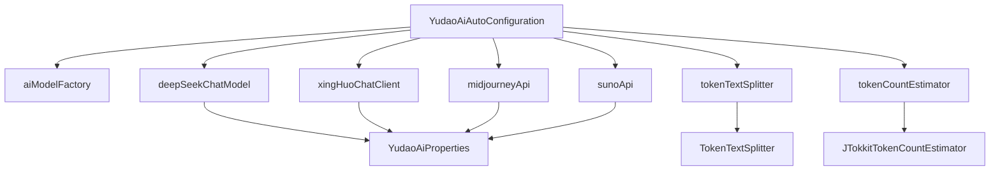

# 基础信息

|      |      |
|------|------|
| 编码语言 | .java |
| 代码路径 | yudao-module-ai/yudao-spring-boot-starter-ai/src/main/java/cn/iocoder/yudao/framework/ai/config/YudaoAiAutoConfiguration.java |
| 包名 | cn.iocoder.yudao.framework.ai.config |
| 依赖项 | ['cn.iocoder.yudao.framework.ai.core.factory.AiModelFactory', 'cn.iocoder.yudao.framework.ai.core.factory.AiModelFactoryImpl', 'cn.iocoder.yudao.framework.ai.core.model.deepseek.DeepSeekChatModel', 'cn.iocoder.yudao.framework.ai.core.model.deepseek.DeepSeekChatOptions', 'cn.iocoder.yudao.framework.ai.core.model.midjourney.api.MidjourneyApi', 'cn.iocoder.yudao.framework.ai.core.model.suno.api.SunoApi', 'cn.iocoder.yudao.framework.ai.core.model.xinghuo.XingHuoChatModel', 'cn.iocoder.yudao.framework.ai.core.model.xinghuo.XingHuoChatOptions', 'com.alibaba.cloud.ai.tongyi.TongYiAutoConfiguration', 'lombok.extern.slf4j.Slf4j', 'org.springframework.ai.tokenizer.JTokkitTokenCountEstimator', 'org.springframework.ai.tokenizer.TokenCountEstimator', 'org.springframework.ai.transformer.splitter.TokenTextSplitter', 'org.springframework.boot.autoconfigure.AutoConfiguration', 'org.springframework.boot.autoconfigure.condition.ConditionalOnProperty', 'org.springframework.boot.context.properties.EnableConfigurationProperties', 'org.springframework.context.annotation.Bean', 'org.springframework.context.annotation.Import', 'org.springframework.context.annotation.Lazy'] |
| 概述说明 | YudaoAiAutoConfiguration类通过注解配置AI功能，包括创建AiModelFactory和多个AI客户端（如DeepSeekChatModel、XingHuoChatModel、MidjourneyApi、SunoApi），支持条件属性控制启用，并包含RAG相关组件（如TokenTextSplitter和TokenCountEstimator），部分功能未实现或注释。 |

# 说明

YudaoAiAutoConfiguration类通过使用@AutoConfiguration和@EnableConfigurationProperties注解，实现了对AI相关功能的配置。该类主要负责创建AiModelFactory以及多个AI客户端，包括DeepSeekChatModel、XingHuoChatModel、MidjourneyApi和SunoApi等。这些客户端的启用可以通过条件属性进行控制，从而灵活地管理不同AI服务的启用状态。此外，该类还涉及RAG（Retrieval-Augmented Generation）相关的组件，如TokenTextSplitter和TokenCountEstimator，这些组件用于文本处理和分词计数等功能。不过，部分功能目前尚未完全实现或处于注释状态，可能需要在后续版本中进行完善。总体而言，YudaoAiAutoConfiguration类为AI功能的集成和配置提供了基础支持，同时具备一定的扩展性和灵活性。

# 类列表 Class Summary

| 名称   | 类型  | 说明 |
|-------|------|-------------|
| YudaoAiAutoConfiguration | class | YudaoAiAutoConfiguration类通过@AutoConfiguration和@EnableConfigurationProperties注解配置AI相关功能，包括创建AiModelFactory和多个AI客户端（如DeepSeekChatModel、XingHuoChatModel、MidjourneyApi、SunoApi），并支持通过条件属性控制其启用。此外，还包含RAG相关的组件（如TokenTextSplitter和TokenCountEstimator），部分功能暂未实现或注释。 |

## 类 YudaoAiAutoConfiguration

|      |      |
|------|------|
| 访问范围 | @AutoConfiguration;@EnableConfigurationProperties(YudaoAiProperties.class);@Slf4j;@Import(TongYiAutoConfiguration.class);public |
| 类型 | class |
| 名称 | YudaoAiAutoConfiguration |
| 说明 | YudaoAiAutoConfiguration类通过@AutoConfiguration和@EnableConfigurationProperties注解配置AI相关功能，包括创建AiModelFactory和多个AI客户端（如DeepSeekChatModel、XingHuoChatModel、MidjourneyApi、SunoApi），并支持通过条件属性控制其启用。此外，还包含RAG相关的组件（如TokenTextSplitter和TokenCountEstimator），部分功能暂未实现或注释。 |

### UML类图

```mermaid
classDiagram
    class YudaoAiAutoConfiguration {
        +aiModelFactory() AiModelFactory
        +deepSeekChatModel(YudaoAiProperties yudaoAiProperties) DeepSeekChatModel
        +xingHuoChatClient(YudaoAiProperties yudaoAiProperties) XingHuoChatModel
        +midjourneyApi(YudaoAiProperties yudaoAiProperties) MidjourneyApi
        +sunoApi(YudaoAiProperties yudaoAiProperties) SunoApi
        +tokenTextSplitter() TokenTextSplitter
        +tokenCountEstimator() TokenCountEstimator
    }

    class YudaoAiProperties {
        +getDeepSeek() DeepSeekProperties
        +getXinghuo() XingHuoProperties
        +getMidjourney() MidjourneyProperties
        +getSuno() SunoProperties
    }

    class DeepSeekProperties {
        +getModel() String
        +getTemperature() double
        +getMaxTokens() int
        +getTopP() double
        +getApiKey() String
    }

    class XingHuoProperties {
        +getModel() String
        +getTemperature() double
        +getMaxTokens() int
        +getTopK() int
        +getAppKey() String
        +getSecretKey() String
    }

    class MidjourneyProperties {
        +getBaseUrl() String
        +getApiKey() String
        +getNotifyUrl() String
    }

    class SunoProperties {
        +getBaseUrl() String
    }

    class AiModelFactory {
        +createModel() AiModel
    }

    class AiModelFactoryImpl {
        +createModel() AiModel
    }

    class DeepSeekChatModel {
        +DeepSeekChatModel(String apiKey, DeepSeekChatOptions options)
    }

    class XingHuoChatModel {
        +XingHuoChatModel(String appKey, String secretKey, XingHuoChatOptions options)
    }

    class MidjourneyApi {
        +MidjourneyApi(String baseUrl, String apiKey, String notifyUrl)
    }

    class SunoApi {
        +SunoApi(String baseUrl)
    }

    class TokenTextSplitter {
        +TokenTextSplitter(int maxTokens, int chunkOverlap, int minTokens, int maxChunkSize, boolean trimWhitespace)
    }

    class TokenCountEstimator {
        +estimateTokenCount(String text) int
    }

    class JTokkitTokenCountEstimator {
        +estimateTokenCount(String text) int
    }

    YudaoAiAutoConfiguration ..> YudaoAiProperties : depends
    YudaoAiAutoConfiguration ..> AiModelFactory : creates
    YudaoAiAutoConfiguration ..> DeepSeekChatModel : creates
    YudaoAiAutoConfiguration ..> XingHuoChatModel : creates
    YudaoAiAutoConfiguration ..> MidjourneyApi : creates
    YudaoAiAutoConfiguration ..> SunoApi : creates
    YudaoAiAutoConfiguration ..> TokenTextSplitter : creates
    YudaoAiAutoConfiguration ..> TokenCountEstimator : creates
    AiModelFactory <|.. AiModelFactoryImpl : implements
    TokenCountEstimator <|.. JTokkitTokenCountEstimator : implements
```

### 描述信息：
该UML类图展示了`YudaoAiAutoConfiguration`类及其相关依赖和创建的类。`YudaoAiAutoConfiguration`通过`@Bean`注解创建了多个AI模型和工具类，如`DeepSeekChatModel`、`XingHuoChatModel`、`MidjourneyApi`等。这些类依赖于`YudaoAiProperties`类来获取配置信息。`AiModelFactory`接口由`AiModelFactoryImpl`实现，`TokenCountEstimator`接口由`JTokkitTokenCountEstimator`实现。

### 内部方法调用关系图

### 描述信息：
该图展示了`YudaoAiAutoConfiguration`类中各个方法之间的调用关系。`YudaoAiAutoConfiguration`类通过`@Bean`注解创建了多个Bean，包括`aiModelFactory`、`deepSeekChatModel`、`xingHuoChatClient`、`midjourneyApi`、`sunoApi`、`tokenTextSplitter`和`tokenCountEstimator`。这些方法依赖于`YudaoAiProperties`类来获取配置信息，并最终返回相应的实例。

### 字段列表 Field List

| 名称  | 类型  | 说明 |
|-------|-------|------|

### 方法列表 Method List

| 名称  | 类型  | 说明 |
|-------|-------|------|
| aiModelFactory | AiModelFactory | 该代码片段定义了一个名为`aiModelFactory`的Bean，其实现类为`AiModelFactoryImpl`，用于创建和管理AI模型实例。 |
| sunoApi | SunoApi | 在配置属性"yudao.ai.suno.enable"为true时，创建SunoApi实例，该实例使用YudaoAiProperties中配置的Suno基础URL进行初始化。 |
| tokenTextSplitter | TokenTextSplitter | 该代码片段定义了一个名为`tokenTextSplitter`的Bean，使用了`@Lazy`注解以避免启动问题。该Bean返回一个`TokenTextSplitter`实例，参数包括500、100、5、10000和true，具体配置待提取。 |
| tokenCountEstimator | TokenCountEstimator | 该代码片段定义了一个名为`tokenCountEstimator`的Bean，使用了`@Lazy`注解以避免启动时加载，并返回`JTokkitTokenCountEstimator`实例。当前`@Lazy`注解被临时注释掉。 |
| midjourneyApi | MidjourneyApi | 当配置属性"yudao.ai.midjourney.enable"为true时，Spring容器将创建并注入MidjourneyApi实例，该实例使用YudaoAiProperties中的Midjourney配置（包括baseUrl、apiKey和notifyUrl）进行初始化。 |
| deepSeekChatModel | DeepSeekChatModel | 该代码定义了一个Spring Bean `deepSeekChatModel`，其创建依赖于配置项`yudao.ai.deepseek.enable`为`true`。该Bean使用`YudaoAiProperties`中的`DeepSeekProperties`配置，构建`DeepSeekChatOptions`对象，并最终返回一个包含API密钥和配置选项的`DeepSeekChatModel`实例。 |
| xingHuoChatClient | XingHuoChatModel | 该代码定义了一个条件化的Spring Bean `XingHuoChatModel`，当配置属性`yudao.ai.xinghuo.enable`为`true`时生效。它通过`YudaoAiProperties`获取星火聊天模型的配置参数，包括模型、温度、最大令牌数和topK值，并使用这些参数构建`XingHuoChatOptions`对象，最终返回一个包含应用密钥、密钥和选项的`XingHuoChatModel`实例。 |

