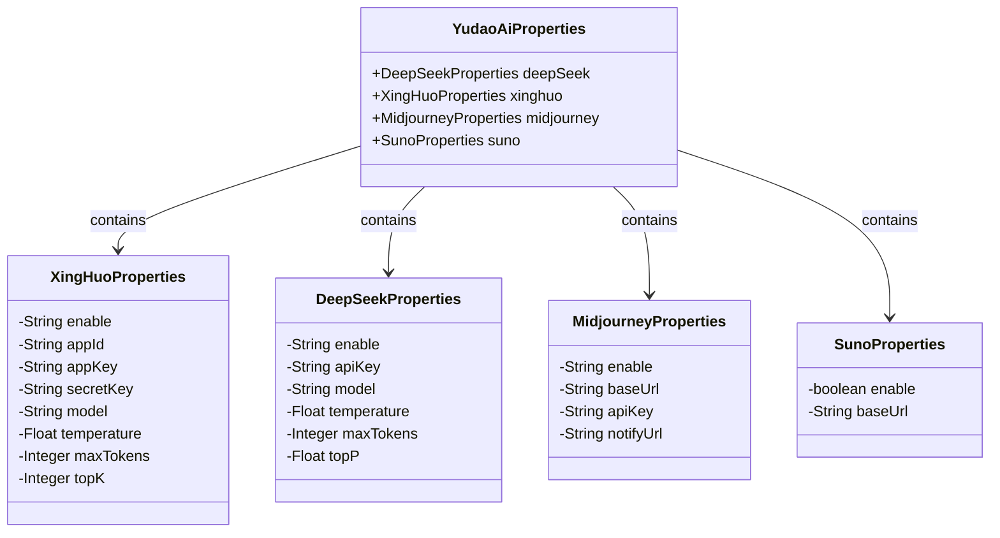
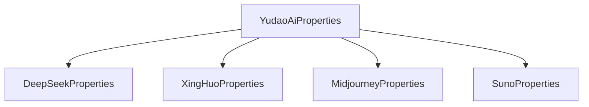

# 基础信息

|      |      |
|------|------|
| 编码语言 | .java |
| 代码路径 | yudao-module-ai/yudao-spring-boot-starter-ai/src/main/java/cn/iocoder/yudao/framework/ai/config/YudaoAiProperties.java |
| 包名 | cn.iocoder.yudao.framework.ai.config |
| 依赖项 | ['lombok.Data', 'org.springframework.boot.context.properties.ConfigurationProperties'] |
| 概述说明 | YudaoAiProperties类包含DeepSeek、讯飞星火、Midjourney和Suno四个子配置类，分别配置启用状态、API密钥、模型参数等。DeepSeek和讯飞星火配置模型、温度、最大令牌数；Midjourney配置基础URL和API密钥；Suno配置启用状态和基础URL。 |

# 说明

YudaoAiProperties类是一个用于管理多个AI服务配置的类，包含四个子配置类，分别是DeepSeek、讯飞星火、Midjourney和Suno。每个子配置类都用于设置和存储各自AI服务的相关参数。

DeepSeek和讯飞星火的配置类包括多个参数，如模型选择、温度设置和最大令牌数等。这些参数用于控制AI生成内容的方式和质量。模型参数决定了使用的具体AI模型，温度参数影响生成内容的随机性和创造性，而最大令牌数则限制了生成内容的长度。

Midjourney的配置类主要包含两个参数：基础URL和API密钥。基础URL用于指定API请求的目标地址，而API密钥则用于身份验证和授权，确保只有合法的请求能够访问服务。

Suno的配置类相对简单，仅包含启用状态和基础URL两个参数。启用状态用于控制该服务是否可用，而基础URL则用于指定API请求的目标地址。

通过这些配置类，YudaoAiProperties类能够灵活地管理和配置多个AI服务，确保它们能够根据需求进行启用和参数调整，从而满足不同的应用场景和需求。

# 类列表 Class Summary

| 名称   | 类型  | 说明 |
|-------|------|-------------|
| YudaoAiProperties | class | YudaoAiProperties类包含DeepSeek、讯飞星火、Midjourney和Suno四个子配置类，分别用于配置各自的启用状态、API密钥、模型参数等。DeepSeek和讯飞星火配置包括模型、温度、最大令牌数等参数；Midjourney配置包括基础URL和API密钥；Suno配置包括启用状态和基础URL。 |

## 类 YudaoAiProperties

|      |      |
|------|------|
| 访问范围 | @ConfigurationProperties(prefix = "yudao.ai");@Data;public |
| 类型 | class |
| 名称 | YudaoAiProperties |
| 说明 | YudaoAiProperties类包含DeepSeek、讯飞星火、Midjourney和Suno四个子配置类，分别用于配置各自的启用状态、API密钥、模型参数等。DeepSeek和讯飞星火配置包括模型、温度、最大令牌数等参数；Midjourney配置包括基础URL和API密钥；Suno配置包括启用状态和基础URL。 |

### UML类图

### 描述信息：
该UML类图展示了`YudaoAiProperties`类及其内部嵌套的四个属性类：`XingHuoProperties`、`DeepSeekProperties`、`MidjourneyProperties`和`SunoProperties`。每个属性类包含不同的配置参数，`YudaoAiProperties`通过组合关系管理这些配置类。

### 内部方法调用关系图

### 描述信息：
该图展示了`YudaoAiProperties`类与其内部嵌套类之间的调用关系。`YudaoAiProperties`类包含了四个嵌套类：`DeepSeekProperties`、`XingHuoProperties`、`MidjourneyProperties`和`SunoProperties`。每个嵌套类分别用于配置不同的AI服务属性，如DeepSeek、讯飞星火、Midjourney和Suno。通过这种结构，`YudaoAiProperties`类能够集中管理多个AI服务的配置信息。

### 字段列表 Field List

| 名称  | 类型  | 说明 |
|-------|-------|------|
| midjourney | MidjourneyProperties | 概要说明：该信息涉及一个名为`MidjourneyProperties`的私有属性`midjourney`，可能用于存储与Midjourney相关的配置或数据。 |
| deepSeek | DeepSeekProperties | private DeepSeekProperties deepSeek; 表示一个私有属性，类型为DeepSeekProperties，用于存储与DeepSeek相关的配置或属性信息。 |
| suno | SunoProperties | SunoProperties 是一个私有属性，类型为 SunoProperties。 |
| xinghuo | XingHuoProperties | private XingHuoProperties xinghuo; 定义了一个私有的XingHuoProperties类型的变量xinghuo。 |

### 方法列表 Method List

| 名称  | 类型  | 说明 |
|-------|-------|------|

