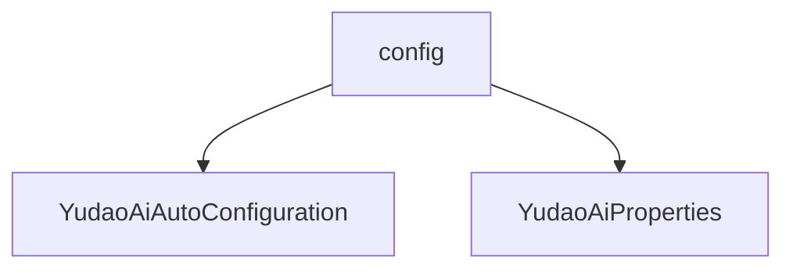

# 基础信息

|      |      |
|------|------|
| 编码语言 | .java |
| 代码路径 | yudao-module-ai/yudao-spring-boot-starter-ai/src/main/java/cn/iocoder/yudao/framework/ai/config |
| 包名 | cn.iocoder.yudao.framework.ai.config |
| 概述说明 | YudaoAiAutoConfiguration类通过@AutoConfiguration和@EnableConfigurationProperties注解实现AI功能配置，创建AiModelFactory及多个AI客户端（如DeepSeekChatModel、XingHuoChatModel等），并通过条件属性控制启用状态。涉及RAG组件如TokenTextSplitter和TokenCountEstimator，部分功能未完全实现。YudaoAiProperties类管理多个AI服务配置，包含DeepSeek、讯飞星火、Midjourney和Suno子配置类，分别设置模型、温度、最大令牌数、基础URL和API密钥等参数，灵活满足不同应用需求。 |

# 说明

YudaoAiAutoConfiguration类通过使用@AutoConfiguration和@EnableConfigurationProperties注解，实现了对AI相关功能的配置。该类主要负责创建AiModelFactory以及多个AI客户端，包括DeepSeekChatModel、XingHuoChatModel、MidjourneyApi和SunoApi等。这些客户端的启用可以通过条件属性进行控制，从而灵活地管理不同AI服务的启用状态。此外，该类还涉及RAG（Retrieval-Augmented Generation）相关的组件，如TokenTextSplitter和TokenCountEstimator，这些组件用于文本处理和分词计数等功能。不过，部分功能目前尚未完全实现或处于注释状态，可能需要在后续版本中进行完善。总体而言，YudaoAiAutoConfiguration类为AI功能的集成和配置提供了基础支持，同时具备一定的扩展性和灵活性。

YudaoAiProperties类是一个用于管理多个AI服务配置的类，包含四个子配置类，分别是DeepSeek、讯飞星火、Midjourney和Suno。每个子配置类都用于设置和存储各自AI服务的相关参数。DeepSeek和讯飞星火的配置类包括多个参数，如模型选择、温度设置和最大令牌数等。这些参数用于控制AI生成内容的方式和质量。模型参数决定了使用的具体AI模型，温度参数影响生成内容的随机性和创造性，而最大令牌数则限制了生成内容的长度。Midjourney的配置类主要包含两个参数：基础URL和API密钥。基础URL用于指定API请求的目标地址，而API密钥则用于身份验证和授权，确保只有合法的请求能够访问服务。Suno的配置类相对简单，仅包含启用状态和基础URL两个参数。启用状态用于控制该服务是否可用，而基础URL则用于指定API请求的目标地址。通过这些配置类，YudaoAiProperties类能够灵活地管理和配置多个AI服务，确保它们能够根据需求进行启用和参数调整，从而满足不同的应用场景和需求。

### 包内部结构视图

### 描述信息：
该Mermaid图展示了`config`文件夹下的两个Java配置文件之间的关系。`YudaoAiAutoConfiguration`和`YudaoAiProperties`都位于`config`文件夹中，表示它们可能与AI框架的自动配置和属性设置相关。

# 文件列表 File List

| 名称   | 类型  | 说明 |
|-------|------|-------------|
| [YudaoAiProperties.java](YudaoAiProperties.md) | file | YudaoAiProperties类包含DeepSeek、讯飞星火、Midjourney和Suno四个子配置类，分别配置启用状态、API密钥、模型参数等。DeepSeek和讯飞星火配置模型、温度、最大令牌数；Midjourney配置基础URL和API密钥；Suno配置启用状态和基础URL。 |
| [YudaoAiAutoConfiguration.java](YudaoAiAutoConfiguration.md) | file | YudaoAiAutoConfiguration类通过注解配置AI功能，包括创建AiModelFactory和多个AI客户端（如DeepSeekChatModel、XingHuoChatModel、MidjourneyApi、SunoApi），支持条件属性控制启用，并包含RAG相关组件（如TokenTextSplitter和TokenCountEstimator），部分功能未实现或注释。 |

