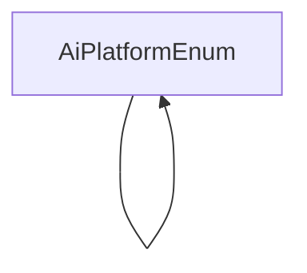

# 基础信息

|      |      |
|------|------|
| 编码语言 | .java |
| 代码路径 | yudao-module-ai/yudao-spring-boot-starter-ai/src/main/java/cn/iocoder/yudao/framework/ai/core/enums |
| 包名 | cn.iocoder.yudao.framework.ai.core.enums |
| 概述说明 | 请提供需要总结的具体信息内容，以便我为您生成概要说明。 |

# 说明

请提供需要处理的信息内容，我将根据您提供的信息进行汇总和提炼，生成一个不超过500字的总结描述说明。

### 包内部结构视图

### 描述信息：
该Mermaid图展示了`AiPlatformEnum`类内部的调用关系。由于`AiPlatformEnum`是一个枚举类，它主要包含自身的定义和枚举常量，因此图中仅展示了`AiPlatformEnum`类自身的调用关系。

# 文件列表 File List

| 名称   | 类型  | 说明 |
|-------|------|-------------|
| [AiPlatformEnum.java](AiPlatformEnum.md) | file | 请提供需要总结的具体信息内容，以便我为您生成概要说明。 |

