# 基础信息

|      |      |
|------|------|
| 编码语言 | .java |
| 代码路径 | yudao-module-ai/yudao-spring-boot-starter-ai/src/main/java/cn/iocoder/yudao/framework/ai/core/factory/AiModelFactoryImpl.java |
| 包名 | cn.iocoder.yudao.framework.ai.core.factory |
| 依赖项 | ['cn.hutool.core.lang.Assert', 'cn.hutool.core.lang.Singleton', 'cn.hutool.core.lang.func.Func0', 'cn.hutool.core.util.ArrayUtil', 'cn.hutool.core.util.StrUtil', 'cn.hutool.extra.spring.SpringUtil', 'cn.iocoder.yudao.framework.ai.config.YudaoAiAutoConfiguration', 'cn.iocoder.yudao.framework.ai.config.YudaoAiProperties', 'cn.iocoder.yudao.framework.ai.core.enums.AiPlatformEnum', 'cn.iocoder.yudao.framework.ai.core.model.deepseek.DeepSeekChatModel', 'cn.iocoder.yudao.framework.ai.core.model.midjourney.api.MidjourneyApi', 'cn.iocoder.yudao.framework.ai.core.model.suno.api.SunoApi', 'cn.iocoder.yudao.framework.ai.core.model.xinghuo.XingHuoChatModel', 'cn.iocoder.yudao.framework.common.util.spring.SpringUtils', 'com.alibaba.cloud.ai.tongyi.TongYiAutoConfiguration', 'com.alibaba.cloud.ai.tongyi.TongYiConnectionProperties', 'com.alibaba.cloud.ai.tongyi.chat.TongYiChatModel', 'com.alibaba.cloud.ai.tongyi.chat.TongYiChatProperties', 'com.alibaba.cloud.ai.tongyi.image.TongYiImagesModel', 'com.alibaba.cloud.ai.tongyi.image.TongYiImagesProperties', 'com.alibaba.dashscope.aigc.generation.Generation', 'com.alibaba.dashscope.aigc.imagesynthesis.ImageSynthesis', 'com.alibaba.dashscope.embeddings.TextEmbedding', 'com.azure.ai.openai.OpenAIClient', 'org.springframework.ai.autoconfigure.azure.openai.AzureOpenAiAutoConfiguration', 'org.springframework.ai.autoconfigure.azure.openai.AzureOpenAiChatProperties', 'org.springframework.ai.autoconfigure.azure.openai.AzureOpenAiConnectionProperties', 'org.springframework.ai.autoconfigure.ollama.OllamaAutoConfiguration', 'org.springframework.ai.autoconfigure.openai.OpenAiAutoConfiguration', 'org.springframework.ai.autoconfigure.qianfan.QianFanAutoConfiguration', 'org.springframework.ai.autoconfigure.qianfan.QianFanChatProperties', 'org.springframework.ai.autoconfigure.qianfan.QianFanConnectionProperties', 'org.springframework.ai.autoconfigure.qianfan.QianFanImageProperties', 'org.springframework.ai.autoconfigure.zhipuai.ZhiPuAiAutoConfiguration', 'org.springframework.ai.autoconfigure.zhipuai.ZhiPuAiChatProperties', 'org.springframework.ai.autoconfigure.zhipuai.ZhiPuAiConnectionProperties', 'org.springframework.ai.autoconfigure.zhipuai.ZhiPuAiImageProperties', 'org.springframework.ai.azure.openai.AzureOpenAiChatModel', 'org.springframework.ai.chat.model.ChatModel', 'org.springframework.ai.embedding.EmbeddingModel', 'org.springframework.ai.image.ImageModel', 'org.springframework.ai.model.function.FunctionCallbackContext', 'org.springframework.ai.ollama.OllamaChatModel', 'org.springframework.ai.ollama.api.OllamaApi', 'org.springframework.ai.openai.OpenAiChatModel', 'org.springframework.ai.openai.OpenAiImageModel', 'org.springframework.ai.openai.api.ApiUtils', 'org.springframework.ai.openai.api.OpenAiApi', 'org.springframework.ai.openai.api.OpenAiImageApi', 'org.springframework.ai.qianfan.QianFanChatModel', 'org.springframework.ai.qianfan.QianFanImageModel', 'org.springframework.ai.qianfan.api.QianFanApi', 'org.springframework.ai.qianfan.api.QianFanImageApi', 'org.springframework.ai.stabilityai.StabilityAiImageModel', 'org.springframework.ai.stabilityai.api.StabilityAiApi', 'org.springframework.ai.vectorstore.RedisVectorStore', 'org.springframework.ai.vectorstore.VectorStore', 'org.springframework.ai.zhipuai.ZhiPuAiChatModel', 'org.springframework.ai.zhipuai.ZhiPuAiImageModel', 'org.springframework.ai.zhipuai.api.ZhiPuAiApi', 'org.springframework.ai.zhipuai.api.ZhiPuAiImageApi', 'org.springframework.boot.autoconfigure.data.redis.RedisProperties', 'org.springframework.retry.support.RetryTemplate', 'org.springframework.web.client.ResponseErrorHandler', 'org.springframework.web.client.RestClient', 'redis.clients.jedis.JedisPooled', 'redis.clients.jedis.search.Schema', 'java.util.List'] |
| 概述说明 | AiModelFactoryImpl类实现AiModelFactory接口，提供获取或创建TongYi、YiYan、DeepSeek等平台的聊天、图像、Midjourney API、Suno API、嵌入模型和向量存储的方法。通过缓存和单例模式管理模型实例，确保高效复用。模型创建方法根据API密钥和URL动态生成，支持默认模型获取。 |

# 说明

AiModelFactoryImpl类实现了AiModelFactory接口，主要用于获取或创建不同AI平台的模型实例。这些平台包括TongYi、YiYan、DeepSeek等，涵盖了多种类型的模型，如聊天模型、图像模型、Midjourney API、Suno API、嵌入模型和向量存储。通过缓存机制和单例模式，AiModelFactoryImpl类能够高效地管理和复用这些模型实例，避免重复创建，提升系统性能。每个平台的模型创建方法根据提供的API密钥和URL动态生成，确保模型实例的灵活性和可配置性。此外，该类还支持获取默认模型，简化了模型获取的流程，使得用户无需每次都指定具体的模型参数。整体设计旨在提供一种高效、灵活且易于扩展的方式来管理和使用不同AI平台的模型。

# 类列表 Class Summary

| 名称   | 类型  | 说明 |
|-------|------|-------------|
| AiModelFactoryImpl | class | AiModelFactoryImpl类实现了AiModelFactory接口，提供了获取或创建不同AI平台（如TongYi、YiYan、DeepSeek等）的聊天模型、图像模型、Midjourney API、Suno API、嵌入模型和向量存储的方法。通过缓存机制和单例模式管理模型实例，确保高效复用。每个平台的模型创建方法根据API密钥和URL动态生成，并支持默认模型的获取。 |

## 类 AiModelFactoryImpl

|      |      |
|------|------|
| 访问范围 | public |
| 类型 | class |
| 名称 | AiModelFactoryImpl |
| 说明 | AiModelFactoryImpl类实现了AiModelFactory接口，提供了获取或创建不同AI平台（如TongYi、YiYan、DeepSeek等）的聊天模型、图像模型、Midjourney API、Suno API、嵌入模型和向量存储的方法。通过缓存机制和单例模式管理模型实例，确保高效复用。每个平台的模型创建方法根据API密钥和URL动态生成，并支持默认模型的获取。 |

### UML类图

```mermaid
classDiagram
    class AiModelFactory {
        <<interface>>
        +getOrCreateChatModel(AiPlatformEnum platform, String apiKey, String url) ChatModel
        +getDefaultChatModel(AiPlatformEnum platform) ChatModel
        +getDefaultImageModel(AiPlatformEnum platform) ImageModel
        +getOrCreateImageModel(AiPlatformEnum platform, String apiKey, String url) ImageModel
        +getOrCreateMidjourneyApi(String apiKey, String url) MidjourneyApi
        +getOrCreateSunoApi(String apiKey, String url) SunoApi
        +getOrCreateEmbeddingModel(AiPlatformEnum platform, String apiKey, String url) EmbeddingModel
        +getOrCreateVectorStore(EmbeddingModel embeddingModel, AiPlatformEnum platform, String apiKey, String url) VectorStore
    }

    class AiModelFactoryImpl {
        +getOrCreateChatModel(AiPlatformEnum platform, String apiKey, String url) ChatModel
        +getDefaultChatModel(AiPlatformEnum platform) ChatModel
        +getDefaultImageModel(AiPlatformEnum platform) ImageModel
        +getOrCreateImageModel(AiPlatformEnum platform, String apiKey, String url) ImageModel
        +getOrCreateMidjourneyApi(String apiKey, String url) MidjourneyApi
        +getOrCreateSunoApi(String apiKey, String url) SunoApi
        +getOrCreateEmbeddingModel(AiPlatformEnum platform, String apiKey, String url) EmbeddingModel
        +getOrCreateVectorStore(EmbeddingModel embeddingModel, AiPlatformEnum platform, String apiKey, String url) VectorStore
        -buildClientCacheKey(Class<?> clazz, Object... params) String
        -buildTongYiChatModel(String key) TongYiChatModel
        -buildTongYiImagesModel(String key) TongYiImagesModel
        -buildYiYanChatModel(String key) QianFanChatModel
        -buildQianFanImageModel(String key) QianFanImageModel
        -buildDeepSeekChatModel(String apiKey) DeepSeekChatModel
        -buildZhiPuChatModel(String apiKey, String url) ZhiPuAiChatModel
        -buildZhiPuAiImageModel(String apiKey, String url) ZhiPuAiImageModel
        -buildXingHuoChatModel(String key) XingHuoChatModel
        -buildOpenAiChatModel(String openAiToken, String url) OpenAiChatModel
        -buildAzureOpenAiChatModel(String apiKey, String url) AzureOpenAiChatModel
        -buildOpenAiImageModel(String openAiToken, String url) OpenAiImageModel
        -buildOllamaChatModel(String url) OllamaChatModel
        -buildStabilityAiImageModel(String apiKey, String url) StabilityAiImageModel
        -buildTongYiEmbeddingModel(String apiKey) EmbeddingModel
    }

    class ChatModel {
        <<interface>>
    }

    class ImageModel {
        <<interface>>
    }

    class MidjourneyApi {
        <<interface>>
    }

    class SunoApi {
        <<interface>>
    }

    class EmbeddingModel {
        <<interface>>
    }

    class VectorStore {
        <<interface>>
    }

    class TongYiChatModel {
        +TongYiChatModel(Generation generation, TongYiChatProperties chatOptions, TongYiConnectionProperties connectionProperties)
    }

    class QianFanChatModel {
        +QianFanChatModel(QianFanApi qianFanApi)
    }

    class DeepSeekChatModel {
        +DeepSeekChatModel(String apiKey)
    }

    class ZhiPuAiChatModel {
        +ZhiPuAiChatModel(ZhiPuAiApi zhiPuAiApi)
    }

    class XingHuoChatModel {
        +XingHuoChatModel(String appKey, String secretKey)
    }

    class OpenAiChatModel {
        +OpenAiChatModel(OpenAiApi openAiApi)
    }

    class AzureOpenAiChatModel {
        +AzureOpenAiChatModel(OpenAIClient openAIClient, AzureOpenAiChatProperties chatProperties, Object o, Object o1)
    }

    class OllamaChatModel {
        +OllamaChatModel(OllamaApi ollamaApi)
    }

    class TongYiImagesModel {
        +TongYiImagesModel(ImageSynthesis imageSynthesis, TongYiImagesProperties imagesOptions, TongYiConnectionProperties connectionProperties)
    }

    class QianFanImageModel {
        +QianFanImageModel(QianFanImageApi qianFanApi)
    }

    class ZhiPuAiImageModel {
        +ZhiPuAiImageModel(ZhiPuAiImageApi zhiPuAiApi)
    }

    class OpenAiImageModel {
        +OpenAiImageModel(OpenAiImageApi openAiApi)
    }

    class StabilityAiImageModel {
        +StabilityAiImageModel(StabilityAiApi stabilityAiApi)
    }

    AiModelFactory <|.. AiModelFactoryImpl
    AiModelFactoryImpl ..> ChatModel
    AiModelFactoryImpl ..> ImageModel
    AiModelFactoryImpl ..> MidjourneyApi
    AiModelFactoryImpl ..> SunoApi
    AiModelFactoryImpl ..> EmbeddingModel
    AiModelFactoryImpl ..> VectorStore
    ChatModel <|.. TongYiChatModel
    ChatModel <|.. QianFanChatModel
    ChatModel <|.. DeepSeekChatModel
    ChatModel <|.. ZhiPuAiChatModel
    ChatModel <|.. XingHuoChatModel
    ChatModel <|.. OpenAiChatModel
    ChatModel <|.. AzureOpenAiChatModel
    ChatModel <|.. OllamaChatModel
    ImageModel <|.. TongYiImagesModel
    ImageModel <|.. QianFanImageModel
    ImageModel <|.. ZhiPuAiImageModel
    ImageModel <|.. OpenAiImageModel
    ImageModel <|.. StabilityAiImageModel
```

### 描述：
该UML类图展示了`AiModelFactory`接口及其实现类`AiModelFactoryImpl`的结构，以及它们与多个模型类（如`ChatModel`、`ImageModel`等）之间的关系。`AiModelFactoryImpl`负责创建和管理不同类型的AI模型，并通过工厂方法模式提供统一的接口。

### 内部方法调用关系图

### 描述信息：
该图展示了`AiModelFactoryImpl`类中各个方法之间的调用关系。`getOrCreateChatModel`和`getOrCreateImageModel`方法根据不同的AI平台调用相应的构建方法，如`buildTongYiChatModel`和`buildOpenAiImageModel`等。这些构建方法进一步依赖于具体的API实现类，如`TongYiApi`和`OpenAiApi`。整体结构清晰地展示了方法之间的依赖关系。

### 字段列表 Field List

| 名称  | 类型  | 说明 |
|-------|-------|------|

### 方法列表 Method List

| 名称  | 类型  | 说明 |
|-------|-------|------|
| getOrCreateMidjourneyApi | MidjourneyApi | 该方法通过缓存键获取或创建MidjourneyApi实例，若缓存中不存在则使用提供的apiKey、url及配置中的notifyUrl创建新实例并返回。 |
| buildDeepSeekChatModel | DeepSeekChatModel | 该方法用于构建一个DeepSeekChatModel对象，接收一个apiKey作为参数，并返回一个新的DeepSeekChatModel实例。 |
| buildOllamaChatModel | OllamaChatModel | 该方法用于构建一个OllamaChatModel实例，通过传入的URL创建OllamaApi对象，并将其作为参数传递给OllamaChatModel构造函数，最终返回该模型实例。 |
| buildXingHuoChatModel | XingHuoChatModel | 该方法用于构建XingHuoChatModel对象，接收一个密钥字符串，按“|”分割成三部分，验证格式后提取appKey和secretKey，并返回包含这两个参数的XingHuoChatModel实例。 |
| buildOpenAiChatModel | OpenAiChatModel | 该方法用于构建OpenAiChatModel对象，接收openAiToken和url作为参数。若url为空，则使用默认的DEFAULT_BASE_URL。通过OpenAiApi对象初始化OpenAiChatModel并返回。 |
| buildTongYiEmbeddingModel | EmbeddingModel | 该方法用于构建一个私有的TongYi嵌入模型，通过传入的API密钥配置连接属性，并利用SpringUtil获取TextEmbedding实例，最终通过TongYiAutoConfiguration生成TongYi文本嵌入客户端。 |
| getOrCreateSunoApi | SunoApi | 该方法用于获取或创建SunoApi实例，通过构建缓存键并使用单例模式确保唯一性。传入参数包括apiKey和url，缓存键由类名、平台类型、apiKey和url组成。若缓存中不存在，则创建新的SunoApi实例并返回。 |
| buildClientCacheKey | String | 该方法用于生成客户端缓存键，接收一个类对象和可变参数。如果参数为空，则返回类名；否则返回类名与参数拼接的字符串，参数间用下划线连接。 |
| buildYiYanChatModel | QianFanChatModel | 该方法用于构建YiYanChatModel，接收一个密钥字符串，将其按“|”分割为appKey和secretKey，验证格式后创建QianFanApi实例并返回QianFanChatModel。 |
| getOrCreateChatModel | ChatModel | 该方法根据传入的平台类型、API密钥和URL，生成或获取对应的聊天模型。通过缓存键管理单例实例，支持多种平台如TONG_YI、YI_YAN、DEEP_SEEK等，每种平台调用相应的构建方法。若平台未知则抛出异常。 |
| getDefaultImageModel | ImageModel | 该方法根据传入的AI平台枚举类型返回对应的图像模型实例。支持的平台包括TONG_YI、YI_YAN、ZHI_PU、OPENAI和STABLE_DIFFUSION，分别对应不同的图像模型类。如果传入的平台类型未知，则抛出非法参数异常。 |
| buildZhiPuChatModel | ZhiPuAiChatModel | 该方法用于构建智谱AI聊天模型，接受API密钥和URL作为参数。若URL为空，则使用默认URL。通过API密钥和URL创建智谱AI API实例，并返回基于该API的聊天模型。 |
| getOrCreateEmbeddingModel | EmbeddingModel | 该方法根据平台类型和提供的API密钥及URL，获取或创建嵌入模型。首先构建缓存键，然后通过单例模式获取或创建模型。如果平台是TONG_YI，则构建相应模型；否则抛出异常提示未知平台。 |
| buildStabilityAiImageModel | StabilityAiImageModel | 该方法用于构建StabilityAiImageModel对象，接受apiKey和url作为参数。若url为空，则使用默认URL。通过apiKey、默认图像模型和url创建StabilityAiApi实例，并返回基于该实例的StabilityAiImageModel对象。 |
| buildOpenAiImageModel | OpenAiImageModel | 该方法用于构建OpenAiImageModel对象，接收openAiToken和url作为参数。若url为空，则使用默认的DEFAULT_BASE_URL。通过OpenAiImageApi和RestClient.builder()创建OpenAiImageApi实例，并最终返回OpenAiImageModel对象。 |
| getDefaultChatModel | ChatModel | 该方法根据传入的AI平台枚举类型返回对应的聊天模型实例。支持的平台包括TONG_YI、YI_YAN、DEEP_SEEK、ZHI_PU、XING_HUO、OPENAI、AZURE_OPENAI和OLLAMA，每个平台对应一个特定的聊天模型类。如果传入的平台类型未知，则抛出非法参数异常。 |
| buildTongYiChatModel | TongYiChatModel | 该方法用于构建TongYiChatModel，通过SpringUtil获取Generation和TongYiChatProperties实例，创建TongYiConnectionProperties并设置apiKey，最后通过TongYiAutoConfiguration生成TongYiChatClient。存在关于apiKey全局唯一性和阿里云增量返回的疑问，相关issue正在跟进。 |
| buildAzureOpenAiChatModel | AzureOpenAiChatModel | 该方法用于构建AzureOpenAiChatModel对象，通过传入的API密钥和URL创建OpenAIClient，并获取AzureOpenAiChatProperties对象，最终返回配置好的AzureOpenAiChatModel实例。 |
| buildZhiPuAiImageModel | ZhiPuAiImageModel | 该方法用于构建ZhiPuAiImageModel对象，接收apiKey和url作为参数。如果url为空，则使用默认的ZhiPuAiConnectionProperties.DEFAULT_BASE_URL。通过ZhiPuAiImageApi类初始化API连接，并返回ZhiPuAiImageModel实例。 |
| getOrCreateImageModel | ImageModel | 该方法根据传入的平台类型、API密钥和URL，创建或获取相应的图像模型。支持的平台包括TONG_YI、YI_YAN、ZHI_PU、OPENAI和STABLE_DIFFUSION，每个平台调用不同的构建方法。若平台未知，则抛出异常。 |
| getOrCreateVectorStore | VectorStore | 该方法用于获取或创建向量存储，基于嵌入模型、平台、API密钥和URL生成缓存键。通过单例模式管理，若缓存不存在则构建Redis向量存储配置，包括索引名、前缀和元数据字段，并利用Redis属性和Jedis连接池初始化Redis向量存储，最后返回该存储实例。 |
| buildTongYiImagesModel | TongYiImagesModel | 该方法通过传入的API密钥构建TongYiImagesModel对象，首先从Spring容器中获取ImageSynthesis和TongYiImagesProperties实例，然后创建TongYiConnectionProperties对象并设置API密钥，最后通过TongYiAutoConfiguration生成并返回TongYiImagesClient实例。 |
| buildQianFanImageModel | QianFanImageModel | 该方法用于构建QianFanImageModel对象，接收一个包含appKey和secretKey的字符串参数，格式为"appKey|secretKey"。方法首先将字符串按"|"分割成两部分，验证长度是否为2，然后提取appKey和secretKey，创建QianFanImageApi实例，并返回基于该实例的QianFanImageModel对象。 |

