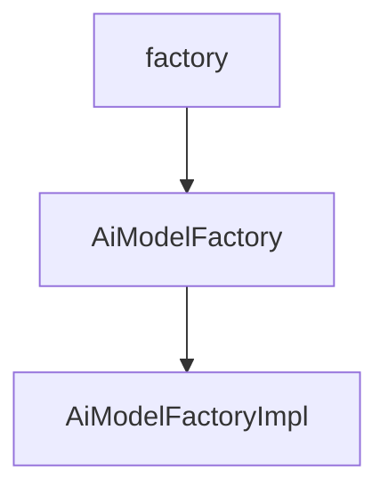

# 基础信息

|      |      |
|------|------|
| 编码语言 | .java |
| 代码路径 | yudao-module-ai/yudao-spring-boot-starter-ai/src/main/java/cn/iocoder/yudao/framework/ai/core/factory |
| 包名 | cn.iocoder.yudao.framework.ai.core.factory |
| 概述说明 | AiModelFactoryImpl类实现AiModelFactory接口，用于获取或创建TongYi、YiYan、DeepSeek等AI平台的多种模型实例，如聊天、图像、Midjourney API等。通过缓存和单例模式高效管理模型，避免重复创建，提升性能。支持动态生成模型实例，提供默认模型简化获取流程，设计灵活且易于扩展。 |

# 说明

AiModelFactoryImpl类实现了AiModelFactory接口，其主要功能是获取或创建不同AI平台的模型实例。这些平台包括TongYi、YiYan、DeepSeek等，涵盖了多种类型的模型，如聊天模型、图像模型、Midjourney API、Suno API、嵌入模型和向量存储。通过缓存机制和单例模式，AiModelFactoryImpl类能够高效地管理和复用这些模型实例，避免重复创建，从而提升系统性能。每个平台的模型创建方法根据提供的API密钥和URL动态生成，确保模型实例的灵活性和可配置性。此外，该类还支持获取默认模型，简化了模型获取的流程，使得用户无需每次都指定具体的模型参数。整体设计旨在提供一种高效、灵活且易于扩展的方式来管理和使用不同AI平台的模型。

### 包内部结构视图

### 描述信息：
该Mermaid图展示了`yudao-module-ai`模块中`AiModelFactory`接口与其实现类`AiModelFactoryImpl`之间的调用关系。`factory`文件夹包含了`AiModelFactory`接口，而`AiModelFactoryImpl`类实现了该接口，形成了清晰的调用关系。

# 文件列表 File List

| 名称   | 类型  | 说明 |
|-------|------|-------------|
| [AiModelFactoryImpl.java](AiModelFactoryImpl.md) | file | AiModelFactoryImpl类实现AiModelFactory接口，提供获取或创建TongYi、YiYan、DeepSeek等平台的聊天、图像、Midjourney API、Suno API、嵌入模型和向量存储的方法。通过缓存和单例模式管理模型实例，确保高效复用。模型创建方法根据API密钥和URL动态生成，支持默认模型获取。 |
| [AiModelFactory.java](AiModelFactory.md) | file | 请提供需要处理的总结描述内容，以便我为您生成不超过100字的概要说明。 |

