# 基础信息

|      |      |
|------|------|
| 编码语言 | .java |
| 代码路径 | yudao-module-ai/yudao-spring-boot-starter-ai/src/main/java/cn/iocoder/yudao/framework/ai/core/model/deepseek/DeepSeekChatModel.java |
| 包名 | cn.iocoder.yudao.framework.ai.core.model.deepseek |
| 依赖项 | ['cn.hutool.core.collection.ListUtil', 'cn.hutool.core.lang.Assert', 'lombok.extern.slf4j.Slf4j', 'org.springframework.ai.chat.metadata.ChatGenerationMetadata', 'org.springframework.ai.chat.model.ChatModel', 'org.springframework.ai.chat.model.ChatResponse', 'org.springframework.ai.chat.model.Generation', 'org.springframework.ai.chat.prompt.ChatOptions', 'org.springframework.ai.chat.prompt.Prompt', 'org.springframework.ai.model.ModelOptionsUtils', 'org.springframework.ai.openai.OpenAiChatOptions', 'org.springframework.ai.openai.api.OpenAiApi', 'org.springframework.ai.openai.metadata.OpenAiChatResponseMetadata', 'org.springframework.ai.retry.RetryUtils', 'org.springframework.http.ResponseEntity', 'org.springframework.retry.support.RetryTemplate', 'reactor.core.publisher.Flux', 'java.util.HashMap', 'java.util.List', 'java.util.Map', 'cn.iocoder.yudao.framework.ai.core.model.deepseek.DeepSeekChatOptions.MODEL_DEFAULT'] |
| 概述说明 | DeepSeekChatModel类实现了ChatModel接口，通过DeepSeek的HTTP接口与OpenAI兼容API交互，支持API密钥初始化、同步异步调用、请求构建与响应处理，转换为ChatResponse返回，并具备流式处理和选项合并功能。 |

# 说明

DeepSeekChatModel类是一个实现了ChatModel接口的类，它通过DeepSeek的HTTP接口与OpenAI兼容的API进行交互。该类设计用于简化与DeepSeek API的通信过程，提供了多种功能以支持开发者高效地集成和使用。

首先，DeepSeekChatModel类包含了一些默认选项和重试模板，这些预设值可以帮助开发者在调用API时减少配置的复杂性。此外，类支持通过API密钥进行初始化，这意味着开发者可以轻松地设置认证信息，确保与API的安全通信。

在功能方面，DeepSeekChatModel类提供了同步和异步两种调用方法。同步调用适用于需要立即获取结果的场景，而异步调用则适用于需要处理长时间运行任务或希望提高应用响应性的场景。无论是同步还是异步调用，类都会构建相应的请求，并处理来自API的响应。处理后的响应会被转换为ChatResponse对象返回，这使得开发者可以方便地获取和使用API返回的数据。

此外，DeepSeekChatModel类还支持流式处理功能，这对于处理大量数据或需要逐步接收数据的应用场景非常有用。流式处理允许数据分批次接收，从而减少内存消耗并提高处理效率。

最后，类还提供了选项合并功能，这使得开发者可以在调用API时灵活地合并默认选项和自定义选项，以满足不同的业务需求。这种灵活性确保了DeepSeekChatModel类可以适应各种复杂的应用场景。

综上所述，DeepSeekChatModel类通过其丰富的功能和灵活的配置选项，为开发者提供了一个强大且易于使用的工具，以便与DeepSeek的API进行高效交互。

# 类列表 Class Summary

| 名称   | 类型  | 说明 |
|-------|------|-------------|
| DeepSeekChatModel | class | DeepSeekChatModel类实现了ChatModel接口，通过DeepSeek的HTTP接口与OpenAI兼容的API进行交互。类中包含默认选项和重试模板，支持通过API密钥初始化，并提供同步和异步调用方法。调用时构建请求并处理响应，转换为ChatResponse返回。类还支持流式处理和选项合并功能。 |


## 类 DeepSeekChatModel

|      |      |
|------|------|
| 访问范围 | @Slf4j;public |
| 类型 | class |
| 名称 | DeepSeekChatModel |
| 说明 | DeepSeekChatModel类实现了ChatModel接口，通过DeepSeek的HTTP接口与OpenAI兼容的API进行交互。类中包含默认选项和重试模板，支持通过API密钥初始化，并提供同步和异步调用方法。调用时构建请求并处理响应，转换为ChatResponse返回。类还支持流式处理和选项合并功能。 |


### UML类图

```mermaid
classDiagram
    class ChatModel {
        <<interface>>
        +call(Prompt prompt) ChatResponse
        +stream(Prompt prompt) Flux~ChatResponse~
        +getDefaultOptions() ChatOptions
    }

    class DeepSeekChatModel {
        -BASE_URL: String = "https://api.deepseek.com"
        -defaultOptions: DeepSeekChatOptions
        -retryTemplate: RetryTemplate
        -openAiApi: OpenAiApi
        +DeepSeekChatModel(String apiKey)
        +DeepSeekChatModel(String apiKey, DeepSeekChatOptions options)
        +DeepSeekChatModel(String apiKey, DeepSeekChatOptions options, RetryTemplate retryTemplate)
        +call(Prompt prompt) ChatResponse
        +stream(Prompt prompt) Flux~ChatResponse~
        +getDefaultOptions() ChatOptions
        -createRequest(Prompt prompt, boolean stream) OpenAiApi.ChatCompletionRequest
        -toMap(String id, OpenAiApi.ChatCompletion.Choice choice) Map~String, Object~
    }

    class OpenAiApi {
        +chatCompletionEntity(OpenAiApi.ChatCompletionRequest request) ResponseEntity~OpenAiApi.ChatCompletion~
        +chatCompletionStream(OpenAiApi.ChatCompletionRequest request) Flux~OpenAiApi.ChatCompletionChunk~
    }

    class DeepSeekChatOptions {
        +builder() Builder
        +fromOptions(DeepSeekChatOptions options) ChatOptions
    }

    class RetryTemplate {
        +execute(RetryCallback~T, E~ retryCallback) T
    }

    class ChatResponse {
        +ChatResponse(List~Generation~ generations)
        +ChatResponse(List~Generation~ generations, OpenAiChatResponseMetadata metadata)
    }

    class Generation {
        +Generation(String content, Map~String, Object~ metadata)
        +withGenerationMetadata(ChatGenerationMetadata metadata) Generation
    }

    class OpenAiChatResponseMetadata {
        +from(OpenAiApi.ChatCompletion body) OpenAiChatResponseMetadata
    }

    class ChatGenerationMetadata {
        +from(String finishReason, Object additionalMetadata) ChatGenerationMetadata
    }

    class Prompt {
        +getInstructions() List~Instruction~
        +getOptions() ChatOptions
    }

    class Instruction {
        +getContent() String
        +getMessageType() MessageType
    }

    class ChatOptions {
        <<interface>>
    }

    class OpenAiChatOptions {
        +copyToTarget(ChatOptions source, Class~ChatOptions~ sourceClass, Class~OpenAiChatOptions~ targetClass) OpenAiChatOptions
        +merge(OpenAiChatOptions source, OpenAiApi.ChatCompletionRequest target, Class~OpenAiApi.ChatCompletionRequest~ targetClass) OpenAiApi.ChatCompletionRequest
    }

    class ModelOptionsUtils {
        +copyToTarget(ChatOptions source, Class~ChatOptions~ sourceClass, Class~OpenAiChatOptions~ targetClass) OpenAiChatOptions
        +merge(OpenAiChatOptions source, OpenAiApi.ChatCompletionRequest target, Class~OpenAiApi.ChatCompletionRequest~ targetClass) OpenAiApi.ChatCompletionRequest
    }

    DeepSeekChatModel <|.. ChatModel
    DeepSeekChatModel --> OpenAiApi
    DeepSeekChatModel --> DeepSeekChatOptions
    DeepSeekChatModel --> RetryTemplate
    DeepSeekChatModel --> ChatResponse
    DeepSeekChatModel --> Generation
    DeepSeekChatModel --> OpenAiChatResponseMetadata
    DeepSeekChatModel --> ChatGenerationMetadata
    DeepSeekChatModel --> Prompt
    DeepSeekChatModel --> Instruction
    DeepSeekChatModel --> ChatOptions
    DeepSeekChatModel --> OpenAiChatOptions
    DeepSeekChatModel --> ModelOptionsUtils
```



### 描述：
该UML类图展示了`DeepSeekChatModel`类及其相关类和接口的关系。`DeepSeekChatModel`实现了`ChatModel`接口，并通过`OpenAiApi`与DeepSeek的API进行交互。类图中还展示了`DeepSeekChatModel`如何通过`RetryTemplate`处理重试逻辑，以及如何通过`ChatResponse`和`Generation`类处理响应数据。


### 内部方法调用关系图

```mermaid
graph TD
    DeepSeekChatModel --> DeepSeekChatModel_Constructor1
    DeepSeekChatModel --> DeepSeekChatModel_Constructor2
    DeepSeekChatModel --> DeepSeekChatModel_Constructor3
    DeepSeekChatModel --> call
    DeepSeekChatModel --> stream
    DeepSeekChatModel --> createRequest
    DeepSeekChatModel --> getDefaultOptions
    call --> createRequest
    call --> retryTemplate.execute
    retryTemplate.execute --> openAiApi.chatCompletionEntity
    retryTemplate.execute --> toMap
    stream --> createRequest
    stream --> retryTemplate.execute
    retryTemplate.execute --> openAiApi.chatCompletionStream
    createRequest --> ModelOptionsUtils.copyToTarget
    createRequest --> ModelOptionsUtils.merge
    getDefaultOptions --> DeepSeekChatOptions.fromOptions
```

### 描述信息：
该图展示了`DeepSeekChatModel`类中方法之间的调用关系。`DeepSeekChatModel`类通过多个构造函数初始化，并提供了`call`和`stream`方法来处理聊天请求。`call`方法通过`retryTemplate.execute`调用`openAiApi.chatCompletionEntity`，而`stream`方法则调用`openAiApi.chatCompletionStream`。`createRequest`方法用于构建请求对象，并调用了`ModelOptionsUtils`工具类的方法。`getDefaultOptions`方法返回默认的聊天选项。

### 字段列表 Field List

| 名称  | 类型  | 说明 |
|-------|-------|------|
| retryTemplate | RetryTemplate | private final RetryTemplate retryTemplate; 声明了一个私有的、不可变的RetryTemplate对象，用于实现重试机制。 |
| openAiApi | OpenAiApi | private final OpenAiApi openAiApi 是一个私有且不可变的OpenAiApi实例，用于访问OpenAI的API服务。 |
| BASE_URL = "https://api.deepseek.com" | String | 概要说明：代码定义了一个静态常量BASE_URL，其值为"https://api.deepseek.com"，用于存储基础API地址。 |
| defaultOptions | DeepSeekChatOptions | private final DeepSeekChatOptions defaultOptions 表示一个私有的、不可变的 DeepSeekChatOptions 类型的默认选项变量。 |

### 方法列表 Method List

| 名称  | 类型  | 说明 |
|-------|-------|------|
| getDefaultOptions | ChatOptions | 该方法重写了`getDefaultOptions`，返回通过`DeepSeekChatOptions.fromOptions`方法从`defaultOptions`生成的聊天选项对象。 |
| toMap | Map<String, Object> | 该方法将给定的ID和OpenAiApi.ChatCompletion.Choice对象转换为一个Map。Map包含消息角色（如果存在）、完成原因（如果存在）以及ID。最终返回生成的Map。 |
| createRequest | OpenAiApi.ChatCompletionRequest | 该方法用于创建OpenAI聊天完成请求。首先，根据提示内容构建ChatCompletionMessage对象列表，然后创建ChatCompletionRequest对象。如果提示中包含自定义选项，将其合并到请求中；若未提供自定义选项，则使用默认选项。最终返回配置好的请求对象。 |
| call | ChatResponse | 该方法通过调用OpenAI API生成聊天响应。首先创建请求并执行重试机制，发起API调用并校验返回结果。若结果为空或无效，记录警告并返回空响应。若结果有效，将API返回的选项转换为生成对象列表，并构建包含生成内容和元数据的聊天响应返回。 |
| stream | Flux<ChatResponse> | 该方法通过调用OpenAI API的流式聊天完成接口，将返回的聊天完成块转换为ChatResponse对象。首先创建请求并执行重试逻辑，然后处理每个聊天完成块，提取ID、角色和完成原因等信息，生成Generation对象并封装为ChatResponse返回。特别处理了当完成原因为STOP时角色为空的情况，确保角色为ASSISTANT。 |


