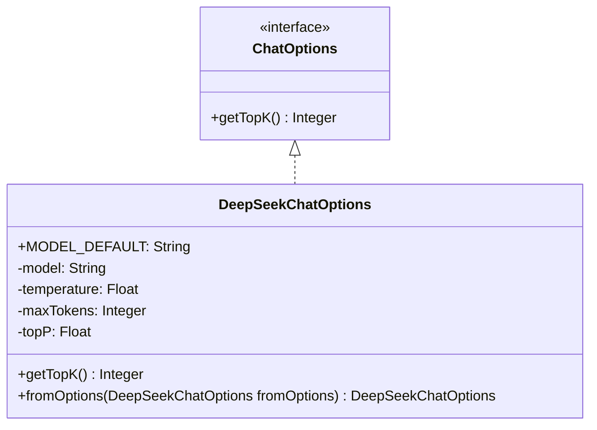
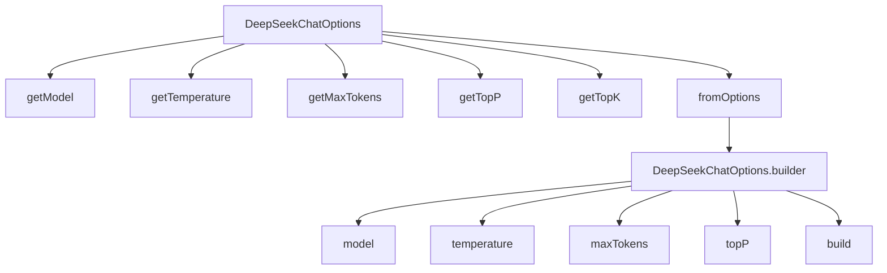

# 基础信息

|      |      |
|------|------|
| 编码语言 | .java |
| 代码路径 | yudao-module-ai/yudao-spring-boot-starter-ai/src/main/java/cn/iocoder/yudao/framework/ai/core/model/deepseek/DeepSeekChatOptions.java |
| 包名 | cn.iocoder.yudao.framework.ai.core.model.deepseek |
| 依赖项 | ['lombok.AllArgsConstructor', 'lombok.Builder', 'lombok.Data', 'lombok.NoArgsConstructor', 'org.springframework.ai.chat.prompt.ChatOptions'] |
| 概述说明 | DeepSeekChatOptions类实现了ChatOptions接口，包含模型、温度、最大Token和topP等属性，默认模型为"deepseek-chat"。该类提供无参和全参构造函数，支持Builder模式，并包含静态方法fromOptions用于从现有选项创建新实例。 |

# 说明

DeepSeekChatOptions类是一个实现了ChatOptions接口的类，主要用于配置聊天模型的相关参数。该类包含多个属性，其中模型属性默认设置为"deepseek-chat"，其他属性包括温度、最大Token和topP等，这些属性用于控制生成文本的多样性和长度。为了提供灵活的实例化方式，DeepSeekChatOptions类提供了两种构造函数：一个无参构造函数和一个全参构造函数，允许用户根据需要设置不同的参数。此外，该类还支持Builder模式，使得在创建对象时可以链式调用设置方法，进一步增强了代码的可读性和易用性。为了方便从现有配置创建新的实例，DeepSeekChatOptions类还包含一个静态方法fromOptions，该方法可以从一个已有的选项对象中提取参数并生成一个新的DeepSeekChatOptions实例。通过这些设计，DeepSeekChatOptions类为开发者提供了高度灵活和可扩展的配置选项，适用于各种不同的聊天模型应用场景。

# 类列表 Class Summary

| 名称   | 类型  | 说明 |
|-------|------|-------------|
| DeepSeekChatOptions | class | DeepSeekChatOptions类实现了ChatOptions接口，包含模型、温度、最大Token和topP等属性，默认模型为"deepseek-chat"。该类提供了无参和全参构造函数，支持Builder模式，并包含一个静态方法fromOptions用于从现有选项创建新实例。 |

## 类 DeepSeekChatOptions

|      |      |
|------|------|
| 访问范围 | @Data;@NoArgsConstructor;@AllArgsConstructor;@Builder;public |
| 类型 | class |
| 名称 | DeepSeekChatOptions |
| 说明 | DeepSeekChatOptions类实现了ChatOptions接口，包含模型、温度、最大Token和topP等属性，默认模型为"deepseek-chat"。该类提供了无参和全参构造函数，支持Builder模式，并包含一个静态方法fromOptions用于从现有选项创建新实例。 |

### UML类图

### 描述：
该UML类图展示了一个名为`DeepSeekChatOptions`的类，它实现了`ChatOptions`接口。`DeepSeekChatOptions`类包含四个私有属性：`model`、`temperature`、`maxTokens`和`topP`，并提供了`getTopK`方法和一个静态工厂方法`fromOptions`。`ChatOptions`接口定义了一个`getTopK`方法，`DeepSeekChatOptions`类通过实现该接口来提供具体实现。

### 内部方法调用关系图

### 描述信息：
该图展示了`DeepSeekChatOptions`类中方法之间的调用关系。`fromOptions`方法调用了`DeepSeekChatOptions.builder`来构建一个新的`DeepSeekChatOptions`实例，并依次设置了`model`、`temperature`、`maxTokens`和`topP`属性。`getTopK`方法返回`null`，与其他方法无直接调用关系。

### 字段列表 Field List

| 名称  | 类型  | 说明 |
|-------|-------|------|
| temperature | Float | 温度数据为浮点数类型。 |
| topP | Float | topP 是一个私有的浮点数变量。 |
| model | String | private String model; 定义了一个私有的字符串类型变量 model，用于存储模型信息。 |
| maxTokens | Integer | private Integer maxTokens; 表示一个私有的整数类型变量maxTokens，用于存储最大令牌数。 |
| MODEL_DEFAULT = "deepseek-chat" | String | public static final String MODEL_DEFAULT = "deepseek-chat"; 定义了一个名为MODEL_DEFAULT的公共静态常量字符串，其值为"deepseek-chat"。 |

### 方法列表 Method List

| 名称  | 类型  | 说明 |
|-------|-------|------|
| fromOptions | DeepSeekChatOptions | 该方法通过传入的DeepSeekChatOptions对象，构建并返回一个新的DeepSeekChatOptions实例，包含模型、温度、最大令牌数和topP参数。 |
| getTopK | Integer | 该代码片段是一个Java方法的重写，方法名为`getTopK`，返回类型为`Integer`。方法当前返回`null`，未实现具体功能。 |

