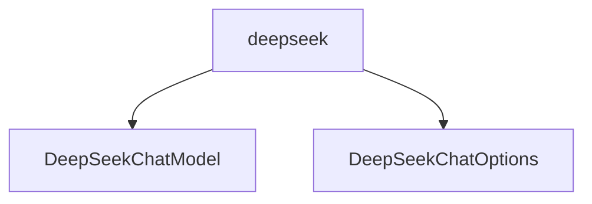

# 基础信息

|      |      |
|------|------|
| 编码语言 | .java |
| 代码路径 | yudao-module-ai/yudao-spring-boot-starter-ai/src/main/java/cn/iocoder/yudao/framework/ai/core/model/deepseek |
| 包名 | cn.iocoder.yudao.framework.ai.core.model.deepseek |
| 概述说明 | DeepSeekChatModel类实现了ChatModel接口，通过DeepSeek的HTTP接口与OpenAI兼容API交互，简化通信过程。支持同步和异步调用、流式处理及选项合并功能，提供默认选项和重试模板，通过API密钥初始化确保安全通信。DeepSeekChatOptions类用于配置聊天模型参数，包含模型、温度、最大Token等属性，支持无参和全参构造函数及Builder模式，提供fromOptions方法从现有配置创建新实例，增强灵活性和可扩展性。 |

# 说明

DeepSeekChatModel类是一个实现了ChatModel接口的类，旨在简化与DeepSeek API的通信过程。该类通过HTTP接口与OpenAI兼容的API进行交互，提供了多种功能以支持开发者高效集成和使用。DeepSeekChatModel类包含默认选项和重试模板，减少了配置的复杂性，并支持通过API密钥进行初始化，确保安全通信。功能上，该类提供了同步和异步两种调用方法，分别适用于需要立即获取结果和处理长时间运行任务的场景。无论是同步还是异步调用，类都会构建请求并处理API响应，将响应转换为ChatResponse对象返回，便于开发者使用。此外，类还支持流式处理功能，适用于处理大量数据或逐步接收数据的场景，减少内存消耗并提高处理效率。类还提供了选项合并功能，允许开发者灵活合并默认选项和自定义选项，适应不同业务需求。

DeepSeekChatOptions类是一个实现了ChatOptions接口的类，主要用于配置聊天模型的相关参数。该类包含多个属性，如模型属性默认设置为"deepseek-chat"，其他属性包括温度、最大Token和topP等，用于控制生成文本的多样性和长度。DeepSeekChatOptions类提供了两种构造函数：无参构造函数和全参构造函数，允许用户根据需要设置不同参数。此外，类支持Builder模式，使得在创建对象时可以链式调用设置方法，增强代码可读性和易用性。类还包含一个静态方法fromOptions，可以从已有选项对象中提取参数并生成新的DeepSeekChatOptions实例。通过这些设计，DeepSeekChatOptions类为开发者提供了高度灵活和可扩展的配置选项，适用于各种聊天模型应用场景。

### 包内部结构视图

### 描述信息：
该Mermaid图展示了`deepseek`文件夹下的两个Java文件`DeepSeekChatModel.java`和`DeepSeekChatOptions.java`之间的调用关系。`deepseek`文件夹是这两个文件的父目录，图中清晰地展示了它们之间的层级关系。

# 文件列表 File List

| 名称   | 类型  | 说明 |
|-------|------|-------------|
| [DeepSeekChatOptions.java](DeepSeekChatOptions.md) | file | DeepSeekChatOptions类实现了ChatOptions接口，包含模型、温度、最大Token和topP等属性，默认模型为"deepseek-chat"。该类提供无参和全参构造函数，支持Builder模式，并包含静态方法fromOptions用于从现有选项创建新实例。 |
| [DeepSeekChatModel.java](DeepSeekChatModel.md) | file | DeepSeekChatModel类实现了ChatModel接口，通过DeepSeek的HTTP接口与OpenAI兼容API交互，支持API密钥初始化、同步异步调用、请求构建与响应处理，转换为ChatResponse返回，并具备流式处理和选项合并功能。 |

