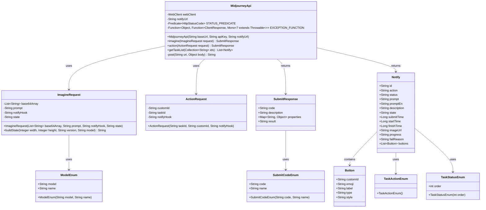
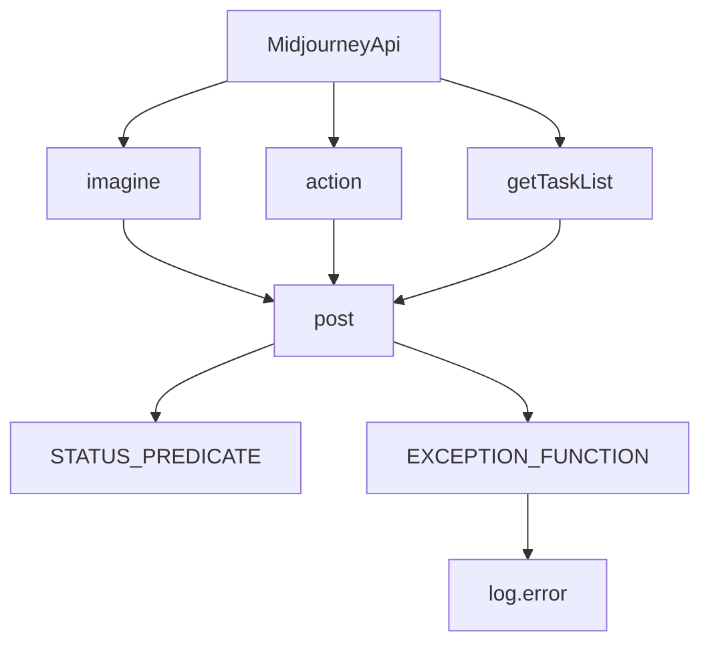

# 基础信息

|      |      |
|------|------|
| 编码语言 | .java |
| 代码路径 | yudao-module-ai/yudao-spring-boot-starter-ai/src/main/java/cn/iocoder/yudao/framework/ai/core/model/midjourney/api/MidjourneyApi.java |
| 包名 | cn.iocoder.yudao.framework.ai.core.model.midjourney.api |
| 依赖项 | ['cn.hutool.core.util.StrUtil', 'cn.iocoder.yudao.framework.common.util.json.JsonUtils', 'com.google.common.collect.ImmutableMap', 'com.google.common.collect.Lists', 'lombok.AllArgsConstructor', 'lombok.Data', 'lombok.Getter', 'lombok.extern.slf4j.Slf4j', 'org.springframework.ai.openai.api.ApiUtils', 'org.springframework.http.HttpRequest', 'org.springframework.http.HttpStatusCode', 'org.springframework.web.reactive.function.client.ClientResponse', 'org.springframework.web.reactive.function.client.WebClient', 'reactor.core.publisher.Mono', 'java.util.Collection', 'java.util.List', 'java.util.Map', 'java.util.function.Function', 'java.util.function.Predicate'] |
| 概述说明 | MidjourneyApi类用于与Midjourney API交互，支持生成图片、放大缩小等操作，通过WebClient发送POST请求，处理非2xx响应并记录错误日志。提供设置通知地址、返回任务提交结果和任务列表功能，包含ImagineRequest、ActionRequest、SubmitResponse等数据结构及任务状态和操作类型的枚举。 |

# 说明

MidjourneyApi类是一个用于与Midjourney API进行交互的工具类，提供了多种操作功能，包括生成图片、放大和缩小图片等。该类通过WebClient发送POST请求与API进行通信，并能够处理非2xx的响应状态码，同时记录错误日志以便后续排查问题。MidjourneyApi类还支持设置通知地址，当任务完成或状态发生变化时，可以通过该地址接收通知。此外，该类能够返回任务提交的结果以及任务列表，方便用户查看和管理任务进度。

在数据结构方面，MidjourneyApi类包含了多个重要的数据结构，如ImagineRequest、ActionRequest和SubmitResponse。ImagineRequest用于封装生成图片的请求参数，ActionRequest则用于封装对图片进行放大或缩小等操作的请求参数。SubmitResponse则用于表示任务提交后的响应结果，包含任务ID、状态等信息。此外，该类还定义了任务状态和操作类型的枚举，用于表示任务的不同状态（如进行中、已完成、失败等）以及可执行的操作类型（如生成、放大、缩小等）。

总的来说，MidjourneyApi类为开发者提供了一个简洁而强大的接口，能够方便地与Midjourney API进行交互，执行各种图片生成和处理操作，并实时监控任务状态。

# 类列表 Class Summary

| 名称   | 类型  | 说明 |
|-------|------|-------------|
| MidjourneyApi | class | MidjourneyApi类用于与Midjourney API交互，提供生成图片、放大缩小等操作。通过WebClient发送POST请求，处理非2xx响应并记录错误日志。支持设置通知地址，返回任务提交结果和任务列表。包含ImagineRequest、ActionRequest、SubmitResponse等数据结构，以及任务状态和操作类型的枚举。 |

## 类 MidjourneyApi

|      |      |
|------|------|
| 访问范围 | @Slf4j;public |
| 类型 | class |
| 名称 | MidjourneyApi |
| 说明 | MidjourneyApi类用于与Midjourney API交互，提供生成图片、放大缩小等操作。通过WebClient发送POST请求，处理非2xx响应并记录错误日志。支持设置通知地址，返回任务提交结果和任务列表。包含ImagineRequest、ActionRequest、SubmitResponse等数据结构，以及任务状态和操作类型的枚举。 |

### UML类图

以下是根据您提供的信息生成的Mermaid格式的UML类图：

### 描述信息：
该UML类图展示了`MidjourneyApi`类及其相关类的关系。`MidjourneyApi`类通过`WebClient`与外部API进行交互，并处理`ImagineRequest`和`ActionRequest`请求，返回`SubmitResponse`和`Notify`结果。`Notify`类包含多个`Button`对象，并且使用了多个枚举类如`ModelEnum`、`SubmitCodeEnum`、`TaskActionEnum`和`TaskStatusEnum`来定义不同的状态和行为。

### 内部方法调用关系图

### 描述信息：
该图展示了`MidjourneyApi`类中方法之间的调用关系。`imagine`、`action`和`getTaskList`方法都调用了`post`方法，而`post`方法则依赖于`STATUS_PREDICATE`和`EXCEPTION_FUNCTION`来处理HTTP请求的状态和异常。`EXCEPTION_FUNCTION`在发生错误时会调用`log.error`记录日志。

### 字段列表 Field List

| 名称  | 类型  | 说明 |
|-------|-------|------|
| notifyUrl | String | private final String notifyUrl; 是一个私有且不可变的字符串变量，用于存储通知URL地址。 |
| webClient | WebClient | 该代码片段定义了一个私有的、不可变的WebClient实例变量，用于在应用程序中进行HTTP请求。 |
| STATUS_PREDICATE = status -> !status.is2xxSuccessful() | Predicate<HttpStatusCode> | private final Predicate<HttpStatusCode> STATUS_PREDICATE = status -> !status.is2xxSuccessful(); 定义了一个谓词，用于判断HTTP状态码是否不属于2xx成功类别。 |
| EXCEPTION_FUNCTION =
            reqParam -> response -> response.bodyToMono(String.class).handle((responseBody, sink) -> {
                HttpRequest request = response.request();
                log.error("[midjourney-api] 调用失败！请求方式:[{}]，请求地址:[{}]，请求参数:[{}]，响应数据: [{}]",
                        request.getMethod(), request.getURI(), reqParam, responseBody);
                sink.error(new IllegalStateException("[midjourney-api] 调用失败！"));
            }) | Function<Object, Function<ClientResponse, Mono<? extends Throwable>>> | 该代码定义了一个异常处理函数EXCEPTION_FUNCTION，用于处理API调用失败的情况。当请求失败时，函数会记录错误日志，包括请求方式、请求地址、请求参数和响应数据，并抛出一个IllegalStateException异常，提示API调用失败。 |

### 方法列表 Method List

| 名称  | 类型  | 说明 |
|-------|-------|------|
| post | String | 该方法通过WebClient发送POST请求，将传入的URI和对象体转换为JSON字符串作为请求体，处理响应状态并根据条件抛出异常，最终返回响应体的字符串形式。 |
| getTaskList | List<Notify> | 该方法通过POST请求发送包含指定ID集合的数据到"/task/list-by-condition"路径，并接收返回的JSON字符串，然后将其解析为Notify对象的列表。 |
| action | SubmitResponse | 该方法接收一个ActionRequest对象，检查其notifyHook属性是否为空，若为空则设置为notifyUrl。然后向"/submit/action"发送POST请求，并将响应解析为SubmitResponse对象返回。 |
| imagine | SubmitResponse | 该方法接收一个ImagineRequest对象，检查其notifyHook属性是否为空，若为空则设置为notifyUrl。随后通过POST请求将请求对象发送至"/submit/imagine"路径，并将返回的响应解析为SubmitResponse对象后返回。 |

