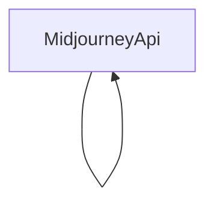

# 基础信息

|      |      |
|------|------|
| 编码语言 | .java |
| 代码路径 | yudao-module-ai/yudao-spring-boot-starter-ai/src/main/java/cn/iocoder/yudao/framework/ai/core/model/midjourney/api |
| 包名 | cn.iocoder.yudao.framework.ai.core.model.midjourney.api |
| 概述说明 | MidjourneyApi类用于与Midjourney API交互，支持生成图片、放大缩小等操作，通过WebClient发送POST请求，处理非2xx响应并记录错误日志。提供设置通知地址、返回任务提交结果和任务列表功能，包含ImagineRequest、ActionRequest、SubmitResponse等数据结构及任务状态和操作类型的枚举。 |

# 说明

MidjourneyApi类是一个用于与Midjourney API进行交互的工具类，提供了多种操作功能，包括生成图片、放大和缩小图片等。该类通过WebClient发送POST请求与API进行通信，并能够处理非2xx的响应状态码，同时记录错误日志以便后续排查问题。MidjourneyApi类还支持设置通知地址，当任务完成或状态发生变化时，可以通过该地址接收通知。此外，该类能够返回任务提交的结果以及任务列表，方便用户查看和管理任务进度。

在数据结构方面，MidjourneyApi类包含了多个重要的数据结构，如ImagineRequest、ActionRequest和SubmitResponse。ImagineRequest用于封装生成图片的请求参数，ActionRequest则用于封装对图片进行放大或缩小等操作的请求参数。SubmitResponse则用于表示任务提交后的响应结果，包含任务ID、状态等信息。此外，该类还定义了任务状态和操作类型的枚举，用于表示任务的不同状态（如进行中、已完成、失败等）以及可执行的操作类型（如生成、放大、缩小等）。

总的来说，MidjourneyApi类为开发者提供了一个简洁而强大的接口，能够方便地与Midjourney API进行交互，执行各种图片生成和处理操作，并实时监控任务状态。

### 包内部结构视图

### 描述信息：
该Mermaid图展示了`MidjourneyApi`类内部的调用关系。由于给定的信息仅包含一个文件路径，图中仅显示`MidjourneyApi`类自身的调用关系。该图简洁明了，展示了类内部的自我调用关系。

# 文件列表 File List

| 名称   | 类型  | 说明 |
|-------|------|-------------|
| [MidjourneyApi.java](MidjourneyApi.md) | file | MidjourneyApi类用于与Midjourney API交互，支持生成图片、放大缩小等操作，通过WebClient发送POST请求，处理非2xx响应并记录错误日志。提供设置通知地址、返回任务提交结果和任务列表功能，包含ImagineRequest、ActionRequest、SubmitResponse等数据结构及任务状态和操作类型的枚举。 |

