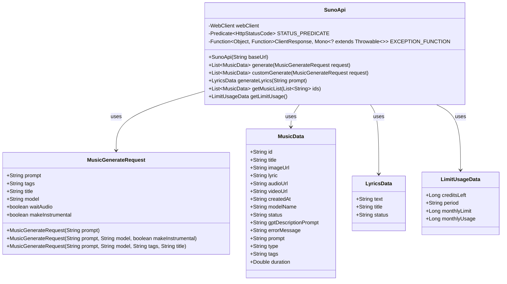
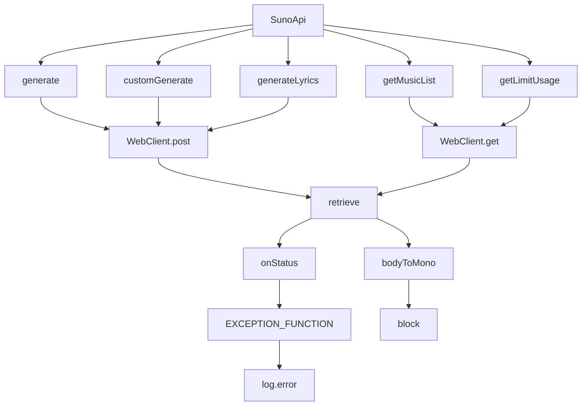

# 基础信息

|      |      |
|------|------|
| 编码语言 | .java |
| 代码路径 | yudao-module-ai/yudao-spring-boot-starter-ai/src/main/java/cn/iocoder/yudao/framework/ai/core/model/suno/api/SunoApi.java |
| 包名 | cn.iocoder.yudao.framework.ai.core.model.suno.api |
| 依赖项 | ['cn.hutool.core.collection.CollUtil', 'cn.hutool.core.text.StrPool', 'com.fasterxml.jackson.annotation.JsonInclude', 'com.fasterxml.jackson.annotation.JsonProperty', 'lombok.extern.slf4j.Slf4j', 'org.springframework.core.ParameterizedTypeReference', 'org.springframework.http.HttpRequest', 'org.springframework.http.HttpStatusCode', 'org.springframework.http.MediaType', 'org.springframework.web.reactive.function.client.ClientResponse', 'org.springframework.web.reactive.function.client.WebClient', 'reactor.core.publisher.Mono', 'java.util.List', 'java.util.function.Function', 'java.util.function.Predicate'] |
| 概述说明 | SunoApi类通过WebClient与Suno API交互，支持生成音乐、自定义生成音乐、生成歌词、获取音乐列表及限额使用情况等功能。API调用失败时记录错误日志并抛出异常。MusicGenerateRequest类包含生成音乐的请求参数如提示、标签、标题、模型等。MusicData、LyricsData和LimitUsageData分别表示音乐数据、歌词数据和限额使用数据。 |

# 说明

SunoApi类是一个用于与Suno API进行交互的工具类，主要通过WebClient实现与API的通信。该类提供了多种功能，包括生成音乐、自定义生成音乐、生成歌词、获取音乐列表以及查询限额使用情况等。当API调用失败时，系统会记录错误日志并抛出异常，以便开发者能够及时处理问题。

在生成音乐的过程中，MusicGenerateRequest类用于封装请求参数。这些参数包括提示（prompt）、标签（tags）、标题（title）以及模型（model）等信息，确保生成音乐时能够根据用户的需求进行定制化操作。生成的音乐数据、歌词数据以及限额使用数据分别由MusicData、LyricsData和LimitUsageData类表示。这些类用于存储和传递API返回的相关信息，便于后续处理和使用。

通过SunoApi类，开发者可以方便地调用Suno API的各项功能，并根据返回的数据进行进一步的操作。无论是生成音乐、获取歌词，还是查询限额使用情况，SunoApi类都提供了简洁的接口，使得与Suno API的交互变得更加高效和便捷。

# 类列表 Class Summary

| 名称   | 类型  | 说明 |
|-------|------|-------------|
| SunoApi | class | SunoApi类通过WebClient与Suno API交互，提供生成音乐、自定义生成音乐、生成歌词、获取音乐列表及限额使用情况等功能。API调用失败时记录错误日志并抛出异常。MusicGenerateRequest类用于生成音乐的请求参数，包含提示、标签、标题、模型等信息。MusicData、LyricsData和LimitUsageData分别表示音乐数据、歌词数据和限额使用数据。 |

## 类 SunoApi

|      |      |
|------|------|
| 访问范围 | @Slf4j;public |
| 类型 | class |
| 名称 | SunoApi |
| 说明 | SunoApi类通过WebClient与Suno API交互，提供生成音乐、自定义生成音乐、生成歌词、获取音乐列表及限额使用情况等功能。API调用失败时记录错误日志并抛出异常。MusicGenerateRequest类用于生成音乐的请求参数，包含提示、标签、标题、模型等信息。MusicData、LyricsData和LimitUsageData分别表示音乐数据、歌词数据和限额使用数据。 |

### UML类图

### 描述信息：
该UML类图展示了`SunoApi`类及其相关数据类的结构。`SunoApi`类通过`WebClient`与外部API进行交互，并定义了多个方法用于生成音乐、歌词以及获取音乐列表和限额数据。`MusicGenerateRequest`、`MusicData`、`LyricsData`和`LimitUsageData`是用于封装请求和响应数据的记录类。

### 内部方法调用关系图

### 描述信息：
该图展示了`SunoApi`类中各个方法之间的调用关系。`SunoApi`类通过`WebClient`进行HTTP请求，调用`generate`、`customGenerate`、`generateLyrics`、`getMusicList`和`getLimitUsage`等方法。每个方法都会调用`WebClient`的`post`或`get`方法，并通过`retrieve`获取响应。如果响应状态码不成功，则会调用`EXCEPTION_FUNCTION`处理异常，并记录错误日志。最后，通过`bodyToMono`将响应体转换为相应的数据类型，并使用`block`方法阻塞等待结果。

### 字段列表 Field List

| 名称  | 类型  | 说明 |
|-------|-------|------|
| webClient | WebClient | 该代码片段定义了一个私有的、不可变的WebClient实例变量，用于在应用程序中进行HTTP请求。 |
| STATUS_PREDICATE = status -> !status.is2xxSuccessful() | Predicate<HttpStatusCode> | 该代码定义了一个名为STATUS_PREDICATE的私有常量，类型为Predicate<HttpStatusCode>，用于判断HTTP状态码是否不属于2xx成功类别。 |
| EXCEPTION_FUNCTION =
            reqParam -> response -> response.bodyToMono(String.class).handle((responseBody, sink) -> {
                HttpRequest request = response.request();
                log.error("[suno-api] 调用失败！请求方式:[{}]，请求地址:[{}]，请求参数:[{}]，响应数据: [{}]",
                        request.getMethod(), request.getURI(), reqParam, responseBody);
                sink.error(new IllegalStateException("[suno-api] 调用失败！"));
            }) | Function<Object, Function<ClientResponse, Mono<? extends Throwable>>> | 该代码定义了一个异常处理函数EXCEPTION_FUNCTION，用于处理API调用失败的情况。当请求失败时，函数会记录错误日志，包括请求方式、请求地址、请求参数和响应数据，并抛出一个IllegalStateException异常，提示API调用失败。 |

### 方法列表 Method List

| 名称  | 类型  | 说明 |
|-------|-------|------|
| generateLyrics | LyricsData | 该方法通过HTTP POST请求向指定API发送音乐生成请求，并接收返回的歌词数据。使用WebClient进行请求，处理状态码异常，并最终返回同步阻塞的歌词数据。 |
| getLimitUsage | LimitUsageData | 该方法通过WebClient发送GET请求到"/api/get_limit"端点，获取限用数据。若响应状态符合预设条件，则抛出异常；否则，将响应体转换为LimitUsageData类型并返回。 |
| getMusicList | List<MusicData> | 该方法通过WebClient发送GET请求，使用提供的ID列表构建URI，查询参数为逗号分隔的ID字符串。请求成功后，将响应体转换为`List<MusicData>`类型并返回。若状态码匹配预设条件，则抛出异常。 |
| generate | List<MusicData> | 该方法通过HTTP POST请求向指定URI发送音乐生成请求，处理响应状态并返回生成的音乐数据列表。使用WebClient进行请求，通过Mono处理异步响应，并在出现特定状态时抛出异常。最终通过block方法同步获取结果。 |
| customGenerate | List<MusicData> | 该方法通过HTTP POST请求调用外部API生成音乐数据。它接收一个MusicGenerateRequest对象作为请求体，发送到"/api/custom_generate"端点。处理响应时，检查状态码并处理异常，最终将响应体转换为List<MusicData>类型并返回。整个过程是同步的，使用block()方法等待结果。 |

