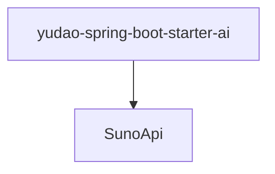

# 基础信息

|      |      |
|------|------|
| 编码语言 | .java |
| 代码路径 | yudao-module-ai/yudao-spring-boot-starter-ai/src/main/java/cn/iocoder/yudao/framework/ai/core/model/suno/api |
| 包名 | cn.iocoder.yudao.framework.ai.core.model.suno.api |
| 概述说明 | SunoApi类通过WebClient与Suno API交互，支持生成音乐、自定义生成音乐、生成歌词、获取音乐列表及限额使用情况等功能。API调用失败时记录错误日志并抛出异常。MusicGenerateRequest类包含生成音乐的请求参数如提示、标签、标题、模型等。MusicData、LyricsData和LimitUsageData分别表示音乐数据、歌词数据和限额使用数据。 |

# 说明

SunoApi类是一个用于与Suno API进行交互的工具类，主要通过WebClient实现与API的通信。该类提供了多种功能，包括生成音乐、自定义生成音乐、生成歌词、获取音乐列表以及查询限额使用情况等。当API调用失败时，系统会记录错误日志并抛出异常，以便开发者能够及时处理问题。

在生成音乐的过程中，MusicGenerateRequest类用于封装请求参数。这些参数包括提示（prompt）、标签（tags）、标题（title）以及模型（model）等信息，确保生成音乐时能够根据用户的需求进行定制化操作。生成的音乐数据、歌词数据以及限额使用数据分别由MusicData、LyricsData和LimitUsageData类表示。这些类用于存储和传递API返回的相关信息，便于后续处理和使用。

通过SunoApi类，开发者可以方便地调用Suno API的各项功能，并根据返回的数据进行进一步的操作。无论是生成音乐、获取歌词，还是查询限额使用情况，SunoApi类都提供了简洁的接口，使得与Suno API的交互变得更加高效和便捷。

### 包内部结构视图

### 描述信息：
该Mermaid图展示了`yudao-spring-boot-starter-ai`模块与`SunoApi`类之间的调用关系。`yudao-spring-boot-starter-ai`模块依赖于`SunoApi`类，用于处理AI核心模型的相关API调用。

# 文件列表 File List

| 名称   | 类型  | 说明 |
|-------|------|-------------|
| [SunoApi.java](SunoApi.md) | file | SunoApi类通过WebClient与Suno API交互，支持生成音乐、自定义生成音乐、生成歌词、获取音乐列表及限额使用情况等功能。API调用失败时记录错误日志并抛出异常。MusicGenerateRequest类包含生成音乐的请求参数如提示、标签、标题、模型等。MusicData、LyricsData和LimitUsageData分别表示音乐数据、歌词数据和限额使用数据。 |

