# 基础信息

|      |      |
|------|------|
| 编码语言 | .java |
| 代码路径 | yudao-module-ai/yudao-spring-boot-starter-ai/src/main/java/cn/iocoder/yudao/framework/ai/core/model/xinghuo/XingHuoChatModel.java |
| 包名 | cn.iocoder.yudao.framework.ai.core.model.xinghuo |
| 依赖项 | ['cn.hutool.core.collection.ListUtil', 'cn.hutool.core.lang.Assert', 'lombok.extern.slf4j.Slf4j', 'org.springframework.ai.chat.metadata.ChatGenerationMetadata', 'org.springframework.ai.chat.model.ChatModel', 'org.springframework.ai.chat.model.ChatResponse', 'org.springframework.ai.chat.model.Generation', 'org.springframework.ai.chat.prompt.ChatOptions', 'org.springframework.ai.chat.prompt.Prompt', 'org.springframework.ai.model.ModelOptionsUtils', 'org.springframework.ai.openai.OpenAiChatOptions', 'org.springframework.ai.openai.api.OpenAiApi', 'org.springframework.ai.openai.metadata.OpenAiChatResponseMetadata', 'org.springframework.ai.retry.RetryUtils', 'org.springframework.http.ResponseEntity', 'org.springframework.retry.support.RetryTemplate', 'reactor.core.publisher.Flux', 'java.util.HashMap', 'java.util.List', 'java.util.Map', 'cn.iocoder.yudao.framework.ai.core.model.xinghuo.XingHuoChatOptions.MODEL_DEFAULT'] |
| 概述说明 | XingHuoChatModel类实现ChatModel接口，通过OpenAiApi与星火API交互，支持同步和异步调用。构造函数需apiKey、secretKey、XingHuoChatOptions和RetryTemplate参数，确保非空。提供call方法处理请求返回ChatResponse，stream方法支持流式响应，createRequest方法构建请求对象并合并默认与运行时选项。 |

# 说明

XingHuoChatModel类是一个实现了ChatModel接口的类，主要用于与星火API进行交互。它通过OpenAiApi与星火API进行通信，支持同步和异步两种调用方式。该类的构造函数接收四个参数：apiKey、secretKey、XingHuoChatOptions和RetryTemplate。这些参数在构造函数中被确保为非空，以确保类的实例化过程不会因为缺少必要参数而失败。

在功能方面，XingHuoChatModel类提供了两个主要方法：call和stream。call方法用于处理请求并返回一个ChatResponse对象，这个对象包含了与星火API交互后的响应数据。stream方法则支持流式响应，适用于需要逐步处理大量数据或实时数据的场景。

此外，XingHuoChatModel类还包含一个createRequest方法，用于构建请求对象。这个方法会合并默认选项和运行时选项，以确保请求对象包含了所有必要的配置信息。通过这种方式，XingHuoChatModel类能够灵活地处理不同的请求需求，同时保持代码的简洁和可维护性。

总的来说，XingHuoChatModel类通过其构造函数、call方法、stream方法和createRequest方法，提供了一个全面且灵活的工具，用于与星火API进行高效、可靠的交互。

# 类列表 Class Summary

| 名称   | 类型  | 说明 |
|-------|------|-------------|
| XingHuoChatModel | class | XingHuoChatModel类实现了ChatModel接口，通过OpenAiApi与星火API交互，支持同步和异步调用。构造函数接收apiKey、secretKey、XingHuoChatOptions和RetryTemplate参数，确保非空。call方法处理请求并返回ChatResponse，stream方法支持流式响应。createRequest方法构建请求对象，合并默认和运行时选项。 |


## 类 XingHuoChatModel

|      |      |
|------|------|
| 访问范围 | @Slf4j;public |
| 类型 | class |
| 名称 | XingHuoChatModel |
| 说明 | XingHuoChatModel类实现了ChatModel接口，通过OpenAiApi与星火API交互，支持同步和异步调用。构造函数接收apiKey、secretKey、XingHuoChatOptions和RetryTemplate参数，确保非空。call方法处理请求并返回ChatResponse，stream方法支持流式响应。createRequest方法构建请求对象，合并默认和运行时选项。 |


### UML类图

以下是基于您提供的代码生成的Mermaid格式的UML类图：

```mermaid
classDiagram
    class ChatModel {
        <<interface>>
        +call(Prompt prompt) ChatResponse
        +stream(Prompt prompt) Flux~ChatResponse~
        +getDefaultOptions() ChatOptions
    }

    class XingHuoChatModel {
        -BASE_URL: String
        -defaultOptions: XingHuoChatOptions
        -retryTemplate: RetryTemplate
        -openAiApi: OpenAiApi
        +XingHuoChatModel(String apiKey, String secretKey)
        +XingHuoChatModel(String apiKey, String secretKey, XingHuoChatOptions options)
        +XingHuoChatModel(String apiKey, String secretKey, XingHuoChatOptions options, RetryTemplate retryTemplate)
        +call(Prompt prompt) ChatResponse
        +stream(Prompt prompt) Flux~ChatResponse~
        +getDefaultOptions() ChatOptions
        -createRequest(Prompt prompt, boolean stream) OpenAiApi.ChatCompletionRequest
        -toMap(String id, OpenAiApi.ChatCompletion.Choice choice) Map~String, Object~
    }

    class OpenAiApi {
        +chatCompletionEntity(OpenAiApi.ChatCompletionRequest request) ResponseEntity~OpenAiApi.ChatCompletion~
        +chatCompletionStream(OpenAiApi.ChatCompletionRequest request) Flux~OpenAiApi.ChatCompletionChunk~
    }

    class XingHuoChatOptions {
        +builder() XingHuoChatOptionsBuilder
        +fromOptions(XingHuoChatOptions options) ChatOptions
    }

    class RetryTemplate {
        +execute(RetryCallback~T, E~ retryCallback) T
    }

    class ChatResponse {
        +ChatResponse(List~Generation~ generations)
        +ChatResponse(List~Generation~ generations, OpenAiChatResponseMetadata metadata)
    }

    class OpenAiApi.ChatCompletionRequest {
        +ChatCompletionRequest(List~OpenAiApi.ChatCompletionMessage~ messages, boolean stream)
    }

    class OpenAiApi.ChatCompletion {
        +choices() List~OpenAiApi.ChatCompletion.Choice~
    }

    class OpenAiApi.ChatCompletionChunk {
        +id() String
        +choices() List~OpenAiApi.ChatCompletion.Choice~
    }

    class OpenAiApi.ChatCompletionMessage {
        +ChatCompletionMessage(String content, OpenAiApi.ChatCompletionMessage.Role role)
    }

    class OpenAiApi.ChatCompletion.Choice {
        +message() OpenAiApi.ChatCompletionMessage
        +finishReason() String
    }

    class Generation {
        +Generation(String content, Map~String, Object~ metadata)
        +withGenerationMetadata(ChatGenerationMetadata metadata) Generation
    }

    class ChatGenerationMetadata {
        +from(String finishReason, Object additionalMetadata) ChatGenerationMetadata
    }

    class OpenAiChatResponseMetadata {
        +from(OpenAiApi.ChatCompletion chatCompletion) OpenAiChatResponseMetadata
    }

    class Prompt {
        +getInstructions() List~Instruction~
        +getOptions() ChatOptions
    }

    class Instruction {
        +getContent() String
        +getMessageType() MessageType
    }

    class ChatOptions {
        <<interface>>
    }

    class ModelOptionsUtils {
        +copyToTarget(ChatOptions source, Class~ChatOptions~ sourceClass, Class~OpenAiChatOptions~ targetClass) OpenAiChatOptions
        +merge(OpenAiChatOptions source, OpenAiApi.ChatCompletionRequest target, Class~OpenAiApi.ChatCompletionRequest~ targetClass) OpenAiApi.ChatCompletionRequest
    }

    XingHuoChatModel ..|> ChatModel : implements
    XingHuoChatModel --> OpenAiApi : uses
    XingHuoChatModel --> XingHuoChatOptions : uses
    XingHuoChatModel --> RetryTemplate : uses
    XingHuoChatModel --> ChatResponse : creates
    XingHuoChatModel --> OpenAiApi.ChatCompletionRequest : creates
    OpenAiApi --> OpenAiApi.ChatCompletion : creates
    OpenAiApi --> OpenAiApi.ChatCompletionChunk : creates
    OpenAiApi.ChatCompletionRequest --> OpenAiApi.ChatCompletionMessage : uses
    OpenAiApi.ChatCompletion --> OpenAiApi.ChatCompletion.Choice : contains
    OpenAiApi.ChatCompletionChunk --> OpenAiApi.ChatCompletion.Choice : contains
    Generation --> ChatGenerationMetadata : uses
    ChatResponse --> Generation : contains
    Prompt --> Instruction : contains
    Prompt --> ChatOptions : uses
    ModelOptionsUtils --> ChatOptions : uses
    ModelOptionsUtils --> OpenAiChatOptions : uses
```



### 描述：
该UML类图展示了`XingHuoChatModel`类及其相关类和接口的关系。`XingHuoChatModel`实现了`ChatModel`接口，并依赖于`OpenAiApi`、`XingHuoChatOptions`和`RetryTemplate`等类。它还创建了`ChatResponse`和`OpenAiApi.ChatCompletionRequest`对象，并与多个内部类和接口进行交互，以完成聊天模型的调用和响应处理。


### 内部方法调用关系图

```mermaid
graph TD
    XingHuoChatModel --> XingHuoChatModel_Constructor1
    XingHuoChatModel --> XingHuoChatModel_Constructor2
    XingHuoChatModel --> XingHuoChatModel_Constructor3
    XingHuoChatModel --> call
    XingHuoChatModel --> stream
    XingHuoChatModel --> createRequest
    XingHuoChatModel --> getDefaultOptions
    call --> createRequest
    call --> retryTemplate.execute
    retryTemplate.execute --> openAiApi.chatCompletionEntity
    retryTemplate.execute --> toMap
    stream --> createRequest
    stream --> retryTemplate.execute
    retryTemplate.execute --> openAiApi.chatCompletionStream
    createRequest --> ModelOptionsUtils.copyToTarget
    createRequest --> ModelOptionsUtils.merge
    getDefaultOptions --> XingHuoChatOptions.fromOptions
```

### 描述信息：
该图展示了`XingHuoChatModel`类中方法之间的调用关系。`XingHuoChatModel`通过多个构造函数初始化，并提供了`call`和`stream`方法来处理聊天请求。`call`方法通过`retryTemplate.execute`调用`openAiApi.chatCompletionEntity`，而`stream`方法则调用`openAiApi.chatCompletionStream`。`createRequest`方法用于构建请求对象，并调用`ModelOptionsUtils`工具类进行选项合并。`getDefaultOptions`方法返回默认的聊天选项。

### 字段列表 Field List

| 名称  | 类型  | 说明 |
|-------|-------|------|
| BASE_URL = "https://spark-api-open.xf-yun.com" | String | 概要说明：定义了一个静态常量BASE_URL，其值为"https://spark-api-open.xf-yun.com"，用于存储基础URL地址。 |
| defaultOptions | XingHuoChatOptions | private final XingHuoChatOptions defaultOptions 定义了一个私有的、不可变的默认聊天选项对象。 |
| openAiApi | OpenAiApi | private final OpenAiApi openAiApi; 声明了一个私有的、不可变的OpenAiApi类型变量openAiApi。 |
| retryTemplate | RetryTemplate | private final RetryTemplate retryTemplate; 声明了一个私有的、不可变的RetryTemplate对象，用于在代码中实现重试逻辑。 |

### 方法列表 Method List

| 名称  | 类型  | 说明 |
|-------|-------|------|
| getDefaultOptions | ChatOptions | 该方法重写了父类的`getDefaultOptions`方法，返回通过`XingHuoChatOptions.fromOptions`方法生成的默认聊天选项。 |
| stream | Flux<ChatResponse> | 该方法通过创建请求并调用OpenAI API的流式聊天完成接口，将返回的聊天完成块转换为ChatResponse对象。每个聊天完成块包含ID、角色和完成原因等信息，最终生成包含多个Generation对象的ChatResponse并返回。 |
| toMap | Map<String, Object> | 该方法将给定的ID和OpenAiApi.ChatCompletion.Choice对象转换为Map。如果消息角色和完成原因不为空，则将它们分别以"role"和"finishReason"为键存入Map。最后将ID存入Map并返回。 |
| createRequest | OpenAiApi.ChatCompletionRequest | 该方法用于创建OpenAI聊天完成请求。首先根据提示内容构建ChatCompletionMessage对象列表，然后创建ChatCompletionRequest对象。接着，如果提示中包含自定义选项，则将其合并到请求中；如果存在默认选项，也将其合并到请求中。最后返回构建好的请求对象。 |
| call | ChatResponse | 该方法通过调用OpenAI API生成聊天响应。首先创建请求并执行重试机制，发起调用并校验返回结果。若结果无效，记录警告并返回空响应。有效结果则转换为ChatResponse对象，包含生成内容和元数据，最终返回该响应。 |


