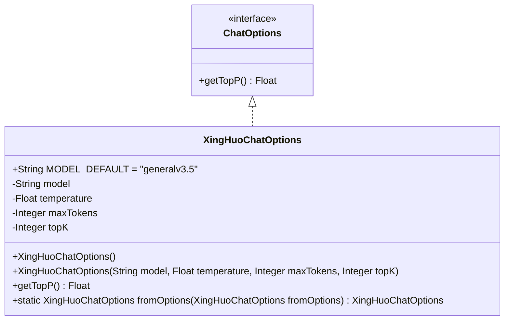
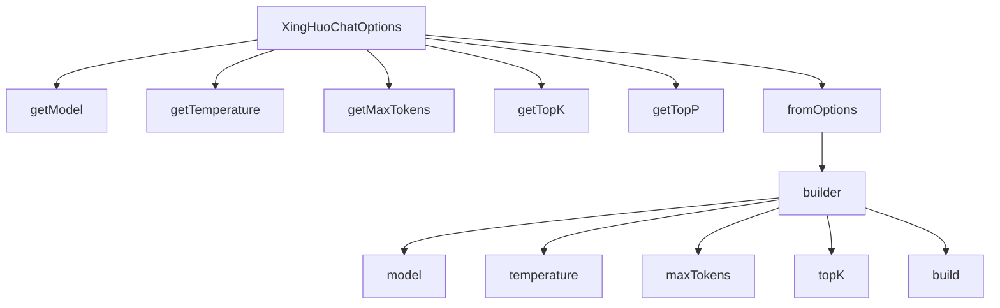

# 基础信息

|      |      |
|------|------|
| 编码语言 | .java |
| 代码路径 | yudao-module-ai/yudao-spring-boot-starter-ai/src/main/java/cn/iocoder/yudao/framework/ai/core/model/xinghuo/XingHuoChatOptions.java |
| 包名 | cn.iocoder.yudao.framework.ai.core.model.xinghuo |
| 依赖项 | ['lombok.AllArgsConstructor', 'lombok.Builder', 'lombok.Data', 'lombok.NoArgsConstructor', 'org.springframework.ai.chat.prompt.ChatOptions'] |
| 概述说明 | XingHuoChatOptions类实现ChatOptions接口，包含模型、温度、最大Token和K个候选等属性，默认模型为"generalv3.5"。提供无参和全参构造函数，支持Builder模式，可通过fromOptions方法从现有选项创建新实例，getTopP方法返回null。 |

# 说明

XingHuoChatOptions类实现了ChatOptions接口，该类包含多个属性，包括模型、温度、最大Token和K个候选等。其中，默认模型设置为"generalv3.5"。XingHuoChatOptions类提供了两种构造函数：一种是无参构造函数，另一种是全参构造函数，允许用户通过传入所有必要的参数来初始化对象。此外，该类还支持Builder模式，使得用户可以通过链式调用的方式逐步构建对象。为了便于从现有选项创建新的实例，XingHuoChatOptions类还提供了一个fromOptions方法，该方法允许基于已有的选项对象生成新的实例。值得注意的是，getTopP方法在该类中返回null，表明该方法在当前实现中未提供具体的返回值。

# 类列表 Class Summary

| 名称   | 类型  | 说明 |
|-------|------|-------------|
| XingHuoChatOptions | class | XingHuoChatOptions类实现了ChatOptions接口，包含模型、温度、最大Token和K个候选等属性。默认模型为"generalv3.5"。提供了无参和全参构造函数，支持Builder模式。可通过fromOptions方法从现有选项创建新实例。getTopP方法返回null。 |

## 类 XingHuoChatOptions

|      |      |
|------|------|
| 访问范围 | @Data;@NoArgsConstructor;@AllArgsConstructor;@Builder;public |
| 类型 | class |
| 名称 | XingHuoChatOptions |
| 说明 | XingHuoChatOptions类实现了ChatOptions接口，包含模型、温度、最大Token和K个候选等属性。默认模型为"generalv3.5"。提供了无参和全参构造函数，支持Builder模式。可通过fromOptions方法从现有选项创建新实例。getTopP方法返回null。 |

### UML类图

### 描述：
该UML类图展示了一个名为`XingHuoChatOptions`的类，它实现了`ChatOptions`接口。`XingHuoChatOptions`类包含四个私有属性：`model`、`temperature`、`maxTokens`和`topK`，并提供了构造方法和静态工厂方法`fromOptions`。接口`ChatOptions`定义了一个方法`getTopP()`，`XingHuoChatOptions`类实现了该方法。

### 内部方法调用关系图

### 描述信息：
该图展示了`XingHuoChatOptions`类中方法之间的调用关系。`fromOptions`方法通过`builder`方法创建新的`XingHuoChatOptions`实例，并调用`getModel`、`getTemperature`、`getMaxTokens`和`getTopK`方法获取属性值。`getTopP`方法返回`null`，未调用其他方法。

### 字段列表 Field List

| 名称  | 类型  | 说明 |
|-------|-------|------|
| temperature | Float | 温度数据为浮点类型，用于存储温度值。 |
| topK | Integer | topK参数用于指定返回结果的数量上限，控制输出规模。 |
| MODEL_DEFAULT = "generalv3.5" | String | public static final String MODEL_DEFAULT 是一个常量，其值为 "generalv3.5"，表示默认模型版本。 |
| maxTokens | Integer | private Integer maxTokens; 是一个私有整型变量，用于存储最大令牌数的值。 |
| model | String | private String model; 声明了一个私有的字符串类型变量 model。 |

### 方法列表 Method List

| 名称  | 类型  | 说明 |
|-------|-------|------|
| getTopP | Float | 该方法重写了父类的getTopP方法，返回值为null，表示当前实现未提供具体的Float类型结果。 |
| fromOptions | XingHuoChatOptions | 该方法从传入的XingHuoChatOptions对象中提取模型、温度、最大令牌数和topK参数，并使用这些参数构建并返回一个新的XingHuoChatOptions对象。 |

