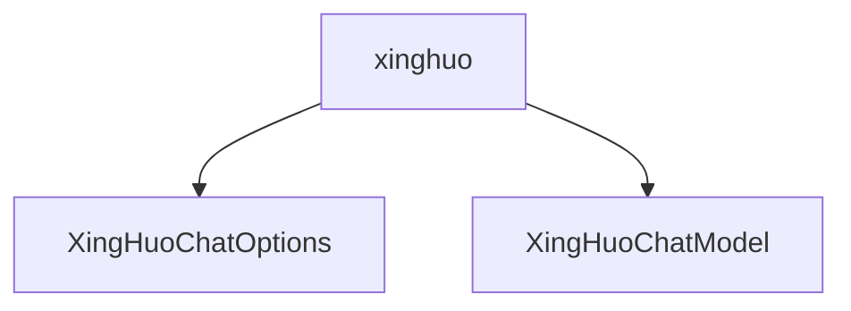

# 基础信息

|      |      |
|------|------|
| 编码语言 | .java |
| 代码路径 | yudao-module-ai/yudao-spring-boot-starter-ai/src/main/java/cn/iocoder/yudao/framework/ai/core/model/xinghuo |
| 包名 | cn.iocoder.yudao.framework.ai.core.model.xinghuo |
| 概述说明 | XingHuoChatOptions类实现ChatOptions接口，包含模型、温度等属性，默认模型为"generalv3.5"，提供无参、全参构造函数及Builder模式，支持fromOptions方法生成新实例，getTopP返回null。XingHuoChatModel类实现ChatModel接口，通过OpenAiApi与星火API交互，支持同步和异步调用，构造函数接收apiKey等非空参数，提供call、stream方法处理请求和流式响应，createRequest方法合并默认和运行时选项构建请求对象，确保灵活高效的API交互。 |

# 说明

XingHuoChatOptions类实现了ChatOptions接口，包含多个属性，如模型、温度、最大Token和K个候选等，其中默认模型设置为"generalv3.5"。该类提供了两种构造函数：无参构造函数和全参构造函数，允许用户通过传入所有必要参数来初始化对象。此外，XingHuoChatOptions类支持Builder模式，用户可以通过链式调用逐步构建对象。为了便于从现有选项创建新实例，该类还提供了fromOptions方法，允许基于已有选项生成新实例。值得注意的是，getTopP方法返回null，表明该方法在当前实现中未提供具体返回值。

XingHuoChatModel类实现了ChatModel接口，主要用于与星火API进行交互。它通过OpenAiApi与星火API通信，支持同步和异步两种调用方式。该类的构造函数接收四个参数：apiKey、secretKey、XingHuoChatOptions和RetryTemplate，这些参数在构造函数中被确保为非空，以确保实例化过程不会因缺少必要参数而失败。

在功能方面，XingHuoChatModel类提供了两个主要方法：call和stream。call方法用于处理请求并返回一个包含星火API响应数据的ChatResponse对象。stream方法支持流式响应，适用于需要逐步处理大量数据或实时数据的场景。此外，XingHuoChatModel类还包含一个createRequest方法，用于构建请求对象。该方法会合并默认选项和运行时选项，以确保请求对象包含所有必要的配置信息。

总的来说，XingHuoChatModel类通过其构造函数、call方法、stream方法和createRequest方法，提供了一个全面且灵活的工具，用于与星火API进行高效、可靠的交互。

### 包内部结构视图

### 描述信息：
该Mermaid图展示了`xinghuo`文件夹下的两个Java文件之间的关系。`xinghuo`文件夹包含`XingHuoChatOptions.java`和`XingHuoChatModel.java`两个文件，它们之间没有直接的调用关系，但都属于同一个文件夹下的文件。

# 文件列表 File List

| 名称   | 类型  | 说明 |
|-------|------|-------------|
| [XingHuoChatModel.java](XingHuoChatModel.md) | file | XingHuoChatModel类实现ChatModel接口，通过OpenAiApi与星火API交互，支持同步和异步调用。构造函数需apiKey、secretKey、XingHuoChatOptions和RetryTemplate参数，确保非空。提供call方法处理请求返回ChatResponse，stream方法支持流式响应，createRequest方法构建请求对象并合并默认与运行时选项。 |
| [XingHuoChatOptions.java](XingHuoChatOptions.md) | file | XingHuoChatOptions类实现ChatOptions接口，包含模型、温度、最大Token和K个候选等属性，默认模型为"generalv3.5"。提供无参和全参构造函数，支持Builder模式，可通过fromOptions方法从现有选项创建新实例，getTopP方法返回null。 |

