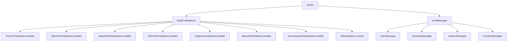

# 基础信息

|      |      |
|------|------|
| 编码语言 | .java |
| 代码路径 | yudao-module-ai/yudao-spring-boot-starter-ai/src/main/java/cn/iocoder/yudao/framework/ai/core/util/AiUtils.java |
| 包名 | cn.iocoder.yudao.framework.ai.core.util |
| 依赖项 | ['cn.hutool.core.util.StrUtil', 'cn.iocoder.yudao.framework.ai.core.enums.AiPlatformEnum', 'cn.iocoder.yudao.framework.ai.core.model.deepseek.DeepSeekChatOptions', 'cn.iocoder.yudao.framework.ai.core.model.xinghuo.XingHuoChatOptions', 'com.alibaba.cloud.ai.tongyi.chat.TongYiChatOptions', 'org.springframework.ai.azure.openai.AzureOpenAiChatOptions', 'org.springframework.ai.chat.messages', 'org.springframework.ai.chat.prompt.ChatOptions', 'org.springframework.ai.ollama.api.OllamaOptions', 'org.springframework.ai.openai.OpenAiChatOptions', 'org.springframework.ai.qianfan.QianFanChatOptions', 'org.springframework.ai.zhipuai.ZhiPuAiChatOptions'] |
| 概述说明 | `AiUtils`类提供两个核心方法：`buildChatOptions`用于根据平台类型（如TONG_YI、YI_YAN）构建聊天选项，处理模型、温度和最大令牌数参数；`buildMessage`则根据消息类型（用户、助手、系统、函数）创建相应的消息对象。 |

# 说明

`AiUtils`类是一个用于处理与人工智能交互相关功能的工具类，主要包含两个核心方法。第一个方法是`buildChatOptions`，它根据指定的平台类型构建聊天选项。该方法支持多个平台，包括TONG_YI、YI_YAN等，并且能够处理多个关键参数，如模型类型、温度设置以及最大令牌数。这些参数可以根据具体需求进行调整，以适应不同平台的聊天功能需求。第二个方法是`buildMessage`，它根据消息类型创建相应的消息对象。支持的消息类型包括用户消息、助手消息、系统消息和函数消息。通过该方法，可以灵活地生成不同类型的消息对象，以便在聊天过程中进行使用。这两个方法共同构成了`AiUtils`类的核心功能，旨在简化与人工智能平台的交互过程，并提供灵活的参数配置和消息生成能力。

# 类列表 Class Summary

| 名称   | 类型  | 说明 |
|-------|------|-------------|
| AiUtils | class | `AiUtils`类包含两个主要方法：`buildChatOptions`根据平台类型构建聊天选项，支持多个平台如TONG_YI、YI_YAN等，并处理模型、温度和最大令牌数参数；`buildMessage`根据消息类型（用户、助手、系统、函数）创建相应的消息对象。 |

## 类 AiUtils

|      |      |
|------|------|
| 访问范围 | public |
| 类型 | class |
| 名称 | AiUtils |
| 说明 | `AiUtils`类包含两个主要方法：`buildChatOptions`根据平台类型构建聊天选项，支持多个平台如TONG_YI、YI_YAN等，并处理模型、温度和最大令牌数参数；`buildMessage`根据消息类型（用户、助手、系统、函数）创建相应的消息对象。 |

### UML类图

```mermaid
classDiagram
    class AiUtils {
        +buildChatOptions(AiPlatformEnum platform, String model, Double temperature, Integer maxTokens) ChatOptions
        +buildMessage(String type, String content) Message
    }

    class ChatOptions {
        <<interface>>
        +withModel(String model) ChatOptions
        +withTemperature(Float temperature) ChatOptions
        +withMaxTokens(Integer maxTokens) ChatOptions
    }

    class TongYiChatOptions {
        +withModel(String model) TongYiChatOptions
        +withTemperature(Double temperature) TongYiChatOptions
        +withMaxTokens(Integer maxTokens) TongYiChatOptions
        +build() ChatOptions
    }

    class QianFanChatOptions {
        +withModel(String model) QianFanChatOptions
        +withTemperature(Float temperature) QianFanChatOptions
        +withMaxTokens(Integer maxTokens) QianFanChatOptions
        +build() ChatOptions
    }

    class DeepSeekChatOptions {
        +model(String model) DeepSeekChatOptions
        +temperature(Float temperature) DeepSeekChatOptions
        +maxTokens(Integer maxTokens) DeepSeekChatOptions
        +build() ChatOptions
    }

    class ZhiPuAiChatOptions {
        +withModel(String model) ZhiPuAiChatOptions
        +withTemperature(Float temperature) ZhiPuAiChatOptions
        +withMaxTokens(Integer maxTokens) ZhiPuAiChatOptions
        +build() ChatOptions
    }

    class XingHuoChatOptions {
        +model(String model) XingHuoChatOptions
        +temperature(Float temperature) XingHuoChatOptions
        +maxTokens(Integer maxTokens) XingHuoChatOptions
        +build() ChatOptions
    }

    class OpenAiChatOptions {
        +withModel(String model) OpenAiChatOptions
        +withTemperature(Float temperature) OpenAiChatOptions
        +withMaxTokens(Integer maxTokens) OpenAiChatOptions
        +build() ChatOptions
    }

    class AzureOpenAiChatOptions {
        +withDeploymentName(String deploymentName) AzureOpenAiChatOptions
        +withTemperature(Float temperature) AzureOpenAiChatOptions
        +withMaxTokens(Integer maxTokens) AzureOpenAiChatOptions
        +build() ChatOptions
    }

    class OllamaOptions {
        +create() OllamaOptions
        +withModel(String model) OllamaOptions
        +withTemperature(Float temperature) OllamaOptions
        +withNumPredict(Integer numPredict) OllamaOptions
    }

    class Message {
        <<interface>>
        +getContent() String
    }

    class UserMessage {
        +UserMessage(String content)
        +getContent() String
    }

    class AssistantMessage {
        +AssistantMessage(String content)
        +getContent() String
    }

    class SystemMessage {
        +SystemMessage(String content)
        +getContent() String
    }

    class FunctionMessage {
        +FunctionMessage(String content)
        +getContent() String
    }

    AiUtils ..> ChatOptions : 依赖
    ChatOptions <|.. TongYiChatOptions : 实现
    ChatOptions <|.. QianFanChatOptions : 实现
    ChatOptions <|.. DeepSeekChatOptions : 实现
    ChatOptions <|.. ZhiPuAiChatOptions : 实现
    ChatOptions <|.. XingHuoChatOptions : 实现
    ChatOptions <|.. OpenAiChatOptions : 实现
    ChatOptions <|.. AzureOpenAiChatOptions : 实现
    ChatOptions <|.. OllamaOptions : 实现
    Message <|.. UserMessage : 实现
    Message <|.. AssistantMessage : 实现
    Message <|.. SystemMessage : 实现
    Message <|.. FunctionMessage : 实现
```

### 描述信息：
该UML类图展示了`AiUtils`类与多个`ChatOptions`实现类之间的关系。`AiUtils`类通过`buildChatOptions`方法生成不同平台的聊天选项，并通过`buildMessage`方法创建不同类型的消息。每个`ChatOptions`实现类都实现了`ChatOptions`接口，而`Message`接口则由`UserMessage`、`AssistantMessage`、`SystemMessage`和`FunctionMessage`类实现。

### 内部方法调用关系图

### 描述信息：
该图展示了`AiUtils`类中的两个主要方法`buildChatOptions`和`buildMessage`的调用关系。`buildChatOptions`方法根据不同的AI平台调用相应的构建器方法，而`buildMessage`方法则根据消息类型创建不同类型的消息对象。

### 字段列表 Field List

| 名称  | 类型  | 说明 |
|-------|-------|------|

### 方法列表 Method List

| 名称  | 类型  | 说明 |
|-------|-------|------|
| buildMessage | Message | 该方法根据传入的消息类型和内容构建相应的消息对象。如果类型为USER、ASSISTANT、SYSTEM或FUNCTION，分别返回对应的UserMessage、AssistantMessage、SystemMessage或FunctionMessage对象。若类型未知，则抛出IllegalArgumentException异常。 |
| buildChatOptions | ChatOptions | 该方法根据传入的AI平台类型、模型名称、温度值和最大令牌数，构建并返回相应的聊天选项对象。不同平台使用不同的构建器方法，部分平台需要将温度值转换为浮点数。对于未知平台类型，抛出异常。 |

