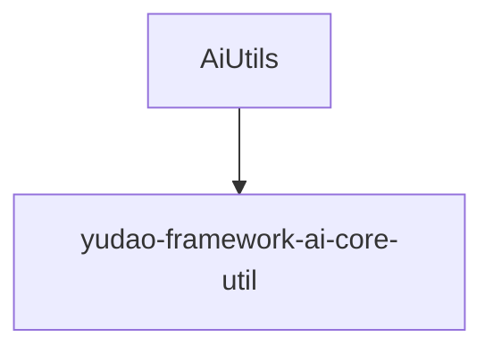

# 基础信息

|      |      |
|------|------|
| 编码语言 | .java |
| 代码路径 | yudao-module-ai/yudao-spring-boot-starter-ai/src/main/java/cn/iocoder/yudao/framework/ai/core/util |
| 包名 | cn.iocoder.yudao.framework.ai.core.util |
| 概述说明 | `AiUtils`类提供两个核心方法：`buildChatOptions`用于根据平台类型（如TONG_YI、YI_YAN）构建聊天选项，处理模型、温度和最大令牌数参数；`buildMessage`则根据消息类型（用户、助手、系统、函数）创建相应的消息对象。 |

# 说明

`AiUtils`类是一个用于处理与人工智能交互相关功能的工具类，主要包含两个核心方法。第一个方法是`buildChatOptions`，它根据指定的平台类型构建聊天选项。该方法支持多个平台，包括TONG_YI、YI_YAN等，并且能够处理多个关键参数，如模型类型、温度设置以及最大令牌数。这些参数可以根据具体需求进行调整，以适应不同平台的聊天功能需求。第二个方法是`buildMessage`，它根据消息类型创建相应的消息对象。支持的消息类型包括用户消息、助手消息、系统消息和函数消息。通过该方法，可以灵活地生成不同类型的消息对象，以便在聊天过程中进行使用。这两个方法共同构成了`AiUtils`类的核心功能，旨在简化与人工智能平台的交互过程，并提供灵活的参数配置和消息生成能力。

### 包内部结构视图

### 描述信息：
该Mermaid图展示了`AiUtils`类与`yudao-framework-ai-core-util`文件夹之间的调用关系。`AiUtils`类位于`yudao-framework-ai-core-util`文件夹中，表示该类是该文件夹的一部分。图中清晰地展示了文件与文件夹之间的层级关系。

# 文件列表 File List

| 名称   | 类型  | 说明 |
|-------|------|-------------|
| [AiUtils.java](AiUtils.md) | file | `AiUtils`类提供两个核心方法：`buildChatOptions`用于根据平台类型（如TONG_YI、YI_YAN）构建聊天选项，处理模型、温度和最大令牌数参数；`buildMessage`则根据消息类型（用户、助手、系统、函数）创建相应的消息对象。 |

