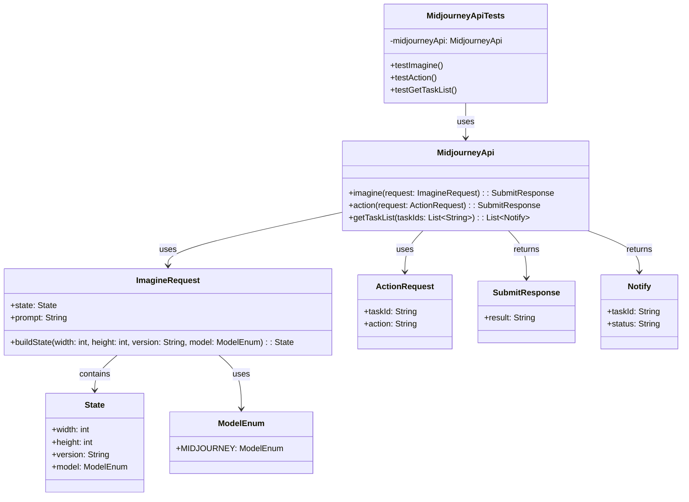
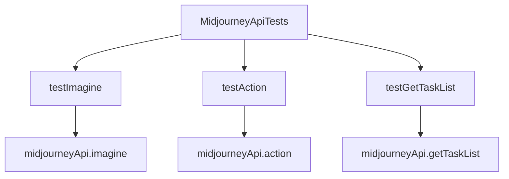

# 基础信息

|      |      |
|------|------|
| 编码语言 | .java |
| 代码路径 | yudao-module-ai/yudao-spring-boot-starter-ai/src/test/java/cn/iocoder/yudao/framework/ai/image/MidjourneyApiTests.java |
| 包名 | cn.iocoder.yudao.framework.ai.image |
| 依赖项 | ['cn.iocoder.yudao.framework.ai.core.model.midjourney.api.MidjourneyApi', 'org.junit.jupiter.api.Disabled', 'org.junit.jupiter.api.Test', 'java.util.Collections', 'java.util.List'] |
| 概述说明 | MidjourneyApiTests类包含三个测试方法：testImagine生成图像请求，testAction执行操作请求，testGetTaskList获取任务列表。每个方法准备参数并调用MidjourneyApi相应方法后打印结果，所有测试方法均被禁用。 |

# 说明

MidjourneyApiTests类是一个包含三个测试方法的测试类，主要用于验证与Midjourney API相关的功能。第一个测试方法testImagine用于测试生成图像请求的功能。该方法会准备必要的参数，并调用MidjourneyApi中对应的生成图像方法，最后将结果打印出来。第二个测试方法testAction用于测试执行特定操作请求的功能。与testImagine类似，该方法也会准备相关参数，调用MidjourneyApi中的执行操作方法，并打印执行结果。第三个测试方法testGetTaskList用于测试获取任务列表的功能。该方法同样会准备参数，调用MidjourneyApi中的获取任务列表方法，并打印返回的任务列表结果。需要注意的是，尽管这三个测试方法已经编写完成，但它们目前均被禁用，无法执行。这些测试方法的设计旨在验证API调用的正确性和功能性，但由于被禁用，暂时无法用于实际测试。

# 类列表 Class Summary

| 名称   | 类型  | 说明 |
|-------|------|-------------|
| MidjourneyApiTests | class | MidjourneyApiTests类包含三个测试方法：testImagine用于生成图像请求，testAction用于执行特定操作请求，testGetTaskList用于获取任务列表。每个方法都准备参数并调用MidjourneyApi的相应方法，最后打印结果。所有测试方法均被禁用。 |

## 类 MidjourneyApiTests

|      |      |
|------|------|
| 访问范围 | public |
| 类型 | class |
| 名称 | MidjourneyApiTests |
| 说明 | MidjourneyApiTests类包含三个测试方法：testImagine用于生成图像请求，testAction用于执行特定操作请求，testGetTaskList用于获取任务列表。每个方法都准备参数并调用MidjourneyApi的相应方法，最后打印结果。所有测试方法均被禁用。 |

### UML类图

### 描述：
该UML类图展示了`MidjourneyApiTests`类与`MidjourneyApi`类之间的关系，以及`MidjourneyApi`类与其他相关类（如`ImagineRequest`、`ActionRequest`、`SubmitResponse`、`Notify`、`State`和`ModelEnum`）之间的依赖关系。`MidjourneyApiTests`类通过调用`MidjourneyApi`类的方法来测试不同的API功能。

### 内部方法调用关系图

### 描述信息：
该图展示了`MidjourneyApiTests`类中的三个测试方法`testImagine`、`testAction`和`testGetTaskList`，它们分别调用了`midjourneyApi`对象的`imagine`、`action`和`getTaskList`方法。这些方法用于测试Midjourney API的不同功能，如生成图像、执行操作和获取任务列表。

### 字段列表 Field List

| 名称  | 类型  | 说明 |
|-------|-------|------|
| midjourneyApi = new MidjourneyApi(
            "https://api.holdai.top/mj",
            "sk-dZEPiVaNcT3FHhef51996bAa0bC74806BeAb620dA5Da10Bf",
            null) | MidjourneyApi | private final MidjourneyApi midjourneyApi = new MidjourneyApi("https://api.holdai.top/mj", "sk-dZEPiVaNcT3FHhef51996bAa0bC74806BeAb620dA5Da10Bf", null); |

### 方法列表 Method List

| 名称  | 类型  | 说明 |
|-------|-------|------|
| testGetTaskList | void | 该代码片段是一个被禁用的测试方法，用于获取任务列表。方法通过传入任务ID调用`midjourneyApi.getTaskList`，并打印返回的任务列表。任务ID可通过`MidjourneyApi.SubmitResponse`的`result`获取。 |
| testAction | void | 该代码片段展示了一个被禁用的测试方法`testAction`，用于调用`MidjourneyApi`的`action`方法。方法中创建了一个`ActionRequest`对象，包含特定参数，并调用`action`方法获取`SubmitResponse`响应，最后打印响应结果。 |
| testImagine | void | 该代码片段展示了一个被禁用的测试方法`testImagine`，用于调用Midjourney API生成一张512x512像素的可爱小猫图片。方法中创建了一个`ImagineRequest`对象，指定了图片描述、尺寸和模型版本，并通过`midjourneyApi.imagine`方法提交请求，最后打印响应结果。 |

