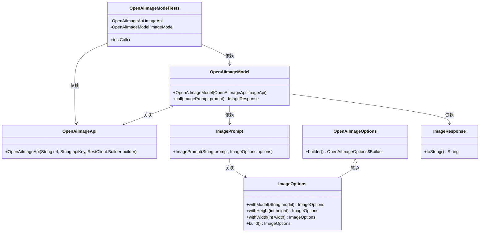
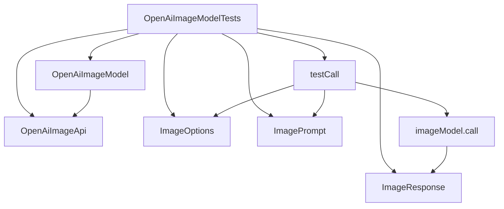

# 基础信息

|      |      |
|------|------|
| 编码语言 | .java |
| 代码路径 | yudao-module-ai/yudao-spring-boot-starter-ai/src/test/java/cn/iocoder/yudao/framework/ai/image/OpenAiImageModelTests.java |
| 包名 | cn.iocoder.yudao.framework.ai.image |
| 依赖项 | ['org.junit.jupiter.api.Disabled', 'org.junit.jupiter.api.Test', 'org.springframework.ai.image.ImageOptions', 'org.springframework.ai.image.ImagePrompt', 'org.springframework.ai.image.ImageResponse', 'org.springframework.ai.openai.OpenAiImageModel', 'org.springframework.ai.openai.OpenAiImageOptions', 'org.springframework.ai.openai.api.OpenAiImageApi', 'org.springframework.web.client.RestClient'] |
| 概述说明 | 该代码演示了使用OpenAiImageApi和OpenAiImageModel进行图像生成测试，通过testCall方法设置图像参数（模型DALL_E_2，尺寸256x256），生成提示词“中国长城!”，调用imageModel.call生成图像并打印结果，但测试方法被禁用（@Disabled）。 |

# 说明

该代码展示了如何使用OpenAiImageApi和OpenAiImageModel进行图像生成测试。测试方法名为testCall，主要用于测试图像生成功能。在测试过程中，首先设置了图像生成的相关参数，包括使用的模型为DALL_E_2，图像尺寸为256x256。接着，生成了一个提示词“中国长城!”，该提示词用于指导图像生成的内容。随后，通过调用imageModel.call方法，根据设置的参数和提示词生成图像，并将生成的结果打印出来。值得注意的是，该测试方法被标记为禁用状态（使用@Disabled注解），这意味着在实际运行测试时，该方法不会被执行。整体上，该代码展示了如何通过OpenAiImageApi和OpenAiImageModel进行图像生成的测试流程，涵盖了参数设置、提示词生成、图像生成及结果输出等关键步骤。

# 类列表 Class Summary

| 名称   | 类型  | 说明 |
|-------|------|-------------|
| OpenAiImageModelTests | class | 该代码展示了如何使用OpenAiImageApi和OpenAiImageModel进行图像生成测试。测试方法testCall设置了图像参数（模型为DALL_E_2，尺寸为256x256），并生成提示词“中国长城!”，调用imageModel.call方法生成图像并打印结果。测试方法被禁用（@Disabled）。 |

## 类 OpenAiImageModelTests

|      |      |
|------|------|
| 访问范围 | public |
| 类型 | class |
| 名称 | OpenAiImageModelTests |
| 说明 | 该代码展示了如何使用OpenAiImageApi和OpenAiImageModel进行图像生成测试。测试方法testCall设置了图像参数（模型为DALL_E_2，尺寸为256x256），并生成提示词“中国长城!”，调用imageModel.call方法生成图像并打印结果。测试方法被禁用（@Disabled）。 |

### UML类图

### 描述信息：
该UML类图展示了`OpenAiImageModelTests`类及其相关类的结构和关系。`OpenAiImageModelTests`依赖于`OpenAiImageApi`和`OpenAiImageModel`，`OpenAiImageModel`则依赖于`ImagePrompt`和`ImageResponse`。`ImagePrompt`与`ImageOptions`有关联关系，`OpenAiImageOptions`继承自`ImageOptions`。

### 内部方法调用关系图

### 描述信息：
该图展示了`OpenAiImageModelTests`类中方法的调用关系。`OpenAiImageModelTests`类通过`OpenAiImageApi`和`OpenAiImageModel`进行初始化，并在`testCall`方法中调用`imageModel.call`来生成图像响应。`ImageOptions`和`ImagePrompt`用于构建请求参数，最终返回`ImageResponse`结果。

### 字段列表 Field List

| 名称  | 类型  | 说明 |
|-------|-------|------|
| imageApi = new OpenAiImageApi(
            "https://api.holdai.top",
            "sk-dZEPiVaNcT3FHhef51996bAa0bC74806BeAb620dA5Da10Bf",
            RestClient.builder()) | OpenAiImageApi | 代码片段创建了一个OpenAiImageApi实例，使用指定的API端点URL、API密钥和RestClient构建器进行初始化。 |
| imageModel = new OpenAiImageModel(imageApi) | OpenAiImageModel | 代码中定义了一个私有且不可变的OpenAiImageModel对象imageModel，通过传入imageApi参数进行初始化。 |

### 方法列表 Method List

| 名称  | 类型  | 说明 |
|-------|-------|------|
| testCall | void | 该代码片段展示了一个被禁用的测试方法，用于调用图像生成API。方法中设置了图像选项，包括使用DALL-E 2模型、图像尺寸为256x256，并创建了一个包含提示“中国长城!”的图像请求。调用图像模型后，打印了生成的图像响应结果。 |

