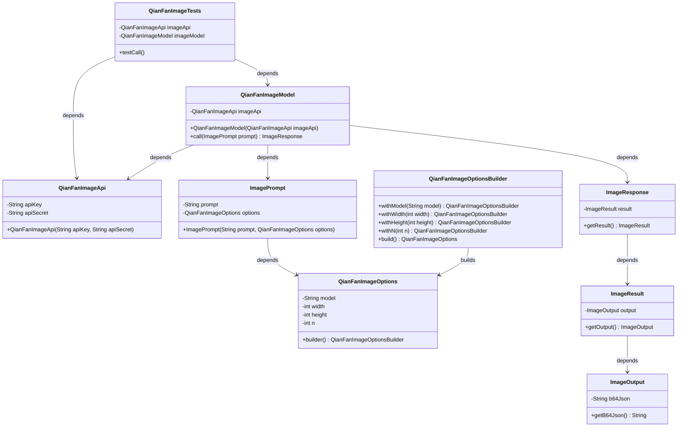
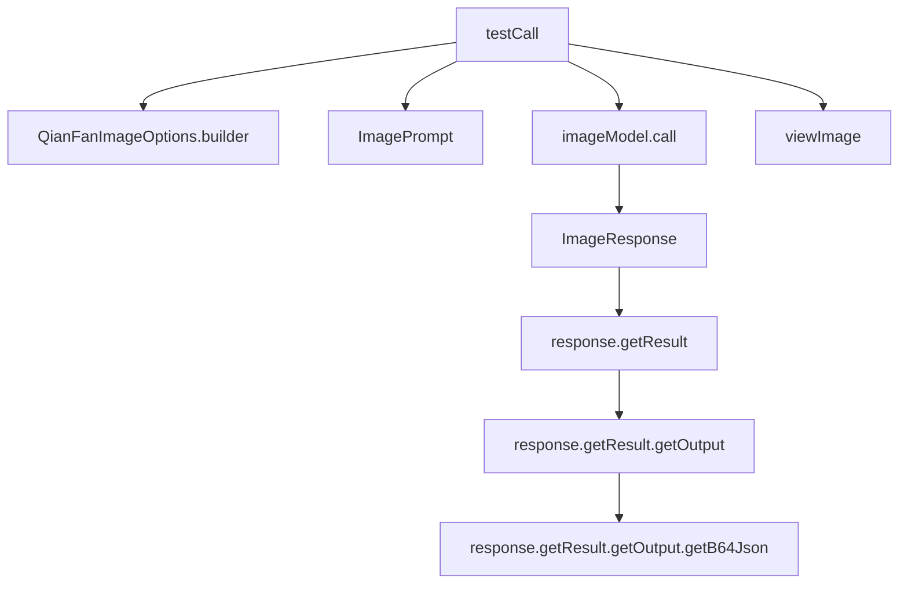

# 基础信息

|      |      |
|------|------|
| 编码语言 | .java |
| 代码路径 | yudao-module-ai/yudao-spring-boot-starter-ai/src/test/java/cn/iocoder/yudao/framework/ai/image/QianFanImageTests.java |
| 包名 | cn.iocoder.yudao.framework.ai.image |
| 依赖项 | ['org.junit.jupiter.api.Disabled', 'org.junit.jupiter.api.Test', 'org.springframework.ai.image.ImagePrompt', 'org.springframework.ai.image.ImageResponse', 'org.springframework.ai.qianfan.QianFanImageModel', 'org.springframework.ai.qianfan.QianFanImageOptions', 'org.springframework.ai.qianfan.api.QianFanImageApi', 'cn.iocoder.yudao.framework.ai.image.StabilityAiImageModelTests.viewImage'] |
| 概述说明 | 该Java测试类用于调用千帆图像API生成图像，测试方法`testCall`配置了模型类型、图像尺寸和数量等参数，通过`imageModel.call`发送请求，生成的图像以Base64编码返回并打印结果，当前测试方法被禁用。 |

# 说明

该信息描述了一个Java测试类，主要用于调用千帆图像API以生成图像。测试类中包含一个名为`testCall`的测试方法，该方法配置了图像生成的相关参数，包括模型类型、图像尺寸和生成图像的数量。这些参数通过`imageModel.call`方法发送请求到API。生成的图像以Base64编码的形式返回，并在控制台中打印结果。需要注意的是，该测试方法目前处于禁用状态，意味着它不会在测试过程中被执行。整体上，该测试类旨在验证图像生成API的功能，并确保其能够正确返回预期的图像数据。

# 类列表 Class Summary

| 名称   | 类型  | 说明 |
|-------|------|-------------|
| QianFanImageTests | class | 该代码是一个Java测试类，用于调用千帆图像API生成图像。测试方法`testCall`配置了图像生成参数，包括模型类型、图像尺寸和数量，并通过`imageModel.call`方法发送请求。生成的图像以Base64编码返回，并打印结果。测试方法当前被禁用。 |

## 类 QianFanImageTests

|      |      |
|------|------|
| 访问范围 | public |
| 类型 | class |
| 名称 | QianFanImageTests |
| 说明 | 该代码是一个Java测试类，用于调用千帆图像API生成图像。测试方法`testCall`配置了图像生成参数，包括模型类型、图像尺寸和数量，并通过`imageModel.call`方法发送请求。生成的图像以Base64编码返回，并打印结果。测试方法当前被禁用。 |

### UML类图

### 描述信息：
该UML类图展示了`QianFanImageTests`类及其相关类的结构和关系。`QianFanImageTests`依赖于`QianFanImageApi`和`QianFanImageModel`，而`QianFanImageModel`则依赖于`ImagePrompt`和`ImageResponse`。`ImageResponse`进一步依赖于`ImageResult`和`ImageOutput`。`QianFanImageOptions`通过`QianFanImageOptionsBuilder`构建，`ImagePrompt`依赖于`QianFanImageOptions`。

### 内部方法调用关系图

### 描述信息：
该图展示了`QianFanImageTests`类中`testCall`方法的调用关系。`testCall`方法首先创建`QianFanImageOptions`和`ImagePrompt`对象，然后调用`imageModel.call`方法获取`ImageResponse`，并从中提取`b64Json`数据，最后调用`viewImage`方法显示图像。

### 字段列表 Field List

| 名称  | 类型  | 说明 |
|-------|-------|------|
| imageModel = new QianFanImageModel(imageApi) | QianFanImageModel | private final QianFanImageModel imageModel = new QianFanImageModel(imageApi); 创建了一个私有的、不可变的QianFanImageModel实例，使用imageApi作为参数进行初始化。 |
| imageApi = new QianFanImageApi(
            "qS8k8dYr2nXunagK4SSU8Xjj", "pHGbx51ql2f0hOyabQvSZezahVC3hh3e") | QianFanImageApi | private final QianFanImageApi imageApi = new QianFanImageApi("qS8k8dYr2nXunagK4SSU8Xjj", "pHGbx51ql2f0hOyabQvSZezahVC3hh3e"); |

### 方法列表 Method List

| 名称  | 类型  | 说明 |
|-------|-------|------|
| testCall | void | 该代码片段展示了一个测试方法，用于调用图像生成API。方法中设置了图像参数，包括模型类型为Stable_Diffusion_XL，图像尺寸为1024x1024，生成数量为1。通过调用API生成图像，并将结果以Base64编码的JSON格式输出和显示。 |

