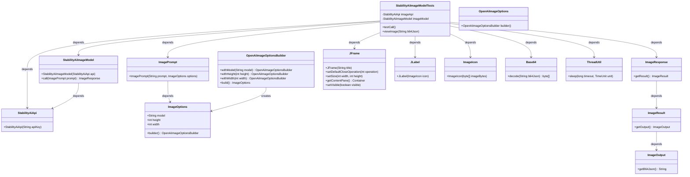

# 基础信息

|      |      |
|------|------|
| 编码语言 | .java |
| 代码路径 | yudao-module-ai/yudao-spring-boot-starter-ai/src/test/java/cn/iocoder/yudao/framework/ai/image/StabilityAiImageModelTests.java |
| 包名 | cn.iocoder.yudao.framework.ai.image |
| 依赖项 | ['cn.hutool.core.codec.Base64', 'cn.hutool.core.thread.ThreadUtil', 'org.junit.jupiter.api.Disabled', 'org.junit.jupiter.api.Test', 'org.springframework.ai.image.ImageOptions', 'org.springframework.ai.image.ImagePrompt', 'org.springframework.ai.image.ImageResponse', 'org.springframework.ai.openai.OpenAiImageOptions', 'org.springframework.ai.stabilityai.StabilityAiImageModel', 'org.springframework.ai.stabilityai.api.StabilityAiApi', 'javax.swing', 'java.awt', 'java.util.concurrent.TimeUnit'] |
| 概述说明 | 该代码为测试类，用于测试StabilityAiImageModel的call方法。通过StabilityAiApi初始化图像模型，设置模型为stable-diffusion-v1-6，尺寸为256x256，生成基于提示词“great wall”的图像。图像以Base64编码返回并在JFrame窗口中显示。测试方法被禁用，窗口显示1小时后关闭。 |

# 说明

该代码是一个测试类，主要用于测试StabilityAiImageModel的call方法。测试过程中，首先通过StabilityAiApi初始化图像模型，并设置了图像生成的相关参数，包括使用的模型为stable-diffusion-v1-6，图像尺寸为256x256。基于提示词“great wall”，模型生成相应的图像，并将生成的图像以Base64编码的形式返回。为了展示生成的图像，代码通过JFrame将图像显示在一个窗口中。需要注意的是，该测试方法被标记为禁用（@Disabled），因此在实际运行中不会自动执行。此外，显示图像的窗口会在持续1小时后自动关闭。整个测试过程旨在验证StabilityAiImageModel的call方法是否能够正确生成并返回基于提示词的图像，并通过图形界面展示结果。

# 类列表 Class Summary

| 名称   | 类型  | 说明 |
|-------|------|-------------|
| StabilityAiImageModelTests | class | 该代码是一个测试类，用于测试StabilityAiImageModel的call方法。通过StabilityAiApi初始化图像模型，设置图像参数（模型为stable-diffusion-v1-6，尺寸为256x256），并生成基于提示词“great wall”的图像。生成的图像以Base64编码返回，并通过JFrame显示在窗口中。测试方法被禁用（@Disabled），显示窗口持续1小时后关闭。 |

## 类 StabilityAiImageModelTests

|      |      |
|------|------|
| 访问范围 | public |
| 类型 | class |
| 名称 | StabilityAiImageModelTests |
| 说明 | 该代码是一个测试类，用于测试StabilityAiImageModel的call方法。通过StabilityAiApi初始化图像模型，设置图像参数（模型为stable-diffusion-v1-6，尺寸为256x256），并生成基于提示词“great wall”的图像。生成的图像以Base64编码返回，并通过JFrame显示在窗口中。测试方法被禁用（@Disabled），显示窗口持续1小时后关闭。 |

### UML类图

### 描述信息：
该UML类图展示了`StabilityAiImageModelTests`类及其相关依赖关系。`StabilityAiImageModelTests`类依赖于`StabilityAiApi`和`StabilityAiImageModel`来调用图像生成API，并通过`ImagePrompt`和`ImageResponse`处理图像生成请求。此外，它还依赖于`JFrame`、`JLabel`等Swing组件来显示生成的图像。

### 内部方法调用关系图

### 描述信息：
该图展示了`StabilityAiImageModelTests`类中方法的调用关系。`testCall`方法首先创建`ImageOptions`和`ImagePrompt`对象，然后调用`imageModel.call`方法生成图像响应。最后，`viewImage`方法用于显示图像，涉及`JFrame`、`JLabel`和`ImageIcon`等组件的创建与操作。

### 字段列表 Field List

| 名称  | 类型  | 说明 |
|-------|-------|------|
| imageModel = new StabilityAiImageModel(imageApi) | StabilityAiImageModel | 代码片段创建了一个名为`imageModel`的私有常量，其类型为`StabilityAiImageModel`，并通过构造函数`StabilityAiImageModel(imageApi)`进行初始化，其中`imageApi`作为参数传入。 |
| imageApi = new StabilityAiApi(
            "sk-e53UqbboF8QJCscYvzJscJxJXoFcFg4iJjl1oqgE7baJETmx") | StabilityAiApi | private final StabilityAiApi imageApi = new StabilityAiApi("sk-e53UqbboF8QJCscYvzJscJxJXoFcFg4iJjl1oqgE7baJETmx"); |

### 方法列表 Method List

| 名称  | 类型  | 说明 |
|-------|-------|------|
| testCall | void | 该代码片段展示了一个被禁用的测试方法，用于调用图像生成模型。方法中设置了图像参数（模型为"stable-diffusion-v1-6"，尺寸为256x256），并创建了一个包含提示词"great wall"的图像请求。调用模型后，获取并打印生成的图像结果，最后通过base64编码查看图像。 |
| viewImage | void | 该代码定义了一个方法`viewImage`，用于显示Base64编码的图片。方法创建一个JFrame窗口，设置大小为800x600，并将解码后的图片显示在JLabel中。JLabel被添加到JFrame的中心位置，窗口显示后保持打开状态1小时。 |

