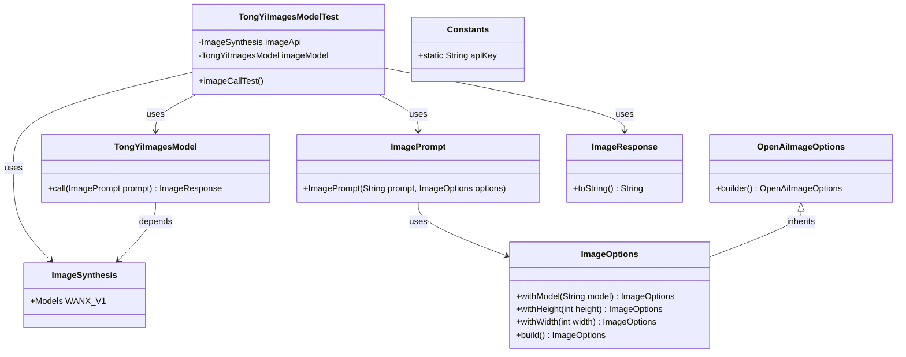
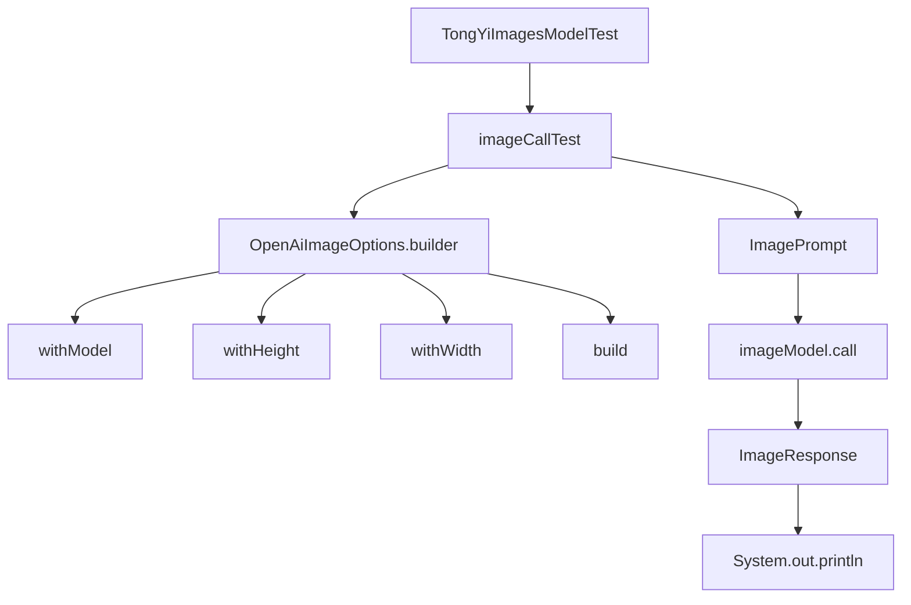

# 基础信息

|      |      |
|------|------|
| 编码语言 | .java |
| 代码路径 | yudao-module-ai/yudao-spring-boot-starter-ai/src/test/java/cn/iocoder/yudao/framework/ai/image/TongYiImagesModelTest.java |
| 包名 | cn.iocoder.yudao.framework.ai.image |
| 依赖项 | ['com.alibaba.cloud.ai.tongyi.image.TongYiImagesModel', 'com.alibaba.dashscope.aigc.imagesynthesis.ImageSynthesis', 'com.alibaba.dashscope.utils.Constants', 'org.junit.jupiter.api.Disabled', 'org.junit.jupiter.api.Test', 'org.springframework.ai.image.ImageOptions', 'org.springframework.ai.image.ImagePrompt', 'org.springframework.ai.image.ImageResponse', 'org.springframework.ai.openai.OpenAiImageOptions'] |
| 概述说明 | 该代码是一个测试类，用于测试图像生成功能，通过`ImageSynthesis`和`TongYiImagesModel`类调用图像生成API，使用指定API密钥和参数（如模型、高度、宽度）生成图像并打印结果。测试方法`imageCallTest`被禁用，未执行。 |

# 说明

该代码是一个测试类，主要用于测试图像生成功能。测试类通过调用`ImageSynthesis`和`TongYiImagesModel`类来实现图像生成API的调用。在调用过程中，使用了指定的API密钥以及一系列参数，包括模型类型、图像的高度和宽度等，以生成所需的图像。生成图像后，代码会打印出生成结果，以便进行验证和调试。然而，测试方法`imageCallTest`在该代码中被禁用，未实际执行。这意味着尽管代码结构和功能已经准备就绪，但具体的图像生成测试并未运行。整体来看，该测试类旨在验证图像生成API的调用流程和参数配置的正确性，但由于测试方法的禁用，实际生成图像的功能尚未得到验证。

# 类列表 Class Summary

| 名称   | 类型  | 说明 |
|-------|------|-------------|
| TongYiImagesModelTest | class | 该代码是一个测试类，用于测试图像生成功能。通过`ImageSynthesis`和`TongYiImagesModel`类调用图像生成API，使用指定的API密钥和参数（如模型、高度、宽度）生成图像，并打印结果。测试方法`imageCallTest`被禁用，未执行。 |

## 类 TongYiImagesModelTest

|      |      |
|------|------|
| 访问范围 | public |
| 类型 | class |
| 名称 | TongYiImagesModelTest |
| 说明 | 该代码是一个测试类，用于测试图像生成功能。通过`ImageSynthesis`和`TongYiImagesModel`类调用图像生成API，使用指定的API密钥和参数（如模型、高度、宽度）生成图像，并打印结果。测试方法`imageCallTest`被禁用，未执行。 |

### UML类图

### 描述信息：
该UML类图展示了`TongYiImagesModelTest`类与多个相关类之间的关系。`TongYiImagesModelTest`依赖于`ImageSynthesis`和`TongYiImagesModel`类，并通过`ImagePrompt`和`ImageResponse`类进行图像生成和响应处理。`OpenAiImageOptions`继承自`ImageOptions`，用于构建图像生成选项。

### 内部方法调用关系图

### 描述信息：
该图展示了`TongYiImagesModelTest`类中的`imageCallTest`方法调用关系。`imageCallTest`首先通过`OpenAiImageOptions.builder`构建图像选项，然后创建`ImagePrompt`对象并调用`imageModel.call`方法获取`ImageResponse`，最后打印响应结果。整个过程清晰地展示了方法间的调用顺序。

### 字段列表 Field List

| 名称  | 类型  | 说明 |
|-------|-------|------|
| imageModel = new TongYiImagesModel(imageApi) | TongYiImagesModel | 代码片段中定义了一个私有且不可变的`TongYiImagesModel`对象`imageModel`，并通过构造函数传入`imageApi`进行初始化。 |
| imageApi = new ImageSynthesis() | ImageSynthesis | 代码片段中定义了一个私有且不可变的ImageSynthesis类实例imageApi，用于图像合成操作。 |

### 方法列表 Method List

| 名称  | 类型  | 说明 |
|-------|-------|------|
| imageCallTest | void | 该代码片段展示了一个被禁用的测试方法`imageCallTest`，用于测试图像生成功能。方法中创建了一个`ImageOptions`对象，指定了模型为`WANX_V1`，图像尺寸为256x256，并生成了一个包含提示文本“中国长城!”的`ImagePrompt`对象。随后调用`imageModel.call`方法生成图像，并打印响应结果。 |

