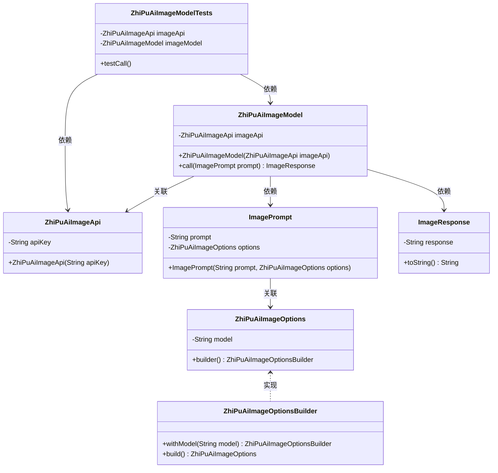
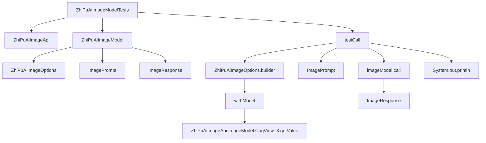

# 基础信息

|      |      |
|------|------|
| 编码语言 | .java |
| 代码路径 | yudao-module-ai/yudao-spring-boot-starter-ai/src/test/java/cn/iocoder/yudao/framework/ai/image/ZhiPuAiImageModelTests.java |
| 包名 | cn.iocoder.yudao.framework.ai.image |
| 依赖项 | ['org.junit.jupiter.api.Disabled', 'org.junit.jupiter.api.Test', 'org.springframework.ai.image.ImagePrompt', 'org.springframework.ai.image.ImageResponse', 'org.springframework.ai.zhipuai.ZhiPuAiImageModel', 'org.springframework.ai.zhipuai.ZhiPuAiImageOptions', 'org.springframework.ai.zhipuai.api.ZhiPuAiImageApi'] |
| 概述说明 | 该代码片段展示了一个测试类`ZhiPuAiImageModelTests`，用于测试智谱AI图像生成API。通过`ZhiPuAiImageApi`和`ZhiPuAiImageModel`类，使用API密钥初始化并调用`CogView_3`模型生成图像。测试方法`testCall`准备了一个包含提示词“万里长城”的请求，调用API并打印响应结果，但该方法当前被禁用。 |

# 说明

该代码片段展示了一个名为`ZhiPuAiImageModelTests`的测试类，专门用于测试智谱AI图像生成API的功能。测试类通过`ZhiPuAiImageApi`和`ZhiPuAiImageModel`两个类与API进行交互。首先，使用API密钥对`ZhiPuAiImageModel`进行初始化，然后调用`CogView_3`模型来生成图像。测试类中包含一个名为`testCall`的测试方法，该方法准备了一个包含提示词“万里长城”的请求，并通过API发送该请求以生成图像。生成的结果会被打印出来以供检查。然而，当前该测试方法被禁用，可能意味着它暂时不会在测试过程中被执行。整体来看，该测试类旨在验证智谱AI图像生成API的正确性和功能性，确保其能够根据给定的提示词生成预期的图像。

# 类列表 Class Summary

| 名称   | 类型  | 说明 |
|-------|------|-------------|
| ZhiPuAiImageModelTests | class | 该代码片段展示了一个测试类`ZhiPuAiImageModelTests`，用于测试智谱AI图像生成API。通过`ZhiPuAiImageApi`和`ZhiPuAiImageModel`类，使用API密钥初始化并调用`CogView_3`模型生成图像。测试方法`testCall`准备了一个包含提示词“万里长城”的请求，调用API并打印响应结果。该测试方法当前被禁用。 |

## 类 ZhiPuAiImageModelTests

|      |      |
|------|------|
| 访问范围 | public |
| 类型 | class |
| 名称 | ZhiPuAiImageModelTests |
| 说明 | 该代码片段展示了一个测试类`ZhiPuAiImageModelTests`，用于测试智谱AI图像生成API。通过`ZhiPuAiImageApi`和`ZhiPuAiImageModel`类，使用API密钥初始化并调用`CogView_3`模型生成图像。测试方法`testCall`准备了一个包含提示词“万里长城”的请求，调用API并打印响应结果。该测试方法当前被禁用。 |

### UML类图

### 描述信息：
该UML类图展示了`ZhiPuAiImageModelTests`类及其相关类的结构和关系。`ZhiPuAiImageModelTests`依赖于`ZhiPuAiImageApi`和`ZhiPuAiImageModel`，而`ZhiPuAiImageModel`则与`ImagePrompt`和`ImageResponse`有依赖关系。`ZhiPuAiImageOptions`通过`ZhiPuAiImageOptionsBuilder`构建，体现了建造者模式的应用。

### 内部方法调用关系图

### 描述信息：
该图展示了`ZhiPuAiImageModelTests`类中`testCall`方法的调用关系。`testCall`方法首先创建`ZhiPuAiImageOptions`和`ImagePrompt`对象，然后通过`imageModel.call`方法调用API并获取`ImageResponse`，最后打印响应结果。整个过程清晰地展示了方法之间的调用链。

### 字段列表 Field List

| 名称  | 类型  | 说明 |
|-------|-------|------|
| imageModel = new ZhiPuAiImageModel(imageApi) | ZhiPuAiImageModel | 代码片段中定义了一个私有且不可变的ZhiPuAiImageModel对象，该对象通过传入的imageApi参数进行初始化。 |
| imageApi = new ZhiPuAiImageApi(
            "78d3228c1d9e5e342a3e1ab349e2dd7b.VXLoq5vrwK2ofboy") | ZhiPuAiImageApi | private final ZhiPuAiImageApi imageApi = new ZhiPuAiImageApi("78d3228c1d9e5e342a3e1ab349e2dd7b.VXLoq5vrwK2ofboy"); |

### 方法列表 Method List

| 名称  | 类型  | 说明 |
|-------|-------|------|
| testCall | void | 该代码片段展示了一个被禁用的测试方法，用于调用智谱AI图像生成API。方法中设置了图像选项，包括模型类型为CogView_3，并创建了一个包含提示词“万里长城”的图像提示对象。随后调用图像模型生成图像，并打印响应结果。 |

