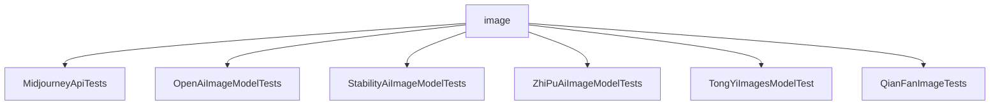

# 基础信息

|      |      |
|------|------|
| 编码语言 | .java |
| 代码路径 | yudao-module-ai/yudao-spring-boot-starter-ai/src/test/java/cn/iocoder/yudao/framework/ai/image |
| 包名 | cn.iocoder.yudao.framework.ai.image |
| 概述说明 | MidjourneyApiTests类包含三个测试方法（testImagine、testAction、testGetTaskList），用于验证Midjourney API的图像生成、操作执行和任务列表获取功能，但均被禁用。其他测试类（如OpenAiImageApi、StabilityAiImageModel、ZhiPuAiImageModelTests、TongYiImagesModel）也用于测试不同AI图像生成API的功能，涉及参数设置、提示词生成、图像生成及结果输出，但相关测试方法同样被禁用，暂无法执行。 |

# 说明

MidjourneyApiTests类是一个包含三个测试方法的测试类，主要用于验证与Midjourney API相关的功能。第一个测试方法testImagine用于测试生成图像请求的功能，准备必要参数并调用生成图像方法，最后打印结果。第二个测试方法testAction用于测试执行特定操作请求的功能，同样准备参数并调用执行操作方法，打印执行结果。第三个测试方法testGetTaskList用于测试获取任务列表的功能，准备参数并调用获取任务列表方法，打印返回的任务列表结果。尽管这三个测试方法已编写完成，但它们目前均被禁用，无法执行。

另一个测试类展示了如何使用OpenAiImageApi和OpenAiImageModel进行图像生成测试。测试方法testCall设置了图像生成的相关参数，包括模型为DALL_E_2，图像尺寸为256x256，并生成提示词“中国长城!”。通过调用imageModel.call方法生成图像，并打印结果。该测试方法被标记为禁用状态，不会在实际运行中执行。

另一个测试类主要用于测试StabilityAiImageModel的call方法。通过StabilityAiApi初始化图像模型，设置模型为stable-diffusion-v1-6，图像尺寸为256x256，基于提示词“great wall”生成图像，并以Base64编码形式返回。生成的图像通过JFrame显示在窗口中，窗口会在1小时后自动关闭。该测试方法同样被标记为禁用。

ZhiPuAiImageModelTests类专门用于测试智谱AI图像生成API的功能。通过ZhiPuAiImageApi和ZhiPuAiImageModel与API交互，使用API密钥初始化模型，调用CogView_3模型生成图像。测试方法testCall准备提示词“万里长城”并发送请求生成图像，打印结果。该测试方法被禁用，暂时不会执行。

另一个测试类通过调用ImageSynthesis和TongYiImagesModel类实现图像生成API的调用。使用API密钥和参数生成图像，打印生成结果。测试方法imageCallTest被禁用，未实际执行。

最后一个测试类调用千帆图像API生成图像。测试方法testCall配置图像生成参数，包括模型类型、图像尺寸和生成数量，通过imageModel.call方法发送请求，生成的图像以Base64编码形式返回并打印结果。该测试方法被禁用，不会在测试过程中执行。整体上，这些测试类旨在验证图像生成API的功能和正确性，但由于测试方法的禁用，实际生成图像的功能尚未得到验证。

### 包内部结构视图

### 描述信息：
该Mermaid图展示了`image`文件夹下的多个测试类之间的调用关系。每个测试类都与`image`文件夹直接关联，表示这些测试类都是针对图像处理相关功能的测试。图中清晰地展示了各个测试类与父文件夹的关系，便于理解文件结构。

# 文件列表 File List

| 名称   | 类型  | 说明 |
|-------|------|-------------|
| [QianFanImageTests.java](QianFanImageTests.md) | file | 该Java测试类用于调用千帆图像API生成图像，测试方法`testCall`配置了模型类型、图像尺寸和数量等参数，通过`imageModel.call`发送请求，生成的图像以Base64编码返回并打印结果，当前测试方法被禁用。 |
| [TongYiImagesModelTest.java](TongYiImagesModelTest.md) | file | 该代码是一个测试类，用于测试图像生成功能，通过`ImageSynthesis`和`TongYiImagesModel`类调用图像生成API，使用指定API密钥和参数（如模型、高度、宽度）生成图像并打印结果。测试方法`imageCallTest`被禁用，未执行。 |
| [ZhiPuAiImageModelTests.java](ZhiPuAiImageModelTests.md) | file | 该代码片段展示了一个测试类`ZhiPuAiImageModelTests`，用于测试智谱AI图像生成API。通过`ZhiPuAiImageApi`和`ZhiPuAiImageModel`类，使用API密钥初始化并调用`CogView_3`模型生成图像。测试方法`testCall`准备了一个包含提示词“万里长城”的请求，调用API并打印响应结果，但该方法当前被禁用。 |
| [StabilityAiImageModelTests.java](StabilityAiImageModelTests.md) | file | 该代码为测试类，用于测试StabilityAiImageModel的call方法。通过StabilityAiApi初始化图像模型，设置模型为stable-diffusion-v1-6，尺寸为256x256，生成基于提示词“great wall”的图像。图像以Base64编码返回并在JFrame窗口中显示。测试方法被禁用，窗口显示1小时后关闭。 |
| [OpenAiImageModelTests.java](OpenAiImageModelTests.md) | file | 该代码演示了使用OpenAiImageApi和OpenAiImageModel进行图像生成测试，通过testCall方法设置图像参数（模型DALL_E_2，尺寸256x256），生成提示词“中国长城!”，调用imageModel.call生成图像并打印结果，但测试方法被禁用（@Disabled）。 |
| [MidjourneyApiTests.java](MidjourneyApiTests.md) | file | MidjourneyApiTests类包含三个测试方法：testImagine生成图像请求，testAction执行操作请求，testGetTaskList获取任务列表。每个方法准备参数并调用MidjourneyApi相应方法后打印结果，所有测试方法均被禁用。 |

